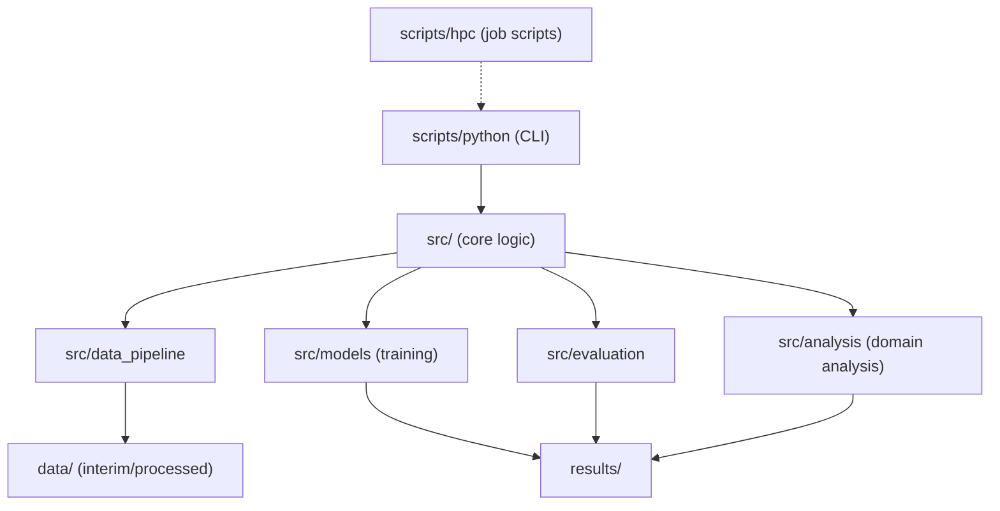
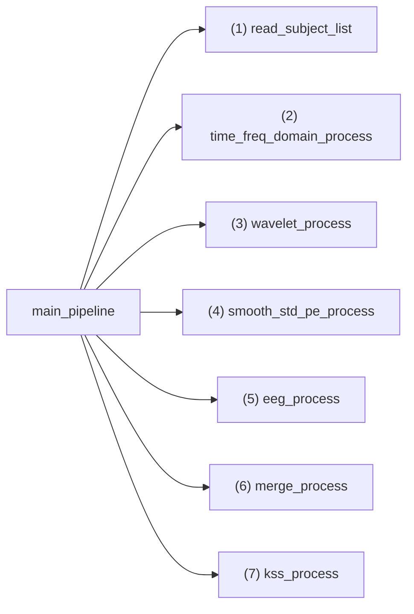
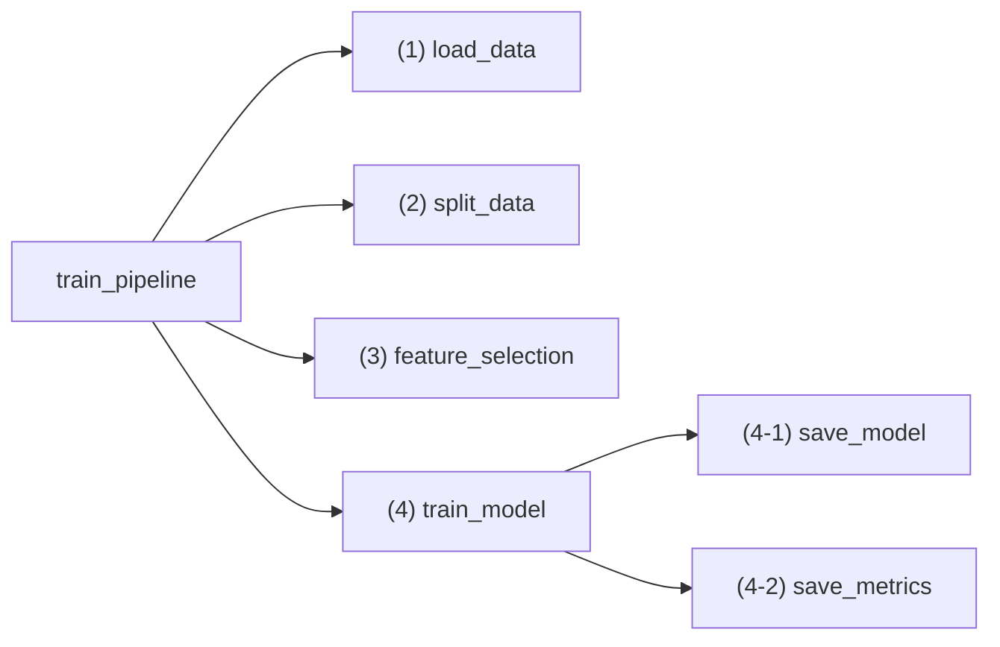
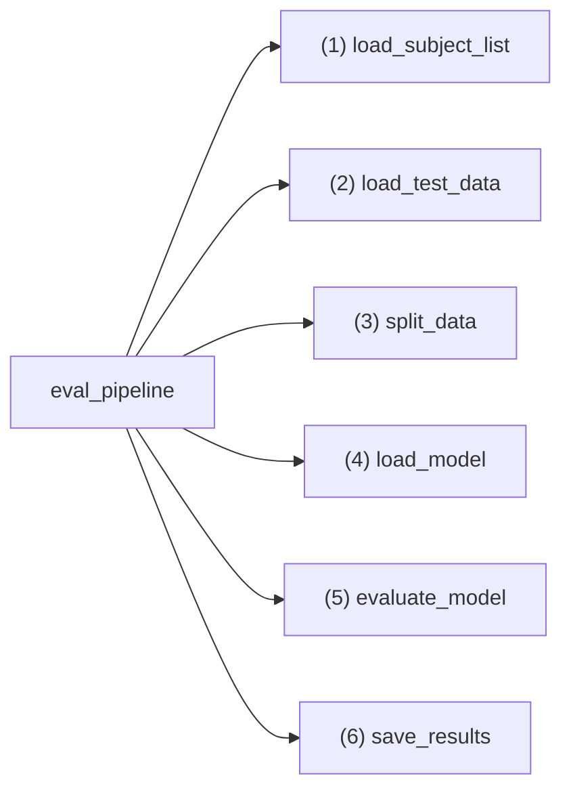

# Developer Guide: Repository Architecture and Data Flow

---

## Overview

This document describes the overall architecture, module dependencies, and end-to-end data flow
of the `vehicle_based_DDD_comparison` repository.

The repository implements a **multi-stage Driver Drowsiness Detection (DDD)** workflow,
spanning preprocessing, model training, evaluation, and domain generalisation analysis.

---

## Repository Structure

```
.
├── config/             # Subject/group definitions
│   └── subjects/
│       ├── general_subjects.txt
│       ├── subject_list.txt
│       └── target_groups.txt
│
├── data/               # Dataset storage (not tracked except README)
│   ├── interim/        # Intermediate cleaned data
│   ├── processed/      # Final processed datasets (per subject)
│   └── README.md
│
├── docs/               # Documentation
│   ├── getting-started/  # Installation and quickstart
│   ├── reference/        # Technical references
│   ├── architecture/     # System design and pipelines
│   └── experiments/      # Reproducibility and results
│
├── models/             # Trained model artifacts
│   ├── BalancedRF/     # Balanced Random Forest
│   ├── EasyEnsemble/   # EasyEnsemble
│   ├── Lstm/           # Deep models (temporal)
│   ├── RF/             # Random Forest
│   ├── SvmA/           # Amplitude-based SVM
│   └── SvmW/           # Wavelet-based SVM
│
├── results/            # Experiment results
│   ├── analysis/       # Domain distance matrices and analysis
│   ├── outputs/        # Evaluation outputs
│   └── README.md
│
├── scripts/
│   ├── python/         # Entry-point CLI scripts (train, evaluate, analyze)
│   ├── hpc/            # PBS job scripts for batch execution
│   │   ├── jobs/       # Individual job scripts
│   │   └── launchers/  # Bulk submission launchers
│   └── local/          # Local execution scripts
│
├── src/                # Core logic
│   ├── analysis/       # Distance computation and correlation
│   ├── data_pipeline/  # Preprocessing (feature extraction, merging, labeling)
│   ├── evaluation/     # Evaluation routines
│   ├── models/         # Training pipelines and model architectures
│   ├── utils/          # Common utilities (I/O, split, caching)
│   └── config.py       # Central configuration
│
└── tests/              # Test suite
```



---

## Core Pipelines

### 1. Preprocessing Pipeline

**Source:** `src/data_pipeline/processing_pipeline.py`

The preprocessing pipeline prepares per-subject datasets from raw physiological and EEG signals.



| Step / Function | Input | Output | Notes |
|---|---|---|---|
| `(1) read_subject_list` | `subject_list.txt` | list of subject IDs | Target subjects for preprocessing |
| `(2) time_freq_domain_process` | raw `.mat` files | CSV (`data/interim/time_freq_domain/`) | For SvmA and common models |
| `(3) wavelet_process` | raw `.mat` files | CSV (`data/interim/wavelet/`) | For SvmW and common models |
| `(4) smooth_std_pe_process` | raw `.mat` files | CSV (`data/interim/smooth_std_pe/`) | For Lstm and common models |
| `(5) eeg_process` | raw `.mat` files | CSV (`data/interim/eeg/`) | EEG band power, ratios |
| `(6) merge_process` | raw `.mat` files | CSV (`data/interim/merged/`) | Merges features by timestamp |
| `(7) kss_process` | `data/interim/merged/*.csv` | CSV (`data/processed/`) | Aligns KSS labels |

---

### 2. Training Pipeline

**Source:** `src/models/model_pipeline.py`

Handles data loading, splitting, feature selection, model fitting, and artifact saving.



| Function | Input | Output | Notes |
|---|---|---|---|
| `(1) load_data` | processed CSVs | DataFrame | Loads per-subject data |
| `(2) split_data` | DataFrame + strategy | Train/Val/Test splits | Supports random, subject-wise, time-wise, and fine-tune strategies |
| `(3) feature_selection` | Train data | Reduced features | RF importance, ANOVA, MI |
| `(4) train_model` | Selected data | trained estimator | RF, SvmA, or LSTM |
| `(4-1) save_model` | model, scaler | `models/{model}/` | Unified naming scheme |
| `(4-2) save_metrics` | logs, metrics | `results/outputs/training/` | Includes thresholds for F1 optimisation |

---

### 3. Evaluation Pipeline

**Source:** `src/evaluation/eval_pipeline.py`



| Step | Input | Output | Notes |
|---|---|---|---|
| `(1) load_subject_list` | subject list | IDs | Supports fold-based CV splits |
| `(2) load_test_data` | processed CSVs | DataFrame | Data for evaluation |
| `(3) split_data` | DataFrame + strategy | Train/Val/Test splits | Supports multiple split strategies |
| `(4) load_model` | `models/{model}` | model, scaler, features | Uses unified filenames |
| `(5) evaluate_model` | model, test data | metrics dict | Accuracy, F1, AUC |
| `(6) save_results` | metrics dict | `results/outputs/evaluation/` | Includes metadata |

---

## Utility Modules

**Location:** `src/utils/`

### `io/loaders.py`

* File I/O wrappers for MATLAB and CSV
* Subject list readers (`read_subject_list`, `read_train_subject_list`)
* Model type mapper (`get_model_type`)

### `io/merge.py`

* `merge_process(subject, model)` aligns features by timestamp and saves merged CSVs.

### `io/split.py`

Implements reproducible data splits:

* Random or stratified
* Subject-wise
* Time-stratified (`time_stratified_three_way_split`)

### `io/target_resolution.py`

* Resolves target and source subject groups for domain experiments
* Handles split2 (2-group) and ranks29 (3-group) domain file paths

---

## HPC Integration

The project supports PBS-based HPC clusters (KAGAYAKI) for large-scale experiments.

### Job Script Structure

Job scripts are located in `scripts/hpc/jobs/` and follow this pattern:

```bash
#!/bin/bash
#PBS -N job_name
#PBS -l select=1:ncpus=4:mem=8gb
#PBS -l walltime=24:00:00
#PBS -q SINGLE

cd $PBS_O_WORKDIR
source ~/conda/etc/profile.d/conda.sh
conda activate python310

python scripts/python/train/train.py --model RF --mode only10
```

### Launcher Scripts

Bulk submission launchers in `scripts/hpc/launchers/` automate submitting multiple jobs across queues:

| Launcher | Purpose |
|----------|---------|
| `launch_paper_domain_split2.sh` | Domain shift experiments (RF, split2) |
| `launch_prior_research_split2.sh` | Prior research experiments (SvmA/SvmW/Lstm, split2) |
| `launch_imbalance.sh` | Imbalance method comparison (RF) |
| `massive_submit.sh` | Bulk submission across 6 queues |

### Queue Configuration

| Queue | Capacity | Typical Use |
|-------|----------|-------------|
| DEFAULT | Unlimited | General experiments |
| SMALL | Unlimited | Quick tests |
| SINGLE | Limited | Standard training |
| LONG | Limited | Long-running jobs |
| LARGE | Limited | Memory-intensive |
| XLARGE | Limited | Very large jobs |

---

## Related Documents

- [Domain Generalization Pipeline](domain_generalization.md) — Domain analysis workflow details
- [Prior Research Models](prior_research.md) — SvmA, SvmW, Lstm architectures
- [Configuration Reference](../reference/configuration.md) — All configurable parameters
