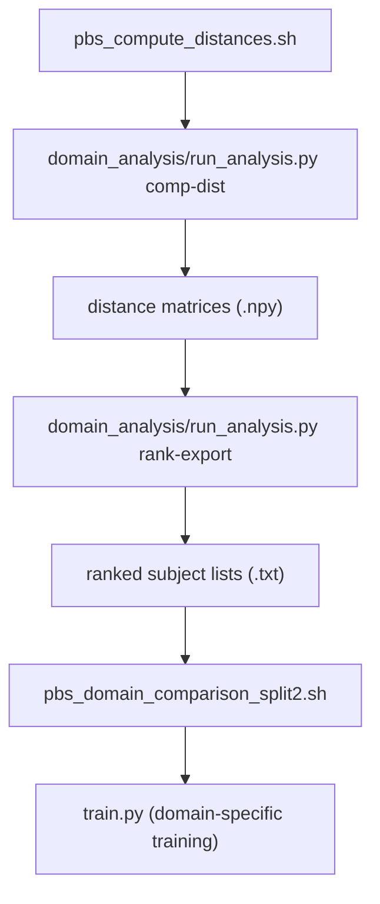

# Domain Generalization Analysis Pipeline

## Overview

This document explains the **Domain Generalization (DG)** analysis workflow implemented in the *vehicle_based_DDD_comparison* repository.

The goal of this pipeline is to **quantify domain differences** among subject groups (e.g., pretrain, general, target domains) and relate them to model performance degradation across domains.

The DG pipeline consists of three sequential stages:

1. **Distance computation**  
   Compute subject- and group-level distance matrices (MMD, Wasserstein, DTW) from processed features.  
   → `scripts/python/analysis/distance/`

2. **Subject ranking**  
   Rank subjects by inter-domain distances (mean/std) to identify *general* and *target* domains.  
   → `scripts/python/analysis/domain/`

3. **Domain-specific training / evaluation**  
   Fine-tune or evaluate models using ranked subject groups (e.g., "only general", "only target", "finetune").  
   → `scripts/hpc/jobs/domain_analysis/`

---

## Pipeline Summary (High-Level)



---

## 1. Distance Computation

### Purpose

To compute pairwise subject and group distances using **three complementary metrics**:

* **MMD (Maximum Mean Discrepancy)** — feature distribution similarity
* **Wasserstein distance** — marginal feature distance
* **DTW (Dynamic Time Warping)** — temporal sequence alignment distance

### Entry Point

```bash
python scripts/python/run_analysis.py comp-dist \
    --subject_list dataset/mdapbe/subject_list.txt \
    --data_root data/processed/common \
    --groups_file config/target_groups.txt
```

### Core Function

```python
from src.analysis.domain.distance import run_comp_dist
```

### Data Flow

| Step | Function | Input | Output | Description |
|---|---|---|---|---|
| 1 | `_load_subject_list()` | `subject_list.txt` | List[str] | Read all subject IDs |
| 2 | `_extract_features_with_cache()` | `data/processed/common/processed_*.csv` | Dict[subj → np.ndarray] | Extract numeric feature arrays per subject (cached) |
| 3 | `compute_mmd()` | Feature arrays | `mmd_matrix.npy` | Kernel-based domain similarity |
| 4 | `wasserstein_distance()` | Feature arrays | `wasserstein_matrix.npy` | Marginal feature distance |
| 5 | `dtw()` | Mean feature sequences | `dtw_matrix.npy` | Temporal alignment distance |
| 6 | `_compute_group_dist_matrix()` | Distance matrix + groups | `group_matrix.npy` | Mean distances between groups |
| 7 | `_compute_group_centroids_from_distance_matrix()` | Distance matrix + groups | `group_centroid_distance_heatmap.png` | 2D embedding via MDS |
| 8 | `_compute_intra_inter_stats()` | Distance matrix + groups | `intra_inter_comparison.png` | Intra/inter domain dispersion |

### Output Structure

```
results/analysis/domain/
├── distance/
│   ├── subject-wise/
│   │   ├── mmd/
│   │   ├── wasserstein/
│   │   └── dtw/
│   └── group-wise/
│       ├── mmd/
│       ├── wasserstein/
│       └── dtw/
├── rankings/
│   ├── centroid_umap/
│   ├── lof/
│   ├── mean_distance/
│   ├── knn/
│   └── split2/           # 2-group domain files
└── summary/
    ├── csv/
    └── png/
```

### Notes

* Cached feature arrays under `results/.cache/features_*.npz` accelerate repeated runs.
* Normalization: global z-score across all subjects before computing distances.
* MDS-based 2D projections visualize domain separability.

---

## 2. Subject Ranking

### Purpose

To categorize subjects into **general / neutral / target domains** based on their distance statistics.

### Entry Point

```bash
python scripts/python/domain_analysis/run_analysis.py rank-export \
    --outdir results/ranks10 \
    --k 10
```

### Algorithm Summary

For each distance metric (MMD, Wasserstein, DTW):

1. Load the corresponding distance matrix and subject list.
2. Compute per-subject **mean** and **std** (excluding diagonal).
3. Sort and export:
   * *Low* (smallest k) → `in_domain`
   * *Middle* (closest to median) → `mid_domain`
   * *High* (largest k) → `out_domain`

### Output Files

```
results/ranks10/
├── mmd_mean_in_domain.txt
├── mmd_mean_mid_domain.txt
├── mmd_mean_out_domain.txt
├── wasserstein_mean_out_domain.txt
├── dtw_mean_in_domain.txt
└── ...
```

### Split2 Domain Files

For 2-group split experiments (without mid_domain):

```
results/analysis/domain/distance/subject-wise/ranks/split2/{ranking_method}/
├── {distance}_in_domain.txt    # 44 subjects
└── {distance}_out_domain.txt   # 43 subjects
```

### Interpretation

| Category | Meaning | Typical Usage |
|---|---|---|
| `in_domain` | Most *typical* (domain-similar) subjects | Used for "only general" training |
| `mid_domain` | Intermediate group | Optional (excluded in split2) |
| `out_domain` | Most *atypical* (domain-dissimilar) subjects | Used for "only target" fine-tuning |

---

## 3. Domain-Specific Training

### Purpose

To evaluate generalization ability by **training/fine-tuning models** on different domain subsets determined by ranking results.

### Training Modes

| Mode | Description |
|------|-------------|
| **source_only** | Cross-domain: Train on the *opposite* domain, evaluate on the target domain |
| **target_only** | Within-domain: Train and evaluate within the *same* domain |
| **mixed** | Multi-domain: Train on *all 87 subjects* (pooled), evaluate on the target domain |

### Split2 Domain Logic

| Mode | Domain | Training Data | Evaluation Data |
|---|---|---|---|
| source_only | out_domain | in_domain (44 subjects) | out_domain (43 subjects) |
| source_only | in_domain | out_domain (43 subjects) | in_domain (44 subjects) |
| target_only | out_domain | out_domain (43 subjects) | out_domain (43 subjects) |
| target_only | in_domain | in_domain (44 subjects) | in_domain (44 subjects) |
| mixed | out_domain | All subjects (87) | out_domain (43 subjects) |
| mixed | in_domain | All subjects (87) | in_domain (44 subjects) |

> **Multi-domain** serves as a pooled-training baseline: it measures how well a model
> trained on all available subjects generalizes to each domain subset, compared to
> cross-domain (source_only) and within-domain (target_only) training.

### PBS Execution

**Experiment 2 (RF):**
```bash
qsub -v CONDITION=baseline,MODE=source_only,DISTANCE=mmd,DOMAIN=out_domain,SEED=42 \
    scripts/hpc/jobs/domain_analysis/pbs_domain_comparison_split2.sh
```

**Experiment 3 (SvmW / SvmA / Lstm):**
```bash
qsub -v MODEL=SvmW,CONDITION=baseline,MODE=source_only,DISTANCE=mmd,DOMAIN=out_domain,SEED=42 \
    scripts/hpc/jobs/train/pbs_prior_research_split2.sh
```

> Experiment 2 は RF のみ（5 条件、288 jobs）。
> Experiment 3 は SvmW, SvmA, Lstm（各 4 条件、合計 756 jobs）で同じドメイン分割パイプラインを使用。
> 詳細は [Reproducibility Guide](../experiments/reproducibility.md) を参照。

### Output Artifacts

```
models/{model}/{JOB_ID}/          # Trained model artifacts
results/outputs/evaluation/{model}/ # Evaluation metrics (JSON)
results/outputs/training/{model}/   # Training metrics
```

---

## 4. Correlation Analysis

### Purpose

To relate *domain distance metrics* (e.g., MMD mean) to *performance gaps* (Δ metrics).

```bash
python scripts/python/domain_analysis/run_analysis.py corr \
    --summary_csv model/common/summary_6groups_only10_vs_finetune_wide.csv \
    --distance results/mmd/mmd_matrix.npy \
    --outdir model/common/dist_corr_mmd
```

**Outputs:**
* `correlations_dUG_vs_deltas.csv`
* `correlation_heatmap_all.png`

---

## 5. Extensibility

| Extension | How to Add | Affected Modules |
|---|---|---|
| **New distance metric** | Implement in `src/analysis/distances.py` | `run_analysis.py comp-dist` |
| **New ranking logic** | Extend `_write_rank_with_middle()` | `rank_export.py` |
| **Alternative visualization** | Add in `src/analysis/` | Optional |
| **New domain group definition** | Update `config/target_groups.txt` | Reused across all analyses |

---

## 6. Key Directories

```
results/analysis/domain/         # Core domain analysis artifacts
results/analysis/domain/distance/ # Distance matrices and rankings
models/                          # Domain-specific trained models
scripts/hpc/jobs/domain_analysis/ # PBS job scripts for domain experiments
scripts/hpc/launchers/           # Bulk submission launchers
```

---

## References

* **MMD:** Gretton et al., *Kernel Two-Sample Tests and MMD*, JMLR (2012).
* **Wasserstein:** Villani, *Optimal Transport: Old and New*, Springer (2009).
* **DTW:** Berndt & Clifford, *Using Dynamic Time Warping to Find Patterns in Time Series*, AAAI (1994).

---

## Related Documents

- [Ranking Methods](../reference/ranking_methods.md) — Subject ranking algorithm details
- [Developer Guide](developer_guide.md) — Overall repository architecture
- [Reproducibility Guide](../experiments/reproducibility.md) — How to reproduce experiments
