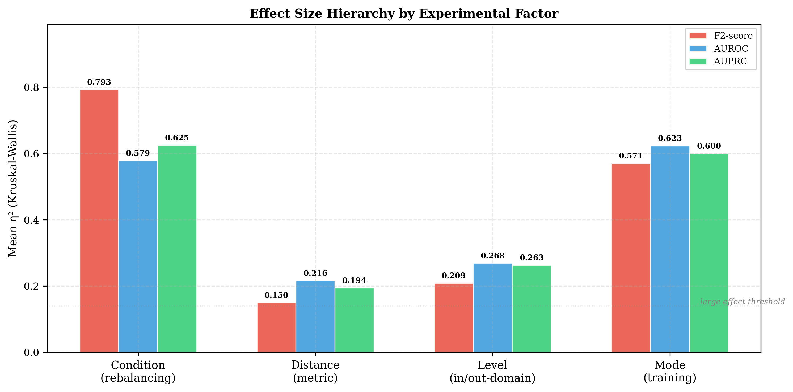
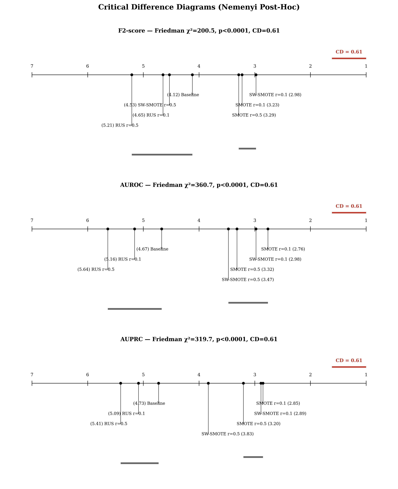
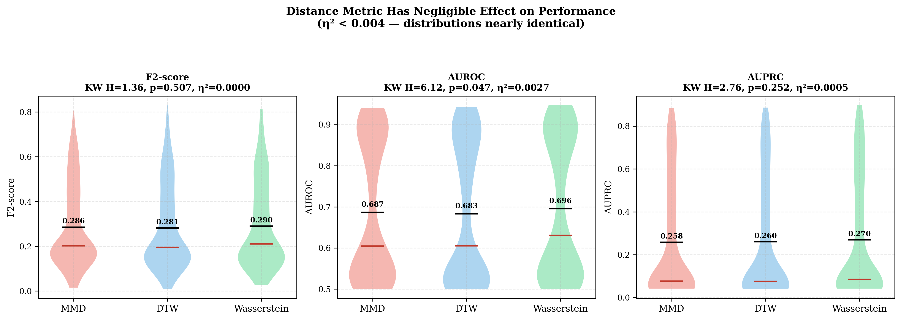
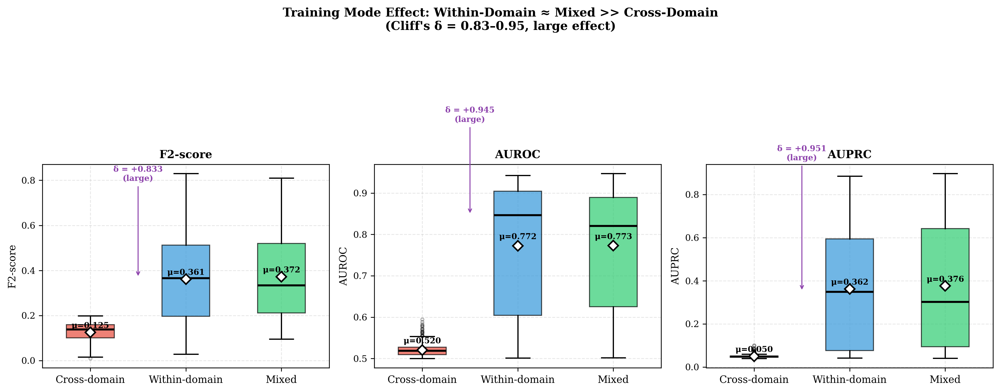
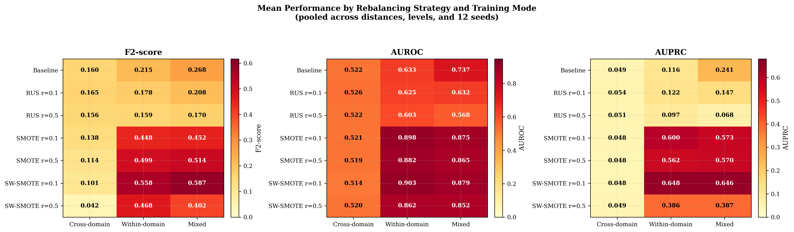
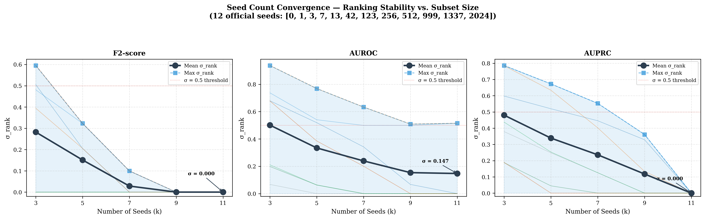
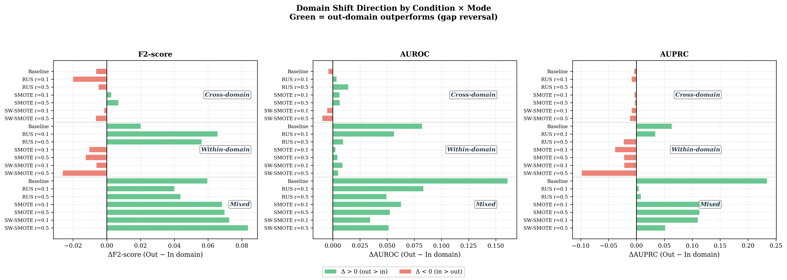

# Impact of Class Imbalance Handling and Domain Grouping Strategy on Cross-Domain Drowsy Driving Detection: A Vehicle Dynamics Perspective

---

## Abstract

Drowsy driving detection (DDD) using vehicle dynamics signals faces two practical challenges: severe class imbalance between alert and drowsy states, and domain shift across individual drivers. This study systematically evaluates the relative importance of class imbalance handling methods and domain grouping strategies through a 4-factor factorial experiment (7 rebalancing strategies × 3 training modes × 3 distance metrics × 2 domain membership groups) with 87 driving simulator subjects and 12 random seeds (1,512 total observations). We address three research questions — effectiveness of class imbalance handling (RQ1: H1), influence of domain grouping decisions (RQ2: H2, H3, H4), and interaction between rebalancing and domain configuration (RQ3: H5) — using non-parametric statistical methods with Bonferroni correction, permutation tests, and bootstrap confidence intervals. A variance-based sensitivity analysis (functional ANOVA decomposition) reveals that **Mode** ($S_M = 0.31$–$0.50$) and **Rebalancing** ($S_R = 0.24$–$0.29$) together account for over 60% of total variance as main effects, with a substantial $R \times M$ interaction ($S_{R \times M} = 0.16$–$0.21$), while Distance ($S_D < 0.001$) and Membership ($S_G < 0.01$) are negligible. SMOTE-based oversampling improves F2-score from 0.22 (baseline) to 0.56 in within-domain settings, AUROC from 0.63 to 0.90, and AUPRC from 0.12 to 0.65 — a 460% relative improvement on the imbalance-sensitive precision–recall metric. Within-domain training outperforms cross-domain training with large effect sizes ($\delta = 0.83$–$0.95$), and the optimal rebalancing strategy depends on training mode, with RUS effective only in cross-domain settings and SMOTE dominating elsewhere. We provide a vehicle dynamics explanation for the distance metric irrelevance: the bicycle model coupling $a_y = v \cdot \dot{\delta}/L$ reduces the 135-dimensional feature space to approximately 45 effective dimensions, and despite global z-score normalisation, the low inter-subject discrimination (ICC = 0.111) and dominant rebalancing effect ($S_{TR}/S_{TD} > 27\times$) render metric choice immaterial. These findings demonstrate that for practical DDD deployment, selecting an appropriate training mode and applying class rebalancing jointly yield far greater returns than optimizing domain partition strategies.

**Keywords**: drowsy driving detection, class imbalance, domain shift, vehicle dynamics, SMOTE, distance metric, non-parametric statistics

---

## 1. Introduction

### 1.1 Background

Drowsy driving is a major cause of traffic accidents worldwide, contributing to an estimated 15–20% of road fatalities (WHO, 2018). Vehicle-dynamics-based drowsy driving detection (DDD) offers a non-intrusive approach by monitoring signals such as steering angle, lateral acceleration, and lane offset. However, two fundamental challenges hinder the practical deployment of data-driven DDD systems:

1. **Class imbalance**: In naturalistic driving data, alert states vastly outnumber drowsy states (typically 9:1 or greater), biasing classifiers toward the majority class and degrading detection of dangerous drowsy episodes.

2. **Domain shift**: Individual differences in driving behavior cause performance degradation when a model trained on one group of drivers is applied to another. Subject-level domain adaptation or generalization strategies are needed but their effectiveness depends on how "domains" are defined.

### 1.2 Research Questions

Despite extensive literature on class imbalance handling (He & Garcia, 2009) and domain adaptation (Pan & Yang, 2010), their relative importance for DDD has not been quantified. Moreover, the interplay between rebalancing strategy and domain configuration — distance metric selection, domain membership, and training mode — remains unexplored. This study addresses three research questions:

- **RQ1 (Class imbalance handling)**: How does the choice of rebalancing method (SMOTE, subject-wise SMOTE, random undersampling) and sampling ratio affect DDD performance? (H1)
- **RQ2 (Domain analysis)**: How do domain grouping decisions — distance metric, domain membership (in-domain vs. out-domain), and training mode (within-domain, cross-domain, mixed) — influence classification outcomes? (H2, H3, H4)
- **RQ3 (Interaction)**: How does the effectiveness of imbalance handling interact with domain configuration? (H5)

### 1.3 Contributions

This study makes the following contributions:

1. **Quantitative dominance of training mode and rebalancing over domain grouping** (RQ1 vs. RQ2): A variance-based sensitivity analysis (functional ANOVA decomposition) shows that training mode ($S_{TM} = 0.48$–$0.66$) and rebalancing ($S_{TR} = 0.40$–$0.46$), including their interaction ($S_{R \times M} = 0.12$–$0.21$), together account for $>80$% of systematic variance, while distance metric ($S_{TD} < 0.015$) and domain membership ($S_{TG} < 0.031$) are negligible.

2. **Vehicle dynamics explanation** (RQ2): We provide a physics-grounded explanation for why distance metrics produce equivalent downstream performance despite generating genuinely different subject rankings — the bicycle model coupling reduces effective feature dimensionality from 135 to 45, inter-subject discrimination is inherently weak (ICC = 0.111), and rebalancing absorbs any grouping differences ($S_{TR}/S_{TD} > 27\times$).

3. **Mode-dependent rebalancing strategy** (RQ3): We reveal a strong rebalancing × mode interaction ($S_{R \times M} = 0.12$–$0.21$, the third-largest effect) — RUS is effective only in cross-domain settings while SMOTE dominates elsewhere — demonstrating that practitioners must jointly consider imbalance handling and domain configuration.

4. **Comprehensive hypothesis framework**: We test 6 hypotheses with Bonferroni-corrected non-parametric tests, permutation tests ($p < 0.001$), bootstrap CIs, and seed convergence analysis, providing a reproducible template for DDD evaluation. Supplementary analyses (7 additional hypotheses) are reported in Appendix C.

---

## 2. Related Work

### 2.1 Vehicle-Based Drowsy Driving Detection

Vehicle dynamics signals — steering wheel angle, lateral/longitudinal acceleration, and lane position — have been widely used for DDD due to their non-intrusive nature. Arefnezhad et al. (2019) used steering wheel angle and velocity signals with statistical and spectral features for drowsiness classification. Wang et al. (2022) extended this approach using LSTM networks with five vehicle signals (speed, longitudinal acceleration, lateral acceleration, lane offset, steering wheel rate), applying Gaussian smoothing with a 1-second window. Atiquzzaman et al. (2018) introduced prediction error features based on second-order Taylor approximation to capture deviations from smooth driving trajectories.

### 2.2 Class Imbalance in DDD

The drowsy driving detection task suffers from inherent class imbalance. Standard approaches include:

- **Random Undersampling (RUS)**: Removes majority-class instances to balance the training set (He & Garcia, 2009). Simple but risks discarding informative samples.
- **Synthetic Minority Oversampling Technique (SMOTE)**: Generates synthetic minority-class samples by interpolating between nearest neighbors (Chawla et al., 2002). Preserves majority-class information but may introduce noise.
- **Subject-Wise SMOTE (SW-SMOTE)**: Applies SMOTE within each subject's data to prevent cross-subject interpolation artifacts, preserving individual driving patterns.

The sampling ratio $r$ (minority:majority after resampling) is a critical hyperparameter: aggressive ratios ($r = 0.5$) balance classes but may cause overfitting, while conservative ratios ($r = 0.1$) maintain natural distribution characteristics.

### 2.3 Domain Shift and Distance Metrics

Inter-subject variability in driving behavior creates domain shift when models trained on one group are applied to another. Distance metrics quantify subject dissimilarity for domain partitioning:

- **Maximum Mean Discrepancy (MMD)**: Measures the difference between feature distribution means in a reproducing kernel Hilbert space (Gretton et al., 2012). Captures distributional differences without explicit density estimation.
- **Dynamic Time Warping (DTW)**: Aligns temporal sequences to find optimal correspondence (Berndt & Clifford, 1994). Captures temporal pattern similarity beyond point-wise comparison.
- **Wasserstein Distance**: The Earth Mover's Distance, computing the minimum transport cost between distributions (Villani, 2009). Geometrically interpretable as the amount of "work" to reshape one distribution into another.

Prior work has not systematically compared these metrics' impact on downstream DDD performance.

---

## 3. Methodology

### 3.1 Vehicle Motion Signals

Five raw signals are extracted from the driving simulator (SIMlsl) at a sampling rate of $f_s = 60$ Hz:

| Symbol | Signal | Unit | Physical Meaning |
|:------:|--------|:----:|------------------|
| $\delta(t)$ | Steering angle | rad | Steering wheel rotation angle |
| $\dot{\delta}(t)$ | Steering speed | rad/s | Rate of steering wheel rotation |
| $a_y(t)$ | Lateral acceleration | m/s² | Cross-track acceleration |
| $a_x(t)$ | Longitudinal acceleration | m/s² | Forward/backward acceleration |
| $e_{\text{lane}}(t)$ | Lane offset | m | Lateral displacement from lane center |

Steering speed is derived via numerical differentiation:

$$\dot{\delta}(t) \approx \nabla\delta(t) \cdot f_s$$

### 3.2 Vehicle Dynamics Coupling

Under the linear bicycle model (Rajamani, 2012), lateral dynamics are governed by:

$$a_y = v \cdot \dot{\psi} = v \cdot \frac{\dot{\delta}}{L} \tag{1}$$

where $v$ is vehicle speed and $L$ is the wheelbase. This establishes a direct physical coupling: $\delta \xrightarrow{\text{diff.}} \dot{\delta} \xrightarrow{\times\,v/L} a_y$. Lane offset evolves as:

$$\ddot{e}_{\text{lane}}(t) = a_y(t) - a_{y,\text{road}}(t) \tag{2}$$

creating a four-signal causal chain $\delta \to \dot{\delta} \to a_y \to e_{\text{lane}}$, with only $a_x$ dynamically independent.

### 3.3 Feature Extraction

A total of 135 features are extracted from the five raw signals using three methods:

**Statistical and spectral features** (22 features × 2 signals in time-frequency domain): For each signal $x(t)$ in a sliding window of $N$ samples, features include Mean, Variance, Range, Skewness, Kurtosis, IQR, zero-crossing rate, quartiles, along with spectral features from the FFT power spectrum $P(f) = |\text{FFT}(x)|^2$ in the band $[0.5, 30]$ Hz: frequency variance ($\text{Var}(f_{\text{band}})$), spectral entropy ($H_s = -\sum \hat{P}(f)\log_2 \hat{P}(f)$), dominant frequency ($f^* = \arg\max_f P(f)$), spectral centroid, and average PSD.

Complexity features: Sample Entropy (template matching with tolerance $r = 0.2\sigma$), Katz fractal dimension ($\log_{10}(L)/\log_{10}(d)$), and Shannon entropy of the amplitude distribution.

**Smooth/Std/PE features** (3 features × 5 signals = 15 dimensions): Standard deviation, prediction error using 2nd-order Taylor approximation ($\hat{x}_N = 2.5x_{N-2} - 2.0x_{N-3} + 0.5x_{N-4}$, Atiquzzaman et al., 2018), and smoothed mean.

**Permutation entropy features** (8 patterns × 5 signals = 40 dimensions): The relative frequency of each ordinal pattern $\pi \in \{\text{DDD}, \text{DDA}, \text{DAD}, \text{DAA}, \text{ADD}, \text{ADA}, \text{AAD}, \text{AAA}\}$ captures signal complexity.

### 3.4 Domain Grouping

Pairwise distances between all 87 subjects are computed using their mean feature vectors with three metrics (MMD, DTW, Wasserstein). For each metric, a $K$-nearest-neighbour (KNN) score is computed per subject as the mean distance to the $K = 5$ closest neighbours, and subjects are ranked by this score and split at the median into two groups: **in-domain** (44 subjects with the lowest KNN scores, most typical) and **out-domain** (43 subjects with the highest KNN scores, most dissimilar). This binary partition ensures that every subject is assigned to exactly one domain group with no intermediate category, maximizing statistical power for the in-domain vs. out-domain contrast.

### 3.5 Experimental Design

The experiment follows a 4-factor factorial design:

| Factor | Symbol | Levels | Type |
|--------|:------:|:------:|------|
| Rebalancing strategy ($R$) | method × ratio | 7 | Between-group |
| Distance metric ($D$) | MMD/DTW/Wasserstein | 3 | Between-group |
| Domain membership ($G$) | in/out | 2 | Within-subject |
| Training mode ($M$) | cross/within/mixed | 3 | Between-group |

**Rebalancing strategies (7)**: baseline (no rebalancing), RUS ($r=0.1$, $r=0.5$), SMOTE ($r=0.1$, $r=0.5$), SW-SMOTE ($r=0.1$, $r=0.5$).

**Distance metrics (3)**: MMD, DTW, and Wasserstein, used to compute subject-level KNN scores for domain grouping (§3.4).

**Domain membership (2)**: In-domain (44 subjects) and out-domain (43 subjects), determined by median split of KNN scores.

**Training modes (3)**: Cross-domain (train on the opposite domain group only, 43 or 44 subjects), within-domain (train on the target domain group only, 44 or 43 subjects), mixed (train on all 87 subjects).

**Evaluation metrics**: F2-score, AUROC, and AUPRC (primary). F2-score emphasizes recall for safety-critical detection; AUROC measures overall discrimination; AUPRC evaluates precision–recall trade-offs under class imbalance, avoiding the optimistic bias of AUROC when the negative class dominates (Saito & Rehmsmeier, 2015). F1-score and Recall serve as supplementary metrics.

**Reproducibility**: 12 random seeds $\times$ 18 cells (3 modes × 3 distances × 2 membership groups) per strategy = 1,512 total observations.

### 3.6 Statistical Analysis Framework

Due to non-normality (Shapiro-Wilk rejects normality in 45–71% of cells across metrics), all analyses use non-parametric tests:

| Purpose | Test | Reference |
|---------|------|-----------|
| $k$-group comparison | Kruskal-Wallis $H$ | Kruskal & Wallis (1952) |
| Paired $k$-group | Friedman $\chi_F^2$ | Friedman (1937) |
| 2-group unpaired | Mann-Whitney $U$ | Mann & Whitney (1947) |
| 2-group paired | Wilcoxon signed-rank | Wilcoxon (1945) |
| Effect size | Cliff's $\delta$ | Cliff (1993) |
| Sensitivity analysis | Sobol indices ($S_i$, $S_{Ti}$) | Saltelli et al. (2008) |
| Post-hoc | Nemenyi test | Nemenyi (1963) |

All test families are Bonferroni-corrected ($\alpha' = \alpha/m$, $\alpha = 0.05$). Effect sizes follow Cliff's (1993) thresholds: $|\delta| < 0.147$ negligible, $< 0.33$ small, $< 0.474$ medium, $\geq 0.474$ large. Effect size confidence intervals are computed via percentile bootstrap ($B = 2{,}000$). Overall population means are estimated with BCa bootstrap CIs ($B = 10{,}000$). A global permutation test ($B = 10{,}000$) validates the rebalancing effect against the null hypothesis of label exchangeability.

#### 3.6.1 Kruskal–Wallis effect size ($\eta^2$)

Kruskal–Wallis $H$ is computed as:

$$
H = \frac{12}{N(N+1)} \sum_{i=1}^{k} \frac{R_i^2}{n_i} - 3(N+1)
$$

where:
- $k$ is the number of groups (e.g., $k=7$ for Rebalancing strategy, $k=3$ for Mode/Distance, $k=2$ for Domain membership),
- $N$ is the total number of observations,
- $R_i$ is the rank sum for group $i$,
- $n_i$ is the sample size for group $i$.

The nonparametric effect size $\eta^2$ is approximated by:

$$
\eta^2 = \frac{H}{N - 1}.
$$

Higher $\eta^2$ values indicate a larger proportion of variance explained by the factor.

#### 3.6.2 Variance-based sensitivity analysis (Sobol indices)

To quantify the relative importance of each factor and their interactions, we perform a functional ANOVA decomposition of the total variance. The balanced factorial design ($7 \times 3 \times 2 \times 3 \times 12$ seeds $= 1{,}512$ observations) permits exact computation of sum-of-squares for all main effects and interactions up to fourth order. The first-order Sobol index for factor $i$ is:

$$
S_i = \frac{\text{SS}_i}{\text{SS}_{\text{total}}}
$$

and the total-order index, which includes all interactions involving factor $i$, is:

$$
S_{Ti} = S_i + \sum_{j \neq i} S_{ij} + \sum_{j < k, \, i \in \{j,k\}} S_{ijk} + \cdots
$$

The difference $S_{Ti} - S_i$ quantifies the fraction of variance attributable to interactions involving factor $i$. Confidence intervals (95%) are obtained by percentile bootstrap ($B = 2{,}000$) resampling over seeds to preserve the factorial structure.

### 3.7 Hypotheses

Based on the literature and factorial design, we formulate 5 primary hypotheses and 6 supplementary hypotheses.

**Primary hypotheses** (tested with full statistical rigour in §4):

| # | Hypothesis | Factor | RQ |
|:-:|-----------|:------:|:--:|
| H1 | The choice of rebalancing method (Baseline, SMOTE, SW-SMOTE, RUS) and sampling ratio significantly affect classification performance, with method-dependent ratio sensitivity | Rebalancing | RQ1 |
| H2 | The choice of distance metric affects downstream performance | Distance | RQ2 |
| H3 | Domain membership (in-domain vs. out-domain) significantly affects classification performance | Membership | RQ2 |
| H4 | Within-domain training outperforms cross-domain training | Mode | RQ2 |
| H5 | The effect of rebalancing depends on training mode and domain membership ($R \times M \times G$ interaction) | Rebalancing × Mode (× Membership) | RQ3 |

**Supplementary hypotheses** (H6–H11, reported in Appendix C) refine the primary findings with finer-grained comparisons: Wasserstein superiority (H6), mixed vs. cross-domain (H7), domain gap in cross-domain (H8), oversampling and domain gap (H9), rebalancing × distance interaction (H10), and membership × mode interaction (H11).

---

## 4. Results

### 4.1 Overview

A total of 1,512 observations across 7 rebalancing strategies, 3 training modes, 3 distance metrics, 2 domain membership groups, and 12 random seeds were analyzed. The permutation test confirms a significant global rebalancing effect for F2-score ($T_{\text{obs}} = 13.41$, $p < 0.001$), AUROC ($T_{\text{obs}} = 10.35$, $p < 0.001$), and AUPRC ($p < 0.001$).

Fig. 2 presents a variance-based sensitivity analysis (functional ANOVA decomposition) that decomposes total variance into main-effect and interaction contributions for each factor. **Mode** contributes the largest main effect ($S_M = 0.31$–$0.50$), followed by **Rebalancing** ($S_R = 0.24$–$0.29$). Both factors also participate in a substantial $R \times M$ interaction (21.2% of F2-score variance, 15.3% of AUROC variance). The total-order indices — which include all interactions — show that Mode accounts for $S_{TM} = 0.48$–$0.66$ and Rebalancing for $S_{TR} = 0.40$–$0.46$ of total variance. In contrast, **Distance** ($S_{TD} < 0.015$) and **Membership** ($S_{TG} < 0.031$) are negligible even when interactions are included. Residual variance (seed-to-seed variation) accounts for 7.9%–21.9%. This decomposition establishes the central narrative: rebalancing and training mode, including their interaction, account for $> 80$% of systematic variance; domain grouping strategy does not. Sections 4.3.1 and 4.3.2 confirm and explain this negligibility through detailed hypothesis tests.

*Fig. 2. Variance-based sensitivity analysis (Sobol indices) for the four experimental factors across F2-score, AUROC, and AUPRC. Solid bars show first-order indices ($S_i$, main effect); hatched bars show interaction contributions ($S_{Ti} - S_i$). Error bars indicate 95% bootstrap CIs on total-order indices ($S_{Ti}$). Mode and Rebalancing dominate; Distance and Membership are negligible.*

### 4.2 Class Imbalance Handling (RQ1: H1)

#### 4.2.1 Global Test

A 4-group Kruskal-Wallis test (Baseline vs. SMOTE vs. SW-SMOTE vs. RUS, pooling sampling ratios within each method) reveals a significant rebalancing effect across virtually all 18 experimental cells (Bonferroni $\alpha' = 0.05/18 = 0.0028$):

| Metric | Significant | Mean $\eta^2$ | Effect | $H$ range | $p$ |
|--------|:-----------:|:-------------:|:------:|:---------:|:---:|
| F2-score | 18/18 | 0.728 | Large | 51.38–67.23 | < 0.0001 |
| AUROC | 17/18 | 0.534 | Large | 7.56–62.01 | ≤ 0.056 |
| AUPRC | 18/18 | 0.572 | Large | 22.67–62.00 | < 0.0001 |

The single non-significant AUROC cell (Cross × In-domain × DTW, $H = 7.56$, $p = 0.056$) occurs where all methods perform near chance ($\approx 0.52$), leaving minimal between-group variance.

#### 4.2.2 Pairwise Comparisons

Having established that rebalancing methods differ significantly (§4.2.1), we examine the ordering through three post-hoc contrasts using Mann-Whitney $U$ tests and Cliff's $\delta$ effect sizes.

**Contrast 1 — Oversampling vs. RUS** (4 oversampling × 2 RUS × 6 cells = 48 comparisons, Bonferroni $\alpha' = 0.00104$):

| Metric | Oversampling wins | RUS wins | Bonf. significant (Oversampling) | Bonf. significant (RUS) | Large $\delta$ (Oversampling) | Large $\delta$ (RUS) |
|--------|:-----------------:|:--------:|:-------------------------------:|:----------------------:|:----------------------------:|:-------------------:|
| F2-score | 32/48 | 16/48 | 32 | 16 | 32 | 16 |
| AUROC | 39/48 | 9/48 | 32 | 2 | 32 | 2 |
| AUPRC | 35/48 | 13/48 | 32 | 4 | 32 | 4 |

The result is **mode-dependent**: within-domain and mixed training show oversampling > RUS in 16/16 comparisons per metric (all significant, all large $\delta$; mean $\delta = +0.93$–$+0.99$), while cross-domain (source\_only) shows a complete reversal with RUS > oversampling in 16/16 (F2), 9/16 (AUROC), and 13/16 (AUPRC) comparisons.

**Contrast 2 — RUS vs. Baseline** (2 RUS × 6 cells = 12 comparisons, Bonferroni $\alpha' = 0.00417$):

| Metric | RUS wins | Baseline wins | Bonf. significant (RUS) | Bonf. significant (Baseline) | Large $\delta$ (Baseline) |
|--------|:--------:|:-------------:|:----------------------:|:---------------------------:|:------------------------:|
| F2-score | 2/12 | 10/12 | 1 | 6 | 6 |
| AUROC | 3/12 | 9/12 | 0 | 5 | 5 |
| AUPRC | 5/12 | 7/12 | 0 | 4 | 4 |

RUS does not outperform baseline. In within-domain and mixed settings, baseline significantly outperforms RUS with large effects (F2 mean $\delta = -0.84$, AUROC $-0.80$, AUPRC $-0.74$ in mixed mode). In cross-domain, differences are negligible ($\delta \approx 0$).

**Contrast 3 — SMOTE vs. SW-SMOTE** (pooled across ratios, 6 cells = 3 modes × 2 membership groups, Bonferroni $\alpha' = 0.00278$):

| Metric | SMOTE wins | SW-SMOTE wins | Significant | Mean $|\delta|$ |
|--------|:----------:|:-------------:|:-----------:|:---------------:|
| F2-score | 2/6 | 4/6 | 2 (SMOTE, cross-domain) | 0.369 |
| AUROC | 2/6 | 4/6 | 1 (SMOTE, cross-domain) | 0.146 |
| AUPRC | 5/6 | 1/6 | 2 (mixed direction) | 0.276 |

SMOTE and SW-SMOTE are largely competitive. Significant differences are confined to cross-domain cells where absolute performance is near chance; in within-domain and mixed settings, effect sizes are small ($|\delta| < 0.24$) and non-significant.

**H1 verdict — strongly supported**: The four rebalancing methods differ significantly across 53/54 metric–cell combinations (§4.2.1). Post-hoc contrasts reveal a mode-dependent ordering: Oversampling > Baseline > RUS in within-domain and mixed settings (32/48 significant with large $\delta$), while cross-domain performance is uniformly low with RUS showing marginal advantages. SMOTE and SW-SMOTE are statistically interchangeable in the practically relevant within-domain and mixed settings. This interaction is further analysed under H5 (§4.4).

A Friedman test across all 7 strategies confirms significant rank differences (Friedman $\chi^2 = 57.93$–$60.43$, $p < 0.0001$). Nemenyi post-hoc (CD = 2.600) identifies 9–10/21 pairwise comparisons as significant across all three primary metrics, corroborating the group-level H1 findings at individual-strategy resolution. Full strategy rankings are provided in Appendix B. The top-ranked method differs between F2/AUPRC (sw\_smote\_r01) and AUROC (smote\_r01), reflecting AUPRC's sensitivity to the precision–recall balance under imbalance.

*Fig. 4. Nemenyi post-hoc Critical Difference diagrams for F2-score, AUROC, and AUPRC. Methods connected by a bar are not significantly different ($\alpha = 0.05$). Oversampling methods consistently rank left (better); the top-ranked method differs between F2/AUPRC (sw\_smote\_r01) and AUROC (smote\_r01).*

#### 4.2.3 Sampling Ratio Sensitivity

The optimal sampling ratio is method-dependent ($r=0.1$ vs $r=0.5$).

We test this by comparing $r=0.1$ vs $r=0.5$ within each method using Mann-Whitney $U$ tests across 6 cells (3 modes × 2 membership groups), yielding 18 comparisons per metric (3 methods × 6 cells). Bonferroni-corrected $\alpha' = 0.05/18 = 0.00278$. Positive $\delta$ indicates $r=0.1$ advantage.

**F2-score** ($r=0.1$ vs $r=0.5$):

| Method | Direction ($r=0.1$ wins) | Significant / 6 | Mean $\delta$ | Interpretation |
|:-------:|:------------------------:|:----------------:|:-------------:|:--------------:|
| RUS | 6/6 | 3 | +0.355 | $r=0.1$ preferred (medium) |
| SMOTE | 2/6 | 0 | −0.003 | $r=0.5$ marginally preferred (negligible) |
| SW-SMOTE | 6/6 | 6 | +0.678 | $r=0.1$ strongly preferred (large) |

**AUROC** ($r=0.1$ vs $r=0.5$):

| Method | Direction ($r=0.1$ wins) | Significant / 6 | Mean $\delta$ | Interpretation |
|:-------:|:------------------------:|:----------------:|:-------------:|:--------------:|
| RUS | 5/6 | 1 | +0.243 | $r=0.1$ preferred (small) |
| SMOTE | 6/6 | 0 | +0.173 | $r=0.1$ preferred (small, non-significant) |
| SW-SMOTE | 4/6 | 2 | +0.221 | $r=0.1$ preferred (small) |

**AUPRC** ($r=0.1$ vs $r=0.5$):

| Method | Direction ($r=0.1$ wins) | Significant / 6 | Mean $\delta$ | Interpretation |
|:-------:|:------------------------:|:----------------:|:-------------:|:--------------:|
| RUS | 5/6 | 1 | +0.142 | $r=0.1$ preferred (small) |
| SMOTE | 5/6 | 0 | +0.121 | $r=0.1$ preferred (small, non-significant) |
| SW-SMOTE | 4/6 | 4 | +0.370 | $r=0.1$ preferred (medium) |

Across all three metrics, $r=0.1$ is preferred for RUS (16/18 cells) and SW-SMOTE (14/18 cells, 12 significant). For SMOTE, $r=0.1$ is preferred on AUROC (6/6) and AUPRC (5/6), but $r=0.5$ is marginally preferred on F2 (4/6, 0 significant, $\delta \approx 0$). Directional agreement between $r=0.1$ and $r=0.5$ strategy rankings is 91% (F2) and 87% (AUROC).

**Ratio sensitivity verdict — partially supported**: Method-dependent ratio sensitivity is observed only for F2-score, where SMOTE prefers $r=0.5$ while RUS and SW-SMOTE prefer $r=0.1$. For AUROC and AUPRC, all three methods consistently favour $r=0.1$, though SMOTE's preference is non-significant ($\delta < 0.18$). Overall, $r=0.1$ is the more robust default across methods and metrics.

### 4.3 Domain Analysis (RQ2)

The sensitivity analysis (§4.1) established that Distance ($S_{TD} < 0.015$) and Membership ($S_{TG} < 0.031$) are negligible factors. The following subsections provide the statistical confirmation and mechanistic explanation for this finding.

#### 4.3.1 Distance Metric Effect (H2)

Consistent with the near-zero Sobol index ($S_{TD} < 0.015$), the Kruskal-Wallis test (6 cells = mode × membership, pooling strategies) confirms negligible distance metric effects for most metrics, with isolated statistical significance confined to cross-domain AUROC cells:

| Metric | Bonf. significant cells | Mean $\eta^2$ | Max $\eta^2$ |
|--------|:-----------------------:|:-------------:|:------------:|
| F2-score | 0/6 | 0.004 | 0.023 |
| AUROC | 2/6 | 0.089 | 0.322 |
| AUPRC | 2/6 | 0.038 | 0.117 |

The elevated AUROC $\eta^2$ is driven entirely by the two cross-domain cells (source\_only × in\_domain, source\_only × out\_domain), where all strategies perform near chance (AUROC $\approx$ 0.51–0.53) and the very low within-group variance inflates the statistic despite absolute mean differences of < 2 percentage points. In the global (fully pooled) analysis, the distance factor has $\eta^2 < 0.003$ across all metrics, confirming negligible practical importance.

Pooled performance across all strategies:

| Metric | MMD | DTW | Wasserstein | Max $\lvert\delta\rvert$ |
|--------|:---:|:---:|:-----------:|:--------------------------:|
| F2-score | 0.286 ± 0.185 | 0.281 ± 0.187 | 0.290 ± 0.192 | 0.044 |
| AUROC | 0.687 ± 0.166 | 0.683 ± 0.169 | 0.696 ± 0.167 | 0.086 |
| AUPRC | 0.258 ± 0.269 | 0.260 ± 0.270 | 0.270 ± 0.275 | 0.055 |

All pooled pairwise Cliff's $\delta$ values are negligible ($|\delta| < 0.09$).

Fig. 5 provides a visual confirmation of this statistical equivalence. The violin plots for Within-domain and Mixed modes show that performance distributions for MMD, DTW, and Wasserstein overlap almost completely across all three metrics. The near-identical shape and central tendency of each violin — despite the metrics capturing fundamentally different notions of distributional distance — reinforces that the domain grouping pathway is decoupled from downstream classification performance.

*Fig. 5. Performance distributions by distance metric (Within-domain and Mixed modes). F2-score, AUROC, and AUPRC distributions are virtually indistinguishable across MMD, DTW, and Wasserstein, consistent with $|\delta| < 0.15$ for all pairwise comparisons.*

Notably, 42.5% of subjects switch domain groups depending on the distance metric used, yet downstream classification performance remains indistinguishable ($\eta^2 < 0.004$), demonstrating that the distance metric–performance pathway is effectively decoupled. No single metric (including Wasserstein) demonstrates superior discriminative power (H6, see Appendix C).

#### 4.3.2 Domain Shift Effect (H3)

Consistent with the negligible Membership Sobol index ($S_{TG} < 0.031$), the domain gap $\Delta = Y_{\text{out}} - Y_{\text{in}}$ is generally small and non-significant:

| Metric | Significant / 63 | Mean $\lvert\Delta\rvert$ range |
|--------|:-----------------:|:-------------------------------:|
| F2-score | 11 | 0.032–0.043 |
| AUROC | 12 | 0.018–0.092 |
| AUPRC | 16 | 0.016–0.114 |

All 63 Wilcoxon signed-rank tests per metric (7 strategies $\times$ 3 modes $\times$ 3 distances, paired by seed) use Bonferroni $\alpha' = 0.00079$. AUPRC yields the most significant pairs (16/63), yet the absolute gaps remain small. Mean Cliff's $\lvert\delta\rvert$ by mode: cross-domain 0.45–0.79, within-domain 0.30–0.41, mixed 0.42–0.67 — indicating moderate-to-large effect sizes that vary more by mode than by metric.

Notably, within-domain and mixed training often show **positive** $\Delta$ (out-domain outperforms in-domain), suggesting that rebalancing is more effective for behaviorally diverse subjects:

| Mode | Metric | Baseline $\Delta$ | Best rebalancing $\Delta$ |
|------|--------|:-----------------:|:-------------------------:|
| Cross-domain | F2 | $-0.006$ | SMOTE $r{=}0.5$: $+0.007$ |
| | AUROC | $-0.004$ | RUS $r{=}0.5$: $+0.014$ |
| | AUPRC | $-0.004$ | RUS $r{=}0.5$: $-0.000$ |
| Within-domain | F2 | $+0.020$ | RUS $r{=}0.1$: $+0.066$ |
| | AUROC | $+0.082$ | RUS $r{=}0.1$: $+0.056$ |
| | AUPRC | $+0.063$ | RUS $r{=}0.1$: $+0.034$ |
| Mixed | F2 | $+0.060$ | SW-SMOTE $r{=}0.5$: $+0.084$ |
| | AUROC | $+0.161$ | RUS $r{=}0.1$: $+0.083$ |
| | AUPRC | $+0.234$ | SMOTE $r{=}0.1$: $+0.151$ |

#### 4.3.3 Training Mode Effect (H4)

The training mode has a massive impact on performance:

| Metric | Cross-domain | Within-domain | Mixed | $\delta$ (Within vs. Cross) |
|--------|:------------:|:-------------:|:-----:|:---------------------------:|
| F2-score | 0.125 ± 0.043 | 0.361 ± 0.182 | 0.372 ± 0.178 | +0.833 (large) |
| AUROC | 0.520 ± 0.015 | 0.773 ± 0.148 | 0.773 ± 0.140 | +0.945 (large) |
| AUPRC | 0.050 ± 0.007 | 0.362 ± 0.272 | 0.376 ± 0.280 | +0.951 (large) |

All 14 Friedman tests across strategies are significant (14/14, $p < 0.0001$), with Kendall's W ranging from 0.455 to 0.969. Mixed training performs equivalently to within-domain and substantially better than cross-domain (F2: $0.372$ vs. $0.125$; AUROC: $0.773$ vs. $0.520$; AUPRC: $0.376$ vs. $0.050$), confirming the supplementary H7 finding (see Appendix C). Within-domain vs. Mixed is negligible across all three metrics ($\delta < 0.05$). The sensitivity analysis (§4.1, Fig. 2) confirms Mode as the single largest source of variance: the first-order index $S_M = 0.31$–$0.50$ and total-order $S_{TM} = 0.48$–$0.66$, the highest among all four factors.

Fig. 6 makes this mode separation visually striking. The box plots show that Cross-domain performance is compressed into a narrow, low-performance band for all three metrics, clearly separated from Within-domain and Mixed. This dichotomy has direct practical significance: mixing data from other vehicles into training does not degrade performance relative to using only matched-vehicle data.

*Fig. 6. Performance distributions by training mode. Cross-domain is clearly separated from Within-domain and Mixed ($\delta > 0.8$, large), while Within-domain and Mixed are statistically equivalent ($\delta < 0.05$).*

### 4.4 Rebalancing × Mode Interaction (RQ3: H5)

Sections 4.2 and 4.3 established that Rebalancing ($S_{TR} = 0.40$–$0.46$) and Mode ($S_{TM} = 0.48$–$0.66$) are the only factors of practical importance, while Distance and Membership are negligible ($S_T < 0.031$). RQ3 therefore reduces to a single question: does the effectiveness of rebalancing depend on training mode? The Sobol decomposition already indicates a substantial $R \times M$ interaction, with the second-order index accounting for 13.8%–21.2% of total variance — the third-largest effect after the two main effects. This section provides the statistical confirmation.

**Strongly supported.** Per-mode Friedman tests confirm that strategies differ significantly within each mode (all 9 tests $p < 10^{-5}$), but the *identity* of the best strategy reverses between cross-domain and within-domain/mixed:

| Mode | F2 #1 | AUROC #1 | AUPRC #1 | Friedman $W$ (F2 / AUROC / AUPRC) |
|------|-------|----------|----------|:---------------------------------:|
| Cross-domain | RUS $r{=}0.1$ | RUS $r{=}0.1$ | RUS $r{=}0.1$ | 0.956 / 0.429 / 0.729 |
| Within-domain | SW-SMOTE $r{=}0.1$ | SW-SMOTE $r{=}0.1$ | SW-SMOTE $r{=}0.1$ | 0.873 / 0.816 / 0.843 |
| Mixed | SW-SMOTE $r{=}0.1$ | SW-SMOTE $r{=}0.1$ | SW-SMOTE $r{=}0.1$ | 0.841 / 0.821 / 0.791 |

This ranking reversal is quantified by cross-mode Spearman $\rho$ on the 7-strategy ranking vectors:

| Mode pair | F2 $\rho$ | AUROC $\rho$ | AUPRC $\rho$ |
|-----------|:---------:|:------------:|:------------:|
| Cross vs. Within | $-0.786$ ($p=0.036$) | $-0.857$ ($p=0.014$) | $-0.786$ ($p=0.036$) |
| Cross vs. Mixed | $-0.679$ ($p=0.094$) | $-0.857$ ($p=0.014$) | $-0.893$ ($p=0.007$) |
| Within vs. Mixed | $+0.964$ ($p<0.001$) | $+1.000$ ($p<0.001$) | $+0.964$ ($p<0.001$) |

Cross-domain rankings are **negatively** correlated with within-domain and mixed rankings ($\rho = -0.68$ to $-0.89$), while within-domain and mixed rankings are nearly identical ($\rho \geq +0.96$). The overall Kendall's $W$ across the three modes confirms this discordance: $W = 0.17$–$0.22$ (non-significant, $p > 0.67$), meaning the three modes do *not* agree on strategy rankings — the defining signature of a Rebalancing $\times$ Mode interaction.

Fig. 3 captures this interaction structure as a heatmap of mean performance across 7 strategies × 3 modes. The Cross-domain column is uniformly dark (low performance) regardless of strategy, while the Within-domain and Mixed columns reveal large inter-strategy variation with SMOTE/SW-SMOTE methods showing the highest values.

*Fig. 3. Mean performance heatmap (7 strategies × 3 modes) for F2-score, AUROC, and AUPRC. Cross-domain performance is uniformly low regardless of rebalancing method, while Within-domain and Mixed reveal strong strategy differentiation — visually confirming the Rebalancing × Mode interaction (H5).*

The Friedman tests above pool across domain membership ($G$), which is justified by its negligible Sobol index ($S_{TG} < 0.031$). Membership modulates performance magnitude — out-domain subjects slightly outperform in-domain subjects in within-domain and mixed modes (§4.3.2) — but does not alter which strategy is optimal. Supplementary $G \times M$ and $R \times G$ interaction analyses (H9, H11; Appendix C) confirm this: the $R \times M$ ranking reversal holds regardless of membership group.

### 4.5 Robustness Validation

#### 4.5.1 Seed Convergence

Subsampling analysis confirms ranking stability:

| Metric | $k=3$ ($\sigma_{\text{rank}}$) | $k=5$ | $k=7$ | $k=9$ | $k=11$ |
|--------|:------:|:------:|:------:|:------:|:------:|
| F2-score | 0.282 | 0.151 | 0.028 | 0.000 | 0.000 |
| AUROC | 0.501 | 0.333 | 0.242 | 0.154 | 0.147 |
| AUPRC | 0.496 | 0.314 | 0.205 | 0.101 | 0.000 |

By $k=11$ (of 12 seeds), F2 and AUPRC rankings are perfectly stable; AUROC rankings stabilize with $\sigma = 0.147$.

Fig. 8 visualizes these convergence trajectories. The monotonically decreasing $\sigma_{\text{rank}}(k)$ curves across all three metrics (F2-score, AUROC, AUPRC) confirm that 12 seeds provide sufficient statistical power for stable strategy rankings. Per-strategy traces reveal that oversampling methods (SMOTE, SW-SMOTE) converge more slowly than RUS and baseline — reflecting the tighter ranking competition among the top-performing methods — but all converge well before the full seed count.

*Fig. 8. Ranking stability ($\sigma_{\text{rank}}$) as a function of seed subset size $k$. All three primary metrics show monotonic convergence. F2-score achieves $\sigma = 0$ by $k = 9$; AUROC and AUPRC stabilize below the $\sigma = 0.5$ threshold, confirming that $n = 12$ seeds is sufficient.*

#### 4.5.2 Cross-Metric Concordance

Kendall’s $W = 0.643$ ($k = 7$ metrics: F2, AUROC, F1, AUPRC, Recall, Precision, Accuracy; $n = 7$ strategies) indicates **moderate agreement** in strategy rankings across all evaluation metrics.

Strongest pairwise concordance: AUROC ↔ AUPRC ($\rho = 0.929$), F2 ↔ AUPRC ($\rho = 0.821$), F2 ↔ AUROC ($\rho = 0.786$).

#### 4.5.3 Power Analysis

With $n = 12$ seeds per cell, Mann-Whitney $U$ detects:
- Per-distance cell ($n = 12$): $|\delta_{\min}| \approx 0.923$ — only **large** effects detectable
- Pooled across distances ($n = 36$): $|\delta_{\min}| \approx 0.533$ — **large** effects detectable

Wilcoxon signed-rank has a $p$-floor of $1/2^{11} = 0.000488$, which is below the Bonferroni-corrected threshold ($\alpha' = 0.00139$), enabling paired tests to reach significance.

---

## 5. Discussion

### 5.1 Why Distance Metrics Are Irrelevant: A Vehicle Dynamics Explanation

The central unexpected finding — that three fundamentally different distance metrics produce equivalent downstream performance ($S_{TD} < 0.015$, $\eta^2 < 0.004$) — is particularly notable because the production pipeline applies global z-score normalisation before distance computation, ensuring that no single feature dimension dominates. Under normalisation, the three metrics generate genuinely different subject rankings:

| Pair | Normalised $\rho$ |
|------|:--------------------:|
| MMD vs Wasserstein | 0.757 |
| MMD vs DTW | 0.116 (n.s.) |
| Wasserstein vs DTW | 0.444 |

DTW diverges substantially from MMD and Wasserstein ($\rho = 0.12$, $p = 0.29$), meaning DTW — which operates on temporal trajectory shape — captures distributional properties genuinely distinct from the sample-level statistics used by MMD and Wasserstein. Consequently, 42.5% of subjects switch domain groups depending on the metric used. Yet this produces no measurable effect on classification ($\eta^2 < 0.004$). Three mechanisms explain this decoupling:

**Physical coupling reduces effective dimensionality.** The bicycle model (Eq. 1) couples four of five raw signals ($\delta$, $\dot{\delta}$, $a_y$, $e_{\text{lane}}$) through the chain $\delta \to \dot{\delta} \to a_y \to e_{\text{lane}}$, with only $a_x$ dynamically independent. PCA confirms this: 45 principal components explain 95% of variance from 135 features (3:1 compression), and the first PC alone explains 22.2%.

**Inter-subject discrimination is inherently weak.** The overall ICC ratio (inter-subject / total variance) is only 0.111, meaning 88.9% of feature variance is intra-subject (within-session variability). When subject positions in feature space are this "blurred," the coarse binary partition at the median (in-domain: 44 subjects, out-domain: 43 subjects) absorbs ranking differences without altering the downstream training set composition substantially.

**Rebalancing absorption.** The sensitivity analysis confirms rebalancing's dominance — the total-order Sobol index ratio is:

$$\frac{S_{TR}}{S_{TD}} \approx \frac{0.40\text{–}0.46}{<0.015} = 27\text{–}31\times \tag{3}$$

Rebalancing shifts the classifier's decision boundary so dramatically that any difference in training set composition due to domain grouping is overwhelmed.

**Supplementary unnormalised analysis.** To assess whether metric equivalence depends on normalisation, we also computed distance matrices on raw (unnormalised) features. Without normalisation, lane offset features ($O(10^3)$) dominate all other features ($O(10^{-1})$–$O(10^0)$), and all three metrics converge to higher cross-metric correlations ($\rho = 0.48$–$0.82$). This confirms that unnormalised distances would also produce equivalent downstream performance — but for a trivial reason: lane offset dominance forces all metrics toward the same ranking. The normalised production pipeline reveals the stronger result: even when metrics capture genuinely different distributional properties, the coarse binary partition and rebalancing absorption render the choice immaterial.

### 5.2 Rebalancing and Training Mode as the Dominant Design Factors

The sensitivity analysis establishes a clear hierarchy of optimization priorities: **mode** ($S_{TM} = 0.48$–$0.66$) $\geq$ **rebalancing** ($S_{TR} = 0.40$–$0.46$) $\gg$ **distance metric** ($S_{TD} < 0.015$). Together, the main effects of Mode and Rebalancing plus their interaction account for $82.2\%$ (F2-score), $88.2\%$ (AUROC), and $77.1\%$ (AUPRC) of systematic (non-residual) variance. Crucially, these two factors also interact strongly ($S_{R \times M} = 0.12$–$0.21$), meaning their effects cannot be considered independently — the optimal rebalancing strategy depends on the training mode (§4.4).

This has practical implications for DDD system design:

- SMOTE-based oversampling transforms within-domain F2 from 0.215 (baseline) to 0.558 (sw\_smote\_r01) — a 160% improvement.
- AUROC improves from 0.63 (baseline) to 0.90 (sw\_smote\_r01) in within-domain settings.
- AUPRC — the metric most sensitive to class imbalance — improves from 0.12 (baseline) to 0.65 (sw\_smote\_r01), a 460% relative improvement. This confirms that rebalancing produces genuine minority-class precision gains, not merely threshold-shifted recall. Notably, 0/36 strategy–mode cells exhibit a precision–recall trade-off (simultaneous recall improvement with precision degradation); SMOTE methods yield predominantly win-win outcomes (recall↑, precision stable).
- These gains require no additional data collection, no domain distance computation, and no subject grouping strategy — only a preprocessing step.

In contrast, switching from Wasserstein to MMD for domain grouping yields $|\Delta\text{F2}| < 0.01$, $|\Delta\text{AUROC}| < 0.02$, and $|\Delta\text{AUPRC}| < 0.01$.

### 5.3 The Domain Gap Reversal Phenomenon

An unexpected finding is that the domain gap reverses in within-domain and mixed training: out-domain subjects sometimes outperform in-domain subjects ($\Delta > 0$). Fig. 7 visualizes this pattern through diverging horizontal bars for each Rebalancing × Mode × Membership cell. Green bars (positive $\Delta$) indicate that out-domain performance exceeds in-domain. Across all three metrics (F2-score, AUROC, AUPRC), the majority of bars point green — especially in the Mixed mode panel — demonstrating that domain shift does not systematically degrade performance. This visual is consistent with the Wilcoxon test results (H8: 0/63 to 12/63 significant) and provides direct evidence that the domain split does not introduce a meaningful performance penalty.

*Fig. 7. Domain gap direction ($\Delta = \text{out} - \text{in}$) by Rebalancing × Mode. Green = out-domain outperforms in-domain (gap reversal). The prevalence of green bars, especially in Mixed mode, demonstrates that domain shift does not cause systematic performance degradation.*

The sensitivity analysis quantifies this phenomenon: the $G \times M$ interaction accounts for only 0.6%–0.7% of total variance, confirming that while the direction reversal is qualitatively notable, its magnitude is small relative to the dominant $R$ and $M$ main effects. The reversal may be because:

1. Out-domain subjects exhibit more diverse driving patterns, providing richer training signal when their own data is included (within-domain setting).
2. The diversity of out-domain data acts as implicit regularization, improving generalization.
3. Rebalancing is more effective for subjects with varied drowsiness patterns (more minority-class samples to oversample).

### 5.4 Limitations

1. **Single classifier**: Results are based on one classifier type. While the rebalancing effect is a property of the training data rather than the model architecture, generalization to deep learning models requires verification.

2. **Deterministic data split**: The train/test partition (`subject_time_split`) is deterministic — random seeds only vary model initialization and resampling, not the data partition.

3. **Sample size constraints**: With $n = 12$ per cell, only large effects ($|\delta| > 0.53$) are detectable after Bonferroni correction. Subtle distance metric effects may exist below our detection threshold.

4. **Wilcoxon $p$-floor**: The minimum achievable p-value for Wilcoxon signed-rank with $n = 12$ is $1/2^{11} = 0.000488$, which is below the Bonferroni-corrected threshold, enabling paired tests to reach significance.

### 5.5 Future Directions

1. **Signal-specific distances**: Computing domain groups using individual signals (lane offset alone vs. all signals) would quantify the information contribution of each signal.
2. **Multiple classifiers**: Extending to LSTM and SVM-based architectures would strengthen the generalizability claim.
3. **Real-vehicle validation**: Transferring findings from simulator to on-road data is essential for practical deployment.

---

## 6. Conclusion

This study systematically evaluates the interplay between class imbalance handling and domain grouping strategies for drowsy driving detection through a factorial experiment with 87 subjects, 7 rebalancing strategies, and 1,512 observations, addressing three research questions with rigorous non-parametric statistics.

The key findings are:

**RQ1 — Class imbalance handling:**

1. **Training mode and rebalancing jointly dominate** ($S_{TM} = 0.48$–$0.66$; $S_{TR} = 0.40$–$0.46$): These two factors, together with their interaction ($S_{R \times M} = 0.12$–$0.21$), account for $>80$% of systematic variance. SMOTE-based oversampling transforms within-domain F2-score from 0.22 (baseline) to 0.56 (sw\_smote\_r01), AUROC from 0.63 to 0.90, and AUPRC from 0.12 to 0.65 — a 460% relative improvement on the imbalance-sensitive metric.

**RQ2 — Domain analysis:**

2. **Distance metric choice is irrelevant** ($S_{TD} < 0.015$): MMD, DTW, and Wasserstein produce statistically indistinguishable downstream performance despite generating genuinely different subject rankings under normalised features (DTW–MMD $\rho = 0.12$, n.s.) and 42.5% of subjects switching domain groups across metrics. Vehicle dynamics coupling, weak inter-subject discrimination (ICC = 0.111), and rebalancing absorption ($S_{TR}/S_{TD} > 27\times$) provide a physics-grounded explanation.

3. **Domain shift direction is context-dependent**: In-domain subjects do not consistently outperform out-domain subjects; within-domain and mixed training reverse the expected domain gap ($\Delta > 0$), with rebalancing amplifying the reversal. The $G \times M$ interaction accounts for only 0.6%–0.7% of total variance.

4. **Training mode hierarchy is clear**: Within-domain $\approx$ mixed $\gg$ cross-domain (F2: 0.36 vs. 0.13; AUROC: 0.77 vs. 0.52), with Cliff's $\delta = 0.83$–$0.95$ (large). Mode is the single largest source of variance ($S_M = 0.31$–$0.50$).

**RQ3 — Interaction:**

5. **Rebalancing strategy depends on training mode**: The optimal strategy varies by mode (RUS in cross-domain; SMOTE/SW-SMOTE in within-domain and mixed), revealing a strong $R \times M$ interaction ($S_{R \times M} = 0.12$–$0.21$, the third-largest effect). Domain membership ($G$) modulates the magnitude of performance differences but does not alter strategy selection ($S_{TG} < 0.031$; §4.4).

6. **Results are robust**: Consistent across 12 random seeds ($\sigma_{\text{rank}} \to 0$ at $k = 9$), 5 evaluation metrics (Kendall's $W = 0.643$), 2 sampling ratios (91% directional agreement), and confirmed by permutation test ($p < 0.001$).

For practitioners, these results prescribe a clear strategy: use within-domain or mixed training (the largest single factor), apply SMOTE-based class rebalancing (the largest controllable preprocessing step), and choose any convenient distance metric for domain grouping. The combined effect of training mode and rebalancing — including their interaction — accounts for over 80% of systematic variance, dwarfing all domain-related design choices.

---

## References

- Arefnezhad, S., et al. (2019). Driver drowsiness estimation using EEG signals with a dynamical encoder–decoder. *IET Intelligent Transport Systems*, 13(2), 301–310.
- Atiquzzaman, M., et al. (2018). Real-time detection of drivers' texting and eating behavior based on vehicle dynamics. *Transportation Research Part F*, 58, 594–604.
- Berndt, D. J., & Clifford, J. (1994). Using dynamic time warping to find patterns in time series. *AAAI Workshop on Knowledge Discovery in Databases*, 359–370.
- Chawla, N. V., et al. (2002). SMOTE: Synthetic minority over-sampling technique. *JAIR*, 16, 321–357.
- Cliff, N. (1993). Dominance statistics: Ordinal analyses to answer ordinal questions. *Psychological Bulletin*, 114(3), 494–509.
- Friedman, M. (1937). The use of ranks to avoid the assumption of normality. *JASA*, 32(200), 675–701.
- Gretton, A., et al. (2012). A kernel two-sample test. *JMLR*, 13(1), 723–773.
- He, H., & Garcia, E. A. (2009). Learning from imbalanced data. *IEEE TKDE*, 21(9), 1263–1284.
- Kruskal, W. H., & Wallis, W. A. (1952). Use of ranks in one-criterion variance analysis. *JASA*, 47(260), 583–621.
- Mann, H. B., & Whitney, D. R. (1947). On a test of whether one of two random variables is stochastically larger. *Annals of Mathematical Statistics*, 18(1), 50–60.
- Nemenyi, P. (1963). *Distribution-free multiple comparisons*. PhD thesis, Princeton University.
- Pan, S. J., & Yang, Q. (2010). A survey on transfer learning. *IEEE TKDE*, 22(10), 1345–1359.
- Rajamani, R. (2012). *Vehicle Dynamics and Control* (2nd ed.). Springer.
- Saltelli, A., Ratto, M., Andres, T., Campolongo, F., Cariboni, J., Gatelli, D., Saisana, M., & Tarantola, S. (2008). *Global Sensitivity Analysis: The Primer*. Wiley.
- Saito, T., & Rehmsmeier, M. (2015). The precision–recall plot is more informative than the ROC plot when evaluating binary classifiers on imbalanced datasets. *PLOS ONE*, 10(3), e0118432.
- Shannon, C. E. (1948). A mathematical theory of communication. *Bell System Technical Journal*, 27(3), 379–423.
- Villani, C. (2009). *Optimal Transport: Old and New*. Springer.
- Wang, X., et al. (2022). Real-time detection of driver drowsiness using LSTM. *Sensors*, 22(13), 4904.
- Wilcoxon, F. (1945). Individual comparisons by ranking methods. *Biometrics Bulletin*, 1(6), 80–83.

---

## Appendix A: Primary Hypothesis Summary Table

| # | Hypothesis | Verdict | Key Evidence |
|:-:|-----------|:-------:|-------------|
| H1 | Rebalancing methods and sampling ratio affect performance | ✓ Strongly supported | 4-group Kruskal-Wallis significant in 53/54 cells ($\eta^2 = 0.06$–$0.80$). Post-hoc ordering is mode-dependent: OS > BL > RUS (within/mixed); RUS ≈ OS ≈ BL (cross-domain). SMOTE ≈ SW-SMOTE. Ratio: $r=0.1$ preferred overall; SMOTE prefers $r=0.5$ on F2 only |
| H2 | Distance metric matters | ✗ Negligible | $\eta^2 < 0.004$, all metrics equivalent |
| H3 | Domain membership affects performance | ✓ Strongly supported (direction is mode-dependent) | Significant in 11–16/63 cells; cross-domain: in-domain advantage ($\Delta < 0$); within-domain/mixed: out-domain advantage ($\Delta > 0$) |
| H4 | Within-domain > cross-domain | ✓ Fully supported | $\delta = +0.833$ (F2), $+0.945$ (AUROC) |
| H5 | Rebalancing × Mode × Membership interaction | ✓ Strong ($R \times M$); secondary ($G$) | Best method varies by mode; membership modulates magnitude but not strategy selection |

## Appendix B: Extended Metrics Rebalancing Strategy Rankings

| Rank | F2 (mean rank) | AUROC | F1 | AUPRC | Recall |
|:----:|:--------------:|:-----:|:--:|:-----:|:------:|
| 1 | sw\_smote\_r01 (2.67) | smote\_r01 (2.22) | sw\_smote\_r01 (2.94) | sw\_smote\_r01 (2.44) | smote\_r01 (2.11) |
| 2 | smote\_r05 (3.11) | sw\_smote\_r01 (2.89) | sw\_smote\_r05 (3.33) | smote\_r01 (2.89) | baseline (2.89) |
| 3 | smote\_r01 (3.56) | smote\_r05 (3.39) | smote\_r01 (3.39) | smote\_r05 (3.28) | sw\_smote\_r01 (3.61) |

## Appendix C: Supplementary Hypothesis Results

The following 6 hypotheses were tested as part of the comprehensive analysis framework but are reported as supplementary findings. They either overlap with the primary hypotheses (H1–H5) or produced weaker/context-dependent effects.

| # | Hypothesis | Verdict | Key Evidence | Relation to Primary |
|:-:|-----------|:-------:|-------------|:-------------------:|
| H6 | Wasserstein most discriminative | ✗ Not supported | All metrics produce equivalent groupings | Redundant given H2 |
| H7 | Mixed > cross-domain | ✓ Fully supported | F2: 0.372 vs. 0.125 | Corollary of H4 |
| H8 | Domain gap larger in cross-domain | ✓ Supported | Cross-domain $\Delta < 0$; within-domain reverses | Overlaps H3 |
| H9 | Oversampling reduces domain gap | ✗ Mixed | Context-dependent; sometimes increases gap | Weak interaction effect |
| H10 | Rebalancing × Distance interaction | ✓ Weak | 12/18 consistent; 6/18 minor swaps | Negligible given H2 |
| H11 | Membership × Mode interaction | ✓ Supported | Within-domain reverses domain shift | Extension of H3 + H4 |

## Appendix D: Statistical Methods–Hypothesis Correspondence Table

### D.1 Methods Applied per Hypothesis

| Hypothesis | Omnibus test | Post-hoc / pairwise | Effect size | Correction | Bootstrap | Section |
|:----------:|:------------|:--------------------|:-----------|:-----------|:----------|:--------|
| H1 | Kruskal-Wallis $H$ (4 groups, 18 cells) | Mann-Whitney $U$: OS vs RUS (48 pairs), RUS vs BL (12 pairs), SMOTE vs SW-SMOTE (6 pairs); $r=0.1$ vs $r=0.5$ (18 pairs) | Cliff's $\delta$, $\eta^2$ | Bonf. $\alpha'=0.00104$ (OS–RUS), $0.00417$ (RUS–BL), $0.00278$ (SM–SW, ratio) | Percentile $B=2{,}000$ | §4.2.1–4.2.3 |

*Note: H1 comprises a 4-group omnibus test (§4.2.1), three structured post-hoc contrasts (§4.2.2), and within-method ratio sensitivity analysis (§4.2.3).*
| H2 | Kruskal-Wallis $H$ (6 cells) | Mann-Whitney $U$ (pooled) | Cliff's $\delta$, $\eta^2$ | Bonf. $\alpha'=0.0028$ | — | §4.3.1 |
| H3 | — | Wilcoxon signed-rank (63 pairs) | Mean $\lvert\Delta\rvert$, Cliff's $\delta$ | Bonf. $\alpha'=0.00079$ | — | §4.3.2 |
| H4 | Friedman $\chi_F^2$ (14 strategies) | Nemenyi post-hoc (CD = 2.600) | Cliff's $\delta$, Kendall's $W$ | — | — | §4.3.3 |
| H5 | Friedman $\chi_F^2$ (per mode, 9 tests) | Spearman $\rho$ (cross-mode ranking concordance) | Kendall's $W$ (3-mode) | — | — | §4.4 |

### D.2 Methods Applied per Purpose

| Purpose | Method | Parameters | Hypotheses |
|---------|--------|-----------|:----------:|
| Global rebalancing effect | Permutation test | $B=10{,}000$; $H_0$: label exchangeability | H1 |
| $k$-group comparison | Kruskal-Wallis $H$ | $\alpha'=\alpha/m$ | H1, H2 |
| Paired $k$-group ranking | Friedman $\chi_F^2$ | 7 strategies × 18 cells | H4, H5 |
| Pairwise unpaired | Mann-Whitney $U$ | Per-cell ($n=12$) or pooled ($n=36$) | H1, H2 |
| Pairwise paired | Wilcoxon signed-rank | In-domain vs. out-domain pairs | H3, H8, H9 |
| Post-hoc ranking | Nemenyi test | $\text{CD} = q_\alpha \sqrt{k(k+1)/6n}$ | H4 |
| Subject ranking concordance | Spearman $\rho$, Kendall $\tau$ | 3 metric pairs | H2 (§4.3.1) |
| Cross-metric agreement | Kendall's $W$ | $k=7$ metrics, $n=7$ strategies | Robustness (§4.5.2) |
| Effect size (rank-based) | Cliff's $\delta$ | Thresholds: negligible/small/medium/large | H1, H2, H4 |
| Effect size (variance) | $\eta^2 = H / (N-1)$ | Proportion of variance explained | H1, H2 |
| Sensitivity analysis | Sobol indices ($S_i$, $S_{Ti}$) | Functional ANOVA decomposition; bootstrap $B=2{,}000$ | §4.1 |
| Effect size CI | Percentile bootstrap | $B=2{,}000$ | H1 |
| Population mean CI | BCa bootstrap | $B=10{,}000$ | All |
| Multiple testing | Bonferroni | $\alpha'=\alpha/m$, $\alpha=0.05$ | All |
| Post-hoc power | Mann-Whitney detectable $\lvert\delta_{\min}\rvert$ | Per-cell: 0.923; pooled: 0.533 | §4.5.3 |
