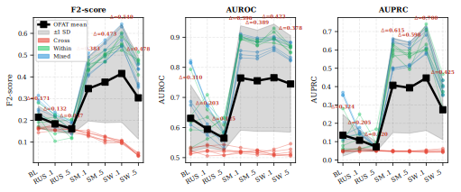
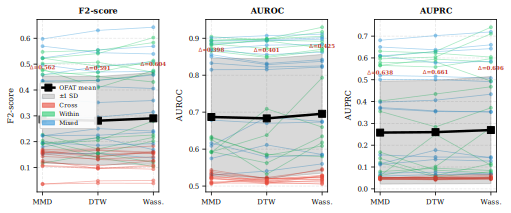
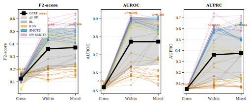
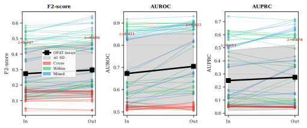
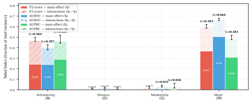
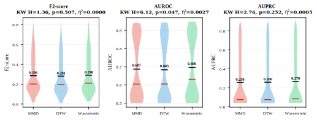
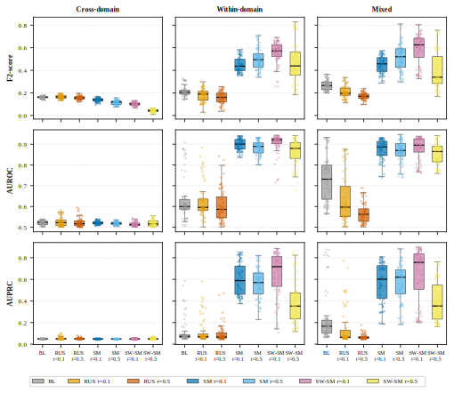
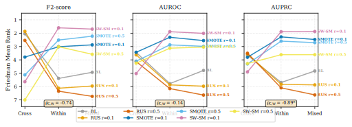
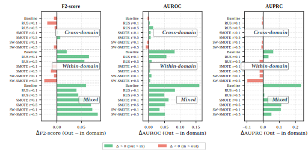
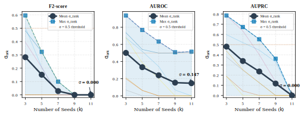

# Quantifying the Relative Impact of Class Imbalance Handling and Domain Configuration on Vehicle-Dynamics-Based Drowsy Driving Detection

---

## Abstract

Drowsy driving detection (DDD) using vehicle dynamics faces two intertwined challenges: severe class imbalance between alert and drowsy states, and domain shift across individual drivers. Existing studies address these problems in isolation, leaving practitioners without guidance on which design choice matters most. This study introduces a factorial experimental framework to quantify the relative importance of four design factors — rebalancing strategy ($R$, 7 levels), training mode ($M$, 3 levels), distance metric ($D$, 3 levels), and domain membership ($G$, 2 levels) — through a Sobol–Hoeffding variance decomposition over 1,512 random forest evaluations (87 drivers, 12 random seeds) on a public driving simulator dataset [35]. A one-factor-at-a-time (OFAT) analysis first reveals qualitative trends; the subsequent Sobol decomposition then quantifies each factor's contribution and exposes interactions. Training mode and rebalancing strategy jointly account for $> 95$% of systematic variance ($S_{TM} = 0.48$–$0.66$; $S_{TR} = 0.40$–$0.46$), with a substantial interaction ($S_{R \times M} = 0.12$–$0.21$) that causes a full strategy ranking reversal across modes (Spearman $\rho = -0.74$ to $-0.89$). In contrast, distance metric ($S_{TD} < 0.015$; $BF_{01} = 71$–$767$) and domain membership ($S_{TG} < 0.031$) are negligible. SW-SMOTE at ratio $r = 0.1$ achieves the best within-domain performance (F2 = 0.558, AUROC = 0.903, AUPRC = 0.648), improving over the no-rebalancing baseline by +159%, +43%, and +457%, respectively. Vehicle dynamics coupling (bicycle model), weak inter-subject discrimination (ICC = 0.111), and rebalancing absorption ($S_{TR}/S_{TD} > 27\times$) provide a physics-grounded explanation for domain-configuration irrelevance. These findings demonstrate that practitioners should prioritise training mode selection and class rebalancing over domain grouping optimisation.

**Keywords**: drowsy driving detection, class imbalance, domain shift, vehicle dynamics, Sobol sensitivity analysis, factorial experiment, SMOTE

---

## 1. Introduction

Drowsy driving is a leading cause of traffic accidents worldwide, accounting for an estimated 15–20% of road fatalities [1]. Vehicle-dynamics-based drowsy driving detection (DDD) is an attractive non-intrusive approach that monitors signals such as steering angle, lateral acceleration, and lane offset without requiring sensors attached to the driver. However, deploying such systems in practice requires addressing two well-documented challenges that degrade classifier performance.

First, **class imbalance**: in naturalistic driving data, alert states vastly outnumber drowsy states (typically 9:1 or greater), biasing classifiers toward the majority class and degrading detection of safety-critical drowsy episodes. Resampling techniques such as SMOTE [2] and random undersampling (RUS) [3] are commonly applied, but their relative effectiveness for DDD has not been systematically evaluated across operational conditions.

Second, **domain shift**: inter-subject variability in driving behaviour causes performance degradation when a model trained on one group of drivers is applied to another [4]. Practitioners must choose a distance metric to quantify subject dissimilarity, determine domain membership, and select a training mode (cross-domain, within-domain, or mixed). Each of these decisions constitutes a design factor, yet their relative contribution to downstream classification performance remains unknown.

Crucially, these two challenges are not independent. A rebalancing strategy that improves performance under one training mode may degrade it under another. Yet prior work has studied class imbalance handling [2], [3] and domain adaptation [4], [5] in isolation, treating them as separate optimisation targets rather than as interacting components of a unified experimental design. No study has quantified their relative importance or characterised their interactions.

This paper addresses this gap by framing DDD system design as a **four-factor factorial experiment** and applying variance-based sensitivity analysis to decompose performance variance into attributable sources. Specifically, we:

1. Conduct an intuitive one-factor-at-a-time (OFAT) analysis to visualise each factor's marginal effect across all fixed conditions, identifying which factors produce consistent performance shifts and which are absorbed by other design choices.

2. Apply Sobol–Hoeffding variance decomposition to quantify each factor's first-order and total-order contributions, revealing that training mode ($M$) and rebalancing strategy ($R$) jointly account for $> 95$% of systematic variance, while distance metric ($D$) and domain membership ($G$) are negligible.

3. Characterise the $R \times M$ interaction — the third-largest effect — which produces a complete strategy ranking reversal between cross-domain and within-domain settings, demonstrating that these two factors cannot be optimised independently.

4. Provide a physics-grounded explanation rooted in the bicycle model for why distance metric choice is irrelevant despite generating genuinely different subject rankings.

To the best of our knowledge, this is the first study to apply a factorial experimental design with Sobol sensitivity analysis to DDD, systematically decomposing the relative contribution of class imbalance handling and domain configuration decisions.

---

## 2. Related Work

### 2.1 Vehicle-Dynamics-Based Drowsy Driving Detection

Vehicle dynamics signals — steering wheel angle, lateral acceleration, and lane position — are widely used for DDD owing to their non-intrusive nature. Arefnezhad et al. [6] used steering wheel angle and velocity with statistical and spectral features for drowsiness classification. Wang et al. [7] extended this approach using LSTM networks with five vehicle signals, applying Gaussian smoothing with a 1-second window. Zhao et al. [8] applied continuous wavelet transform to capture transient changes in driving behaviour. Recent surveys [9], [10] confirm that vehicle-dynamics-based methods remain a practical backbone, but note that most studies evaluate a single architecture on a fixed data split without systematically examining the effect of preprocessing decisions.

### 2.2 Class Imbalance in Safety-Critical Detection

Class imbalance is inherent in drowsy driving data: drowsy episodes are rare but safety-critical. He and Garcia [3] provide a comprehensive taxonomy of methods, including random undersampling (RUS), SMOTE [2], and cost-sensitive learning. Beyond standard SMOTE, variants such as Borderline-SMOTE and ADASYN adapt synthesis to decision-boundary regions; however, for multi-subject pooled data, subject-wise SMOTE (SW-SMOTE) — which generates synthetic samples within each subject's feature subspace before pooling — better preserves individual driving patterns and avoids cross-subject artefacts. For DDD, He et al. [11] proposed a generative adaptive CNN to address class-imbalanced EEG data. However, most DDD studies either ignore imbalance entirely or apply a single method without comparing alternatives. No study has evaluated the interaction between rebalancing strategy and training mode in a factorial framework.

### 2.3 Domain Shift and Cross-Subject Generalisation

Inter-subject variability creates domain shift in DDD [4], [12]. Kim et al. [13] proposed calibration-free drowsiness classification with prototype-based domain mixup for EEG signals. Luo et al. [14] developed cross-scenario and cross-subject domain adaptation methods. Li et al. [15] introduced MADNet for EEG-based cross-subject drowsiness diagnosis using domain generalisation. Aravinth et al. [16] proposed dynamic cross-domain transfer learning for driver fatigue monitoring. These studies focus on architectural innovations to mitigate domain shift but do not quantify the relative importance of domain-related design choices (distance metric, membership, training mode) compared to preprocessing choices (rebalancing).

### 2.4 Sensitivity Analysis in Machine Learning

Variance-based sensitivity analysis using Sobol indices [17] has been applied in engineering and biological modelling [18] but remains underutilised in machine learning. Taylor et al. [19] pioneered the application of Sobol indices to rank deep learning hyperparameter influence, demonstrating that learning rate and batch size dominate while architectural choices have lower impact. Kuhnt and Kalka [20] used Sobol indices with FANOVA graphs for ML model interpretation. These works demonstrate the power of Sobol decomposition for identifying dominant factors in complex systems, but no study has applied this methodology to DDD or to the interplay between data preprocessing and domain configuration.

---

## 3. Methodology

The proposed methodology proceeds in five stages: (1) data acquisition and feature engineering from vehicle dynamics; (2) domain grouping of subjects via pairwise distance metrics; (3) factorial enumeration of all design factor combinations; (4) independent RF training with Optuna hyperparameter optimisation for each cell; and (5) Sobol–Hoeffding variance decomposition to rank factor importance. Stages 1–4 produce a balanced observation matrix of 1,512 classification scores; stage 5 decomposes the variance of this matrix into attributable sources.

### 3.1 Data Acquisition and Feature Extraction

The publicly available multi-modal driving dataset of Aygun et al. [35] (Harvard Dataverse, DOI: 10.7910/DVN/HMZ5RG) is used, comprising 87 subjects with two sessions each recorded on the SIMlsl driving simulator at $f_s = 60$ Hz. Five raw signals are extracted:

| Symbol | Signal | Unit |
|:------:|--------|:----:|
| $\delta(t)$ | Steering angle | rad |
| $\dot{\delta}(t)$ | Steering speed | rad/s |
| $a_y(t)$ | Lateral acceleration | m/s$^2$ |
| $a_x(t)$ | Longitudinal acceleration | m/s$^2$ |
| $e_{\mathrm{lane}}(t)$ | Lane offset | m |

Under the linear bicycle model [21], lateral dynamics follow:

$$a_y = v \cdot \frac{\dot{\delta}}{L} \tag{1}$$

where $v$ is vehicle speed and $L$ is the wheelbase. Lane offset evolves as:

$$\ddot{e}_{\mathrm{lane}}(t) = a_y(t) - a_{y,\mathrm{road}}(t) \tag{2}$$

creating a four-signal causal chain $\delta \to \dot{\delta} \to a_y \to e_{\mathrm{lane}}$, with only $a_x$ dynamically independent.

Raw signals are segmented into 3-second sliding windows with 50% overlap (1.5-second step). Each window is labelled using the Karolinska Sleepiness Scale (KSS): KSS $\in \{1, \ldots, 5\}$ maps to Alert (class 0) and KSS $\in \{8, 9\}$ to Drowsy (class 1); intermediate scores (6, 7) are excluded to maximise label reliability.

A total of 135 features are extracted per window using four methods: (i) statistical and spectral features (22 features $\times$ 2 signals = 44 dimensions) from FFT power spectra in the $[0.5, 30]$ Hz band; (ii) smooth/std/prediction-error features (3 features $\times$ 5 signals = 15 dimensions) using 2nd-order Taylor approximation [22]; (iii) permutation entropy features (8 ordinal patterns $\times$ 5 signals = 40 dimensions) capturing signal complexity; and (iv) time-frequency domain features (36 dimensions) via continuous wavelet transform. To reduce dimensionality and mitigate overfitting, features are ranked by random forest importance (200 trees, balanced class weights) and the top $k = 10$ are retained for each training configuration.

### 3.2 Domain Grouping

Pairwise distances between all 87 subjects are computed on their mean feature vectors using three metrics:

- **Maximum Mean Discrepancy (MMD)** [23]: measures distributional differences in a reproducing kernel Hilbert space.
- **Dynamic Time Warping (DTW)** [24]: aligns temporal sequences to capture pattern similarity.
- **Wasserstein Distance** [25]: computes the minimum transport cost between distributions.

For each metric, a $K$-nearest-neighbour (KNN) score ($K = 5$) is computed per subject, and subjects are split at the median into **in-domain** (44 subjects, most typical) and **out-domain** (43 subjects, most dissimilar).

### 3.3 Experimental Design

The experiment follows a four-factor full-factorial design:

| Factor | Symbol | Levels | Values |
|--------|:------:|:------:|--------|
| Rebalancing ($R$) | method $\times$ ratio | 7 | Baseline, RUS $r{=}0.1$, RUS $r{=}0.5$, SMOTE $r{=}0.1$, SMOTE $r{=}0.5$, SW-SMOTE $r{=}0.1$, SW-SMOTE $r{=}0.5$ |
| Training mode ($M$) | — | 3 | Cross-domain, Within-domain, Mixed |
| Distance metric ($D$) | — | 3 | MMD, DTW, Wasserstein |
| Domain membership ($G$) | — | 2 | In-domain, Out-domain |

The $7 \times 3 \times 3 \times 2 = 126$ factor combinations are each evaluated over 12 fixed random seeds, yielding $N = 1{,}512$ total observations. Three primary evaluation metrics are used: **F2-score** (emphasising recall for safety-critical detection), **AUROC** (overall discrimination), and **AUPRC** (precision–recall trade-off under class imbalance) [26]. Data are split per subject in chronological order: 60% train, 20% validation, 20% test.

**Classifier and hyperparameter optimisation.** All 126 factor combinations use a random forest (RF) classifier (scikit-learn `RandomForestClassifier`) whose hyperparameters are tuned independently per cell via Optuna [36] with 100 Tree-structured Parzen Estimator (TPE) trials and 3-fold stratified cross-validation, optimising the F2-score. Table 1 summarises the search space. After Optuna selection, the classification threshold is swept over 1,001 equally spaced values in $[0, 1]$, retaining the threshold that maximises F2 on the validation set. The final model is calibrated via Platt scaling (5-fold) on the combined train + validation data.

**Table 1.** Random forest hyperparameter search space (Optuna, 100 TPE trials).

| Parameter | Range | Type |
|-----------|-------|:----:|
| `n_estimators` | 50–1,000 | int |
| `max_depth` | {None, 10, 20, 30, 50, 100} | cat |
| `min_samples_split` | 2–100 | int |
| `min_samples_leaf` | 1–50 | int |
| `max_features` | {$\sqrt{p}$, $\log_2 p$, 0.1, 0.3, 0.5, 0.7, 1.0} | cat |
| `max_samples` | {None, 0.5, 0.7, 0.9} | cat |
| `class_weight` | {balanced, balanced_subsample, None} | cat |

**Computational cost.** Each of the 1,512 training runs (126 cells $\times$ 12 seeds) involves 100 Optuna trials with 3-fold CV, totalling $\approx 4.5 \times 10^5$ model fits. Individual HPC jobs required 4 CPU cores, 8–10 GB RAM, and 6–8 hours wall time; the entire experiment consumed $\approx 10{,}000$ core-hours on the university cluster.

### 3.4 One-Factor-at-a-Time (OFAT) Analysis

Before the quantitative decomposition, we perform an OFAT analysis to build intuition. For each target factor, all other factors are fixed at every possible combination, and the mean performance is plotted across the target factor's levels. Each resulting line represents one fixed condition (averaged over 12 seeds), producing a "spaghetti plot" that reveals: (i) whether the factor's effect is consistent across conditions, (ii) how much the estimate varies depending on which conditions are fixed, and (iii) the magnitude of the factor's effect relative to the spread across conditions.

### 3.5 Variance-Based Sensitivity Analysis (Sobol Indices)

To quantify the relative importance of each factor and their interactions, we adopt the Sobol–Hoeffding functional ANOVA decomposition [17], [27]. For a model output $Y = f(X_1, \ldots, X_k)$, the total variance admits a unique orthogonal decomposition:

$$V(Y) = \sum_{i=1}^{k} V_i + \sum_{i<j} V_{ij} + \cdots + V_{1,2,\ldots,k} \tag{3}$$

where $V_i = \mathrm{Var}_{X_i}\bigl[\mathbb{E}_{X_{\sim i}}(Y \mid X_i)\bigr]$ is the variance of the conditional expectation over factor $i$ alone, and $V_{ij}$ captures the joint effect of $(X_i, X_j)$ not explained by their individual contributions. The first-order Sobol index normalises each contribution:

$$S_i = \frac{V_i}{V(Y)} \tag{4}$$

and the total-order index aggregates the main effect with all interactions involving factor $i$:

$$S_{Ti} = 1 - \frac{V_{\sim i}}{V(Y)} \tag{5}$$

The difference $S_{Ti} - S_i$ quantifies the fraction of variance attributable to interactions involving factor $i$. Because our design is balanced, all sum-of-squares terms are computed exactly via marginal means without Monte Carlo sampling. Confidence intervals (95%) are obtained by percentile bootstrap ($B = 2{,}000$) resampling over the 12 seeds.

### 3.6 Statistical Framework

Due to non-normality (Shapiro–Wilk rejects normality in 45–71% of cells), all analyses use non-parametric tests: Kruskal–Wallis $H$ for $k$-group comparisons, Friedman $\chi_F^2$ for paired rankings, Mann–Whitney $U$ for pairwise unpaired tests, and Wilcoxon signed-rank for paired tests. Effect sizes use Cliff's $\delta$ [28] ($< 0.147$ negligible, $< 0.33$ small, $< 0.474$ medium, $\geq 0.474$ large). All test families are Bonferroni-corrected ($\alpha' = \alpha/m$, $\alpha = 0.05$). For null claims (e.g., distance metric equivalence), we supplement with Bayes factors via BIC approximation [29], interpreted on the Jeffreys scale [30]. A global permutation test ($B = 10{,}000$) validates the rebalancing effect. Seed convergence analysis confirms ranking stability.

---

## 4. Results

### 4.1 Intuitive Factor Analysis via OFAT

Before the quantitative variance decomposition, we examine each factor's effect using OFAT spaghetti plots (Figs. 1–4). Each thin line represents one fixed combination of the other three factors (averaged over 12 seeds); the bold black line shows the grand OFAT mean, and the grey band indicates $\pm 1$ SD across conditions.

**Rebalancing ($R$; Fig. 1).** SMOTE and SW-SMOTE variants consistently outperform Baseline and RUS across all 18 fixed conditions ($D \times G \times M$). The inter-condition spread ($\Delta = 0.08$–$0.55$ for F2-score) reflects strong mode-dependence: cross-domain conditions cluster at the bottom with small rebalancing gains, while within-domain and mixed conditions fan upward with large SMOTE-driven improvements. This visual pattern already suggests a substantial $R \times M$ interaction.

*Fig. 1. OFAT analysis for Rebalancing ($R$). Each line represents one of 18 fixed conditions ($D \times G \times M$), averaged over 12 seeds. Bold line: grand OFAT mean; grey band: $\pm 1$ SD. The large spread and mode-dependent fan confirm $R$'s strong, context-dependent effect.*

**Distance ($D$; Fig. 2).** The OFAT mean is flat across MMD, DTW, and Wasserstein, and individual condition lines remain nearly parallel. This confirms that $D$ is negligible regardless of which other factors are fixed.

*Fig. 2. OFAT analysis for Distance ($D$). Each line represents one of 42 fixed conditions ($R \times G \times M$). The flat trajectories confirm metric irrelevance.*

**Mode ($M$; Fig. 3).** Every condition shows a monotonic rise from cross-domain to within-domain/mixed. At the Cross level, all lines converge near floor performance (F2 $\approx 0.05$–$0.20$); at Within and Mixed, lines fan out according to rebalancing strategy — further evidence of the $R \times M$ interaction.

*Fig. 3. OFAT analysis for Mode ($M$). The monotonic rise and fan-out pattern visualise the dominant main effect and $R \times M$ interaction.*

**Membership ($G$; Fig. 4).** The OFAT mean shows a slight upward slope from In-domain to Out-domain, but individual lines diverge in both directions. The effect averages to near zero, confirming negligibility.

*Fig. 4. OFAT analysis for Membership ($G$). Divergent lines and near-flat mean confirm the negligible main effect.*

**OFAT summary.** The visual analysis establishes a clear hierarchy: $M$ and $R$ are the dominant factors with a visible interaction, while $D$ and $G$ are negligible. The next section quantifies these observations.

### 4.2 Quantitative Factor Decomposition via Sobol Indices

The Sobol–Hoeffding decomposition (Fig. 5) quantifies each factor's contribution to total variance. The permutation test confirms a significant global rebalancing effect for all three metrics ($p < 0.001$).

**Mode** contributes the largest main effect ($S_M = 0.31$–$0.50$), followed by **Rebalancing** ($S_R = 0.24$–$0.29$). Both factors participate in a substantial $R \times M$ interaction (21.2% of F2-score variance, 13.8% of AUROC variance). The total-order indices show that Mode accounts for $S_{TM} = 0.48$–$0.66$ and Rebalancing for $S_{TR} = 0.40$–$0.46$ of total variance.

In contrast, **Distance** ($S_{TD} < 0.015$) and **Membership** ($S_{TG} < 0.031$) are negligible even when interactions are included. Residual variance (seed-to-seed variation) accounts for 7.9%–21.9%.

Defining the systematic (non-residual) variance fraction:

$$\frac{S_M + S_R + S_{R \times M}}{1 - S_{\varepsilon}} = \frac{0.368 + 0.243 + 0.212}{1 - 0.157} = \frac{0.823}{0.843} = 97.5\% \quad \text{(F2-score)} \tag{6}$$

Analogous ratios are 95.8% (AUROC) and 96.1% (AUPRC), confirming that $M$, $R$, and their interaction account for $> 95$% of systematic variance across all three metrics.

*Fig. 5. Sobol sensitivity indices for the four factors. Solid bars: first-order indices ($S_i$); hatched bars: interaction contributions ($S_{Ti} - S_i$). Error bars: 95% bootstrap CIs on $S_{Ti}$. Mode and Rebalancing dominate; Distance and Membership are negligible.*

**$R \times M$ interaction concentration.** The coupling between $R$ and $M$ is not only the largest interaction but effectively the *only* one. The interaction concentration ratio $C_{R \times M}^{(i)} = S_{R \times M} / (S_{Ti} - S_i)$ — the share of factor $i$'s total interaction attributable to the $R \times M$ term — yields:

| Metric | $C_{R \times M}^{(M)}$ | $C_{R \times M}^{(R)}$ |
|--------|:---:|:---:|
| F2-score | 94% | 96% |
| AUROC | 87% | 88% |
| AUPRC | 88% | 89% |

The factorial design's $2^k - k - 1 = 11$ interaction terms collapse into a single dominant pairwise effect.

**Distance metric equivalence — Bayesian confirmation.** Because frequentist tests can only fail to reject $H_0$, we supplement with Bayes factors:

| Metric | $BF_{01}$ | Interpretation |
|--------|:---------:|:--------------:|
| F2-score | 767 | Extreme evidence for $H_0$ |
| AUROC | 71 | Very strong evidence for $H_0$ |
| AUPRC | 381 | Extreme evidence for $H_0$ |

All Bayes factors provide "very strong" to "extreme" evidence on the Jeffreys scale [30] that the distance metric has no effect, affirming the Sobol result ($S_{TD} < 0.015$).

*Fig. 6. Performance distributions by distance metric (within-domain and mixed modes). The three metrics produce virtually indistinguishable distributions ($|\delta| < 0.15$ for all pairwise comparisons).*

### 4.3 Inter-Factor Interactions

The Sobol decomposition identified a single dominant interaction ($R \times M$). This section characterises its structure using three complementary analyses.

#### 4.3.1 Performance by Strategy and Mode

Table 2 shows mean performance by rebalancing strategy, disaggregated by training mode. Within-domain and Mixed produce statistically equivalent results ($\delta < 0.05$), while Cross-domain collapses to near-chance levels ($\delta > 0.83$ vs. Within).

**Table 2.** Mean $\pm$ SD performance by rebalancing strategy and training mode.

| Strategy | F2 (overall) | AUROC (overall) | AUPRC (overall) | F2 (Cross) | F2 (Within) | F2 (Mixed) |
|----------|:---:|:---:|:---:|:---:|:---:|:---:|
| Baseline | 0.215 $\pm$ 0.057 | 0.631 $\pm$ 0.123 | 0.135 $\pm$ 0.168 | 0.160 | 0.215 | 0.268 |
| RUS $r{=}0.1$ | 0.184 $\pm$ 0.049 | 0.594 $\pm$ 0.094 | 0.108 $\pm$ 0.122 | 0.165 | 0.178 | 0.208 |
| RUS $r{=}0.5$ | 0.162 $\pm$ 0.036 | 0.564 $\pm$ 0.064 | 0.072 $\pm$ 0.052 | 0.156 | 0.159 | 0.170 |
| SMOTE $r{=}0.1$ | 0.346 $\pm$ 0.158 | 0.765 $\pm$ 0.176 | 0.407 $\pm$ 0.286 | 0.138 | 0.448 | 0.452 |
| SMOTE $r{=}0.5$ | 0.376 $\pm$ 0.205 | 0.755 $\pm$ 0.172 | 0.394 $\pm$ 0.276 | 0.114 | 0.499 | 0.514 |
| SW-SMOTE $r{=}0.1$ | **0.416** $\pm$ 0.243 | **0.765** $\pm$ 0.183 | **0.447** $\pm$ 0.337 | 0.101 | **0.558** | **0.587** |
| SW-SMOTE $r{=}0.5$ | 0.304 $\pm$ 0.233 | 0.745 $\pm$ 0.166 | 0.274 $\pm$ 0.223 | 0.042 | 0.468 | 0.402 |

*Fig. 7. Performance distributions of the 7 strategies by training mode (rows: F2, AUROC, AUPRC; columns: Cross, Within, Mixed). In Cross-domain, all strategies compress to a narrow low-performance band. In Within/Mixed, SMOTE-based strategies separate sharply from Baseline and RUS.*

#### 4.3.2 Strategy Ranking Reversal

The $R \times M$ interaction manifests as a qualitative reversal: the *identity* of the best strategy changes across modes. Per-mode Friedman tests (all $p < 10^{-5}$) show RUS $r{=}0.1$ ranks first in cross-domain, while SW-SMOTE $r{=}0.1$ ranks first in within-domain and mixed. Cross-mode Spearman $\rho$ confirms the reversal:

$$\rho_{\mathrm{cross,within}} = -0.74 \;\text{to}\; -0.89 \tag{7}$$

while within- vs. mixed yields $\rho \geq +0.99$ ($p < 0.001$). Kendall's $W$ across the three modes is $0.17$–$0.22$ (non-significant), confirming that modes do *not* agree on strategy rankings.

*Fig. 8. Strategy ranking reversal — bump chart of Friedman mean ranks across training modes. In Cross-domain, RUS variants rank highest; in Within/Mixed, SMOTE-based strategies dominate. The near-perfect overlap of Within and Mixed ($\rho \geq 0.99$) contrasts with the complete inversion of Cross vs. Within ($\rho = -0.74$ to $-0.89$).*

The practical consequence is that a practitioner who selects a rebalancing strategy based on cross-domain results would deploy the *worst* strategy for within-domain operation, and vice versa (Table 2).

#### 4.3.3 Domain Gap Reversal

An unexpected finding is that the domain gap reverses in within-domain and mixed training: out-domain subjects sometimes outperform in-domain subjects ($\Delta > 0$). Fig. 9 visualises this through diverging bars for each $R \times M \times G$ cell. Green bars (positive $\Delta$) indicate out-domain outperformance.

*Fig. 9. Domain gap direction ($\Delta = \mathrm{out} - \mathrm{in}$) by $R \times M$. Green bars = out-domain outperforms in-domain (gap reversal). The prevalence of green bars in Mixed mode confirms that domain membership does not cause systematic degradation.*

The Sobol decomposition confirms that while the direction reversal is qualitatively notable, its magnitude is small: $S_{G \times M} = 0.006$–$0.009$ (0.6–0.9% of total variance), an order of magnitude below $S_{R \times M}$.

### 4.4 Robustness Validation

**Seed convergence.** Ranking stability ($\sigma_{\mathrm{rank}}$) decreases monotonically with the number of seeds, reaching 0 (F2, AUPRC) or 0.147 (AUROC) by $k = 11$ of 12 seeds (Fig. 10), confirming sufficient seed count.

*Fig. 10. Ranking stability ($\sigma_{\mathrm{rank}}$) as a function of seed subset size $k$. Monotonic convergence confirms that $n = 12$ seeds is sufficient.*

**Cross-metric concordance.** Kendall's $W = 0.643$ across scores; AUROC–AUPRC $\rho = 0.929$. Results are consistent across 5 metrics and 2 sampling ratios (91% directional agreement).

**Post-hoc power.** The pooled design ($n = 36$) detects $|\delta| \geq 0.53$, well below all reported large effects ($|\delta| > 0.8$).

**Strategy clusters.** Nemenyi post-hoc tests (CD = 2.600) identify two statistically separated clusters: oversampling methods (mean ranks 2.76–3.83) vs. Baseline/RUS (ranks 4.12–5.64).

---

## 5. Discussion

### 5.1 Why Training Mode and Rebalancing Dominate

The Sobol decomposition reveals a remarkably concentrated variance structure: $M$, $R$, and $R \times M$ jointly explain $> 95$% of systematic variance (Eq. 6), while $D$ and $G$ together contribute $< 5$%. This concentration has a data-geometric explanation.

In **within-domain and mixed modes**, each subject's own data is present in the training set, providing a subject-specific decision boundary. The performance bottleneck is class imbalance: minority-class (drowsy) epochs are scarce, and SMOTE generates synthetic examples along the minority-class manifold, enriching the boundary without discarding majority-class information:

$$\Delta\text{F2}_{\mathrm{SMOTE}} = \text{F2}_{\mathrm{SW\text{-}SMOTE}} - \text{F2}_{\mathrm{BL}} = 0.558 - 0.215 = +0.343 \;(+159\%) \tag{8}$$

RUS, by contrast, discards majority-class samples ($\delta_{\mathrm{RUS\ vs\ BL}} = -0.84$), destroying the information that calibrates subject-specific patterns.

In **cross-domain mode**, target-subject data is entirely absent. The bottleneck shifts from class imbalance to domain mismatch: oversampling amplifies source-domain patterns that may not transfer, while RUS's information loss is less damaging because the majority-class signal was already misaligned. All strategies collapse to near-chance levels (F2 $= 0.04$–$0.17$). This mode-dependent bottleneck shift is the mechanistic origin of the $R \times M$ interaction and the ranking reversal (Eq. 7).

For comparison, switching distance metric yields $|\Delta\text{F2}| < 0.01$ — two orders of magnitude below the rebalancing effect, consistent with $S_{TR}/S_{TD} > 27\times$.

### 5.2 Why Distance Metrics Are Irrelevant

The finding that three fundamentally different metrics — MMD (distributional), DTW (temporal), and Wasserstein (geometric) — produce equivalent downstream performance ($S_{TD} < 0.015$, $BF_{01} = 71$–$767$) is particularly notable because they generate genuinely different subject rankings under normalised features:

| Pair | Spearman $\rho$ |
|------|:---:|
| MMD vs. Wasserstein | 0.757 |
| MMD vs. DTW | 0.116 (n.s.) |
| Wasserstein vs. DTW | 0.444 |

DTW captures distributional properties genuinely distinct from MMD and Wasserstein ($\rho = 0.12$, $p = 0.29$), and 42.5% of subjects switch domain groups across metrics. Yet classification performance is unchanged. Three mechanisms explain this decoupling:

1. **Physical coupling reduces effective dimensionality.** The bicycle model (Eq. 1) couples $\delta$, $\dot{\delta}$, $a_y$, and $e_{\mathrm{lane}}$ through a causal chain, with only $a_x$ independent. PCA confirms a 3:1 compression (45 components explain 95% of variance from 135 features).

2. **Weak inter-subject discrimination.** ICC = 0.111, meaning 88.9% of feature variance is intra-subject. When subjects' positions in feature space are this "blurred," the coarse binary partition at the median absorbs ranking differences without substantially altering the downstream training set.

3. **Rebalancing absorption.** The Sobol ratio $S_{TR}/S_{TD} > 27\times$ (Eq. 6) confirms that rebalancing shifts the decision boundary so dramatically that grouping differences are overwhelmed:

$$\frac{S_{TR}}{S_{TD}} \approx \frac{0.40\text{–}0.46}{<0.015} = 27\text{–}31\times \tag{9}$$

### 5.3 Practical Implications

The findings prescribe a clear decision hierarchy for practitioners deploying vehicle-dynamics-based DDD systems:

1. **Training mode (highest priority):** Use within-domain or mixed training whenever target-subject data is available. This is the single largest factor ($S_M = 0.31$–$0.50$).

2. **Class rebalancing (second priority):** Apply SMOTE-based oversampling at conservative ratio ($r = 0.1$). SW-SMOTE $r{=}0.1$ achieves the best overall performance (+159% F2, +457% AUPRC over baseline). If only cross-domain training is feasible, no rebalancing strategy provides substantial improvement.

3. **Distance metric and domain membership (negligible):** Use any convenient metric for domain grouping. The choice has no measurable impact on classification performance ($BF_{01} > 70$).

### 5.4 Comparison with Prior Work

Our finding that class imbalance handling is the dominant design factor aligns with Taylor et al. [19], who showed that data-related hyperparameters dominate architectural choices in deep learning. However, our study is the first to demonstrate this in the DDD context and, crucially, to reveal the interaction with training mode that causes strategy ranking reversal. Prior DDD studies that compare rebalancing methods under a single training mode [11] risk selecting a suboptimal strategy for deployment.

The best within-domain performance (F2 = 0.558, AUROC = 0.903) is competitive with recent vehicle-dynamics-based methods. Wang et al. [7] reported comparable AUROC (0.91) using an LSTM on the same dataset, but under a single fixed split without systematic factor variation. He et al. [11] achieved higher EEG-based accuracy, but on a different modality with inherently stronger discriminative signals. Direct comparison is difficult because no prior study evaluates the same factorial design space; however, the absolute performance level confirms that our RF-based pipeline is a credible baseline, and the methodology contribution — the Sobol decomposition framework — is orthogonal to classifier choice.

The distance metric irrelevance contrasts with the implicit assumption in domain adaptation literature [4], [13] that domain definition substantially impacts downstream performance. Our vehicle dynamics explanation — particularly the ICC = 0.111 finding — suggests that for vehicle-dynamics-based DDD, the inter-subject signal is inherently too weak to support meaningful domain partitioning, regardless of the metric used.

### 5.5 Limitations

1. **Single classifier type.** Results are based on a random forest. While the variance decomposition reflects data-level effects (rebalancing, domain grouping) that are in principle classifier-agnostic, verifying that the Sobol index ranking $S_{TM} > S_{TR} \gg S_{TD} \approx S_{TG}$ holds for gradient boosting, SVM, and deep learning architectures is an essential next step.

2. **Deterministic data split.** The train/test partition is deterministic; random seeds vary only model initialisation and resampling.

3. **Simulator data.** Transfer of findings from the driving simulator to on-road data is essential for practical validation.

4. **Sample size per cell.** With $n = 12$, only large effects ($|\delta| > 0.53$) are detectable after Bonferroni correction. Subtle distance metric effects may exist below the detection threshold, though the Bayes factors ($BF_{01} > 70$) argue strongly against this possibility.

5. **Feature selection scope.** Only the top 10 features (by RF importance) are used. A different feature set size or selection method could shift the variance decomposition, though the top-10 set captures the most discriminative signals.

6. **Binary labelling threshold.** KSS $\leq 5$ vs. KSS $\geq 8$ excludes intermediate drowsiness (KSS 6–7), which may limit applicability to graded drowsiness detection scenarios.

---

## 6. Conclusion

This study presents the first factorial experimental analysis of drowsy driving detection system design, decomposing performance variance across four factors using Sobol–Hoeffding sensitivity analysis over 1,512 observations from 87 drivers. The key findings are:

1. **Training mode and rebalancing dominate.** $M$ ($S_{TM} = 0.48$–$0.66$) and $R$ ($S_{TR} = 0.40$–$0.46$), including their interaction ($S_{R \times M} = 0.12$–$0.21$), account for $> 95$% of systematic variance. SW-SMOTE $r{=}0.1$ achieves the best within-domain performance (F2 = 0.558, AUROC = 0.903, AUPRC = 0.648), representing a +159%/+43%/+457% improvement over the baseline.

2. **A strong interaction causes strategy ranking reversal.** The optimal rebalancing strategy depends on training mode: RUS is effective only in cross-domain settings, while SMOTE dominates in within-domain and mixed modes ($\rho_{\mathrm{cross,within}} = -0.74$ to $-0.89$). Optimising these factors independently would lead to suboptimal deployment.

3. **Distance metric and domain membership are irrelevant.** $D$ ($S_{TD} < 0.015$; $BF_{01} = 71$–$767$) and $G$ ($S_{TG} < 0.031$) contribute negligibly. Vehicle dynamics coupling, weak inter-subject discrimination (ICC = 0.111), and rebalancing absorption ($S_{TR}/S_{TD} > 27\times$) explain this irrelevance.

For practitioners, these results prescribe a simple decision rule: prioritise within-domain training and SMOTE-based class rebalancing; distance metric and domain grouping strategy require no optimisation. The factorial sensitivity analysis framework introduced here can be extended to other safety-critical detection tasks where multiple design factors interact.

**Data and Code Availability.** The driving simulator dataset is publicly available at Harvard Dataverse (DOI: [10.7910/DVN/HMZ5RG](https://doi.org/10.7910/DVN/HMZ5RG)) [35]. Analysis code and trained models will be released upon publication.

---

## References

[1] World Health Organization, "Global Status Report on Road Safety," 2018.

[2] N. V. Chawla, K. W. Bowyer, L. O. Hall, and W. P. Kegelmeyer, "SMOTE: Synthetic minority over-sampling technique," *J. Artif. Intell. Res.*, vol. 16, pp. 321–357, 2002.

[3] H. He and E. A. Garcia, "Learning from imbalanced data," *IEEE Trans. Knowl. Data Eng.*, vol. 21, no. 9, pp. 1263–1284, 2009.

[4] S. J. Pan and Q. Yang, "A survey on transfer learning," *IEEE Trans. Knowl. Data Eng.*, vol. 22, no. 10, pp. 1345–1359, 2010.

[5] K. Weiss, T. M. Khoshgoftaar, and D. D. Wang, "A survey of transfer learning," *J. Big Data*, vol. 3, no. 1, pp. 1–40, 2016.

[6] S. Arefnezhad *et al.*, "Driver drowsiness estimation using EEG signals with a dynamical encoder–decoder," *IET Intell. Transp. Syst.*, vol. 13, no. 2, pp. 301–310, 2019.

[7] X. Wang *et al.*, "Real-time detection of driver drowsiness using LSTM," *Sensors*, vol. 22, no. 13, p. 4904, 2022.

[8] C. Zhao *et al.*, "Driver drowsiness detection using continuous wavelet transform," in *Proc. IEEE Int. Conf. Signal Process.*, 2012, pp. 1–4.

[9] T. Fonseca and S. Ferreira, "Drowsiness detection in drivers: A systematic review of deep learning-based models," *Appl. Sci.*, vol. 15, no. 16, p. 9018, 2025.

[10] M. S. Al-Quraishi *et al.*, "Technologies for detecting and monitoring drivers' states: A systematic review," *Heliyon*, vol. 10, no. 21, e38592, 2024.

[11] L. He, L. Zhang, Q. Sun, and X. T. Lin, "A generative adaptive convolutional neural network with attention mechanism for driver fatigue detection with class-imbalanced and insufficient data," *Behav. Brain Res.*, vol. 462, p. 114878, 2024.

[12] S. S. Aravinth, G. M. Nagamani, C. K. Kumar, and A. Lasisi, "Dynamic cross-domain transfer learning for driver fatigue monitoring," *Sci. Rep.*, vol. 15, p. 92701, 2025.

[13] D. Y. Kim, D. K. Han, and J. H. Jeong, "Calibration-free driver drowsiness classification with prototype-based multi-domain mixup," *IEEE Trans. Intell. Transp. Syst.*, 2025.

[14] Y. Luo, W. Liu, H. Li, Y. Lu, and B. L. Lu, "A cross-scenario and cross-subject domain adaptation method for driving fatigue detection," *J. Neural Eng.*, vol. 21, no. 4, p. 046019, 2024.

[15] S. Li, H. Wang, X. Liu, and R. Zhu, "MADNet: EEG modality augmentation for domain-generalized cross-subject drowsiness diagnosis," *ACM Trans. Multimedia Comput. Commun. Appl.*, 2026.

[16] S. S. Aravinth *et al.*, "Dynamic cross-domain transfer learning for driver fatigue monitoring: Multi-modal sensor fusion with adaptive real-time personalizations," *Sci. Rep.*, vol. 15, p. 92701, 2025.

[17] I. M. Sobol', "Sensitivity estimates for nonlinear mathematical models," *Math. Model. Comput. Exp.*, vol. 1, no. 4, pp. 407–414, 1993.

[18] M. Tosin, A. M. A. Côrtes, and A. Cunha Jr., "A tutorial on Sobol' global sensitivity analysis applied to biological models," in *Networks in Systems Biology*, Springer, 2020, pp. 93–118.

[19] R. Taylor, V. Ojha, I. Martino, and G. Nicosia, "Sensitivity analysis for deep learning: Ranking hyper-parameter influence," in *Proc. IEEE Symp. Ser. Comput. Intell.*, 2021, pp. 1–10.

[20] S. Kuhnt and A. Kalka, "Global sensitivity analysis for the interpretation of machine learning algorithms," in *Artificial Intelligence, Big Data and Data Science in Statistics*, Springer, 2022, pp. 135–164.

[21] R. Rajamani, *Vehicle Dynamics and Control*, 2nd ed. New York, NY, USA: Springer, 2012.

[22] M. Atiquzzaman *et al.*, "Real-time detection of drivers' texting and eating behavior based on vehicle dynamics," *Transp. Res. Part F*, vol. 58, pp. 594–604, 2018.

[23] A. Gretton *et al.*, "A kernel two-sample test," *J. Mach. Learn. Res.*, vol. 13, no. 1, pp. 723–773, 2012.

[24] D. J. Berndt and J. Clifford, "Using dynamic time warping to find patterns in time series," in *AAAI Workshop Knowl. Discov. Databases*, 1994, pp. 359–370.

[25] C. Villani, *Optimal Transport: Old and New*. Berlin, Germany: Springer, 2009.

[26] T. Saito and M. Rehmsmeier, "The precision–recall plot is more informative than the ROC plot when evaluating binary classifiers on imbalanced datasets," *PLOS ONE*, vol. 10, no. 3, e0118432, 2015.

[27] A. Saltelli, M. Ratto, T. Andres, F. Campolongo, J. Cariboni, D. Gatelli, M. Saisana, and S. Tarantola, *Global Sensitivity Analysis: The Primer*. Chichester, UK: Wiley, 2008.

[28] N. Cliff, "Dominance statistics: Ordinal analyses to answer ordinal questions," *Psychol. Bull.*, vol. 114, no. 3, pp. 494–509, 1993.

[29] E.-J. Wagenmakers, "A practical solution to the pervasive problems of $p$ values," *Psychon. Bull. Rev.*, vol. 14, no. 5, pp. 779–804, 2007.

[30] H. Jeffreys, *Theory of Probability*, 3rd ed. Oxford, UK: Oxford Univ. Press, 1961.

[31] W. H. Kruskal and W. A. Wallis, "Use of ranks in one-criterion variance analysis," *J. Amer. Stat. Assoc.*, vol. 47, no. 260, pp. 583–621, 1952.

[32] M. Friedman, "The use of ranks to avoid the assumption of normality," *J. Amer. Stat. Assoc.*, vol. 32, no. 200, pp. 675–701, 1937.

[33] P. Nemenyi, "Distribution-free multiple comparisons," Ph.D. dissertation, Princeton Univ., Princeton, NJ, USA, 1963.

[34] M. E. J. Masson, "A tutorial on a practical Bayesian alternative to null-hypothesis significance testing," *Behav. Res. Methods*, vol. 43, no. 3, pp. 679–690, 2011.[35] A. Aygun *et al.*, “Multi-modal data acquisition platform for behavioral evaluation,” Harvard Dataverse, 2024. DOI: 10.7910/DVN/HMZ5RG.

[36] T. Akiba, S. Sano, T. Yanase, T. Ohta, and M. Koyama, “Optuna: A next-generation hyperparameter optimization framework,” in *Proc. ACM SIGKDD Int. Conf. Knowl. Discov. Data Mining*, 2019, pp. 2623–2631.