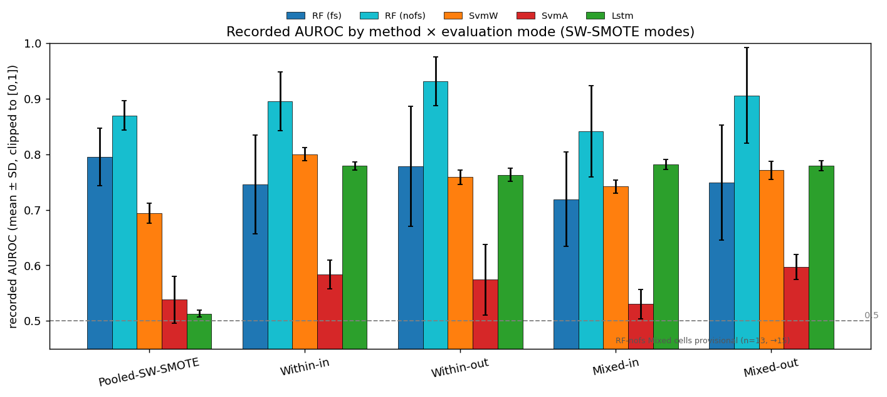
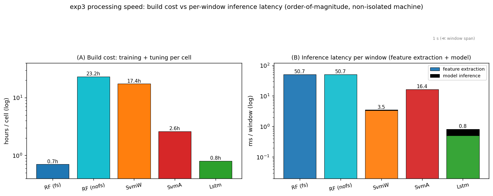

# exp3 c1 — Progress Summary (recorded AUROC × method × mode, and processing speed)

**Last updated: 2026-08-02.** Operational progress tracker for the exp3 "c1" grid. AUROC values are
the recorded metrics; the model-characteristic analysis is in
[c1_recorded_value_analysis.md](c1_recorded_value_analysis.md). The two **Within** modes are shown
here for progress completeness but are **retired** from the reported analysis (see
[within_retirement_plan.md](within_retirement_plan.md)); the deployable regimes are Pooled and Mixed.

## 1. Recorded AUROC by method × evaluation mode

Mean ± SD (n). All SW-SMOTE / Within / Mixed cells are complete; the **Pooled-base** column is the arm
reopened on 2026-08-12 (see the note below) and is interim at n=9 of 15 for RF-nofs.

| Method | Pooled-base | Pooled-SW-SMOTE | Within-in | Within-out | Mixed-in | Mixed-out |
|---|---|---|---|---|---|---|
| **RF (fs)** | 0.738 ± 0.090 (15) | 0.795 ± 0.052 (15) | 0.746 ± 0.089 (24) | 0.778 ± 0.108 (24) | 0.719 ± 0.085 (24) | 0.749 ± 0.104 (24) |
| **RF (nofs)** | **0.647 ± 0.055 (9)†** | 0.870 ± 0.026 (5) | 0.895 ± 0.053 (15) | 0.931 ± 0.044 (15) | 0.846 ± 0.077 (15) | 0.912 ± 0.081 (15) |
| **SvmW** | 0.519 ± 0.011 (6) | 0.694 ± 0.018 (6) | 0.800 ± 0.012 (8) | 0.759 ± 0.013 (8) | 0.742 ± 0.012 (8) | 0.771 ± 0.016 (8) |
| **SvmA** | 0.481 ± 0.008 (6) | 0.538 ± 0.042 (6) | 0.583 ± 0.026 (11) | 0.574 ± 0.064 (11) | 0.530 ± 0.026 (11) | 0.597 ± 0.022 (11) |
| **Lstm** | 0.512 ± 0.011 (6) | 0.513 ± 0.006 (6) | 0.779 ± 0.007 (15) | 0.763 ± 0.012 (15) | 0.782 ± 0.009 (15) | 0.779 ± 0.009 (15) |

† interim, run in progress (2026-08-13).

Every retained cell is CI-adequate (required n ≈ 11–12 for a 95 % CI half-width ≤ 0.05; RF-nofs Mixed
is the tightest constraint and is met at n=15). Lstm targets the DRT `event_label` (a different
construct from the KSS label the other four use), so its absolute level is not directly commensurable.

**Completion status (updated 2026-08-13):**

| Method | Status |
|---|---|
| RF (fs) | ✅ complete (all modes) |
| RF (nofs) | ⏳ Pooled-SW-SMOTE / Within / Mixed complete; **Pooled-base 9/15 running** (reopened 08-12) |
| SvmW | ✅ complete (Within/Mixed 8/8, Pooled-SW-SMOTE 6/6) |
| SvmA | ✅ complete (Within/Mixed 11/11, Pooled-SW-SMOTE 6/6) |
| Lstm | ✅ complete (all modes) |

- **The exp3 c1 recorded-value campaign is complete** *for the cells listed above*. Remaining downstream
  work is the TIV2026_exp3 manuscript revision from this finalized set.

**Reopened 2026-08-12 — one cell was missing all along: RF-nofs × Pooled-base (no rebalancing).**
It had **0 runs**, not merely too few, and the "no Pooled-base arm by design" note in the analysis
write-ups was never backed by a recorded decision. Launched 2026-08-12 22:17 (10 seeds, extended to 15
on 08-13), plus a 6th Pooled-SW-SMOTE seed so the paired imbalance test can clear p<0.05.

| status 2026-08-13 09:30 | |
|---|---|
| Pooled-base seeds done | **9 / 15** (0,1,7,13,123,256,512,1337,2025), zero failures, 3.7–9.8 h each |
| interim value | **0.647 ± 0.055** (AUPRC 0.093) — seed-adequate already (hw 0.042, req_n ≈ 5) |
| still running | base s42 + wave-2 seeds 2024,3,5,9,11; SW-SMOTE s7 |
| ETA | **2026-08-13 evening** (~24 h ahead of the original estimate) |

**The filled cell reverses the RF feature-count effect.** RF-nofs (0.647) lands **below** RF-fs (0.738)
under Pooled-base, the opposite of every other retained mode — the full feature set helps only once the
imbalance is handled, and RF-nofs's imbalance response (≈+0.23) is the largest of any method in the
study. Details and the consequences for §C/§D1/§D2 are in
[c1_recorded_value_analysis.md](c1_recorded_value_analysis.md) §A.

*Recorded AUROC (mean ± SD, clipped to [0,1]) by method across the five SW-SMOTE modes. RF-nofs is
highest but most dispersed; in the deployable Mixed modes the top-10 RF-fs is 4th of 5 (SvmW and Lstm
above it); SvmA sits near the 0.5 line throughout.*

## 2. Processing speed (added as an evaluation metric per advisor's suggestion)

Two cost axes are reported: **training/tuning cost** (the price of building each detector) and
**inference latency** (the deployment-relevant per-window prediction speed).

> **Measurement environment (all §2 timings are hardware-specific).** Laptop workstation — **CPU**
> Intel Core i9-12900HK (14 cores / 20 threads, up to ~5 GHz, AVX2); **64 GB** RAM; **GPU** NVIDIA
> RTX 3060 Laptop (6 GB, driver 596.08); **OS** Windows 11 (build 22631), with the GPU training jobs
> (Lstm / TensorFlow, SvmA / cuML) run under WSL2. **Software** Python 3.11.9, numpy 1.26.4, scipy
> 1.16.3, scikit-learn 1.5.2, pandas 2.2.3, TensorFlow 2.13.1. Training wall-times (2a) come from
> mixed Windows-CPU (RF, SvmW) and WSL2-GPU (Lstm, SvmA) runs on a **shared, non-isolated** machine;
> the inference / extraction micro-benchmarks (2b–2d) are **CPU single-thread**, with the Lstm forward
> pass on CPU (CUDA disabled). All numbers are order-of-magnitude and would differ on other hardware.

### 2a. Training + tuning wall-time per cell (measured from the c1 run logs)

Each cell is one seed × mode fit including its hyperparameter search (Optuna for RF/SvmW/Lstm, PSO
for SvmA).

| Method | Learner / tuning | Median | Range | Notes |
|---|---|---|---|---|
| **RF (fs)** | RandomForest + Optuna, top-10 | **0.7 h** | 0.4–1.9 h | cheapest |
| **Lstm** | Bi-LSTM (GPU) | **0.8 h** | 0.4–1.5 h | GPU |
| **SvmA** | ANFIS/PSO + cuML-SVM (GPU) | **2.6 h** | 1.2–5.9 h | within/mixed; the Pooled SW-SMOTE arm is ~9–12.5 h (57 k-row subject-wise SMOTE) |
| **SvmW** | GHM-wavelet + SVM + Optuna | **17.4 h** | 6.3–101.8 h | wavelet-packet energy per window |
| **RF (nofs)** | RandomForest + Optuna, all 165 | **23.2 h** | 7.4–68.0 h | most expensive; 165-feature search |

**RF-nofs and SvmW are ~20–30× more expensive to train than RF-fs / Lstm.** RF-nofs's cost is the
165-feature Optuna search; SvmW's is the multiwavelet feature construction plus SVM tuning.

### 2b. Model-only inference latency (per-window prediction)

Model prediction time with the features already computed (300-tree RF and RBF-SVM on CPU
single-thread; Lstm is the BiLSTM-36 + attention forward pass measured with TF):

| Model | µs / window | windows / s |
|---|---|---|
| RF (top-10 features) | **24** | ~42,000 |
| RF (165 features) | 33 | ~30,000 |
| RBF-SVM (36 steering feats, 1750 SVs) | 110 | ~9,000 |
| **Lstm** (BiLSTM-36 + attention, seq 100×12) | **316** | ~3,200 |

Model-only, every method predicts a window in tens-to-hundreds of microseconds — trivially
real-time. But this excludes the feature extraction, which turns out to dominate (2c–2d).

### 2c. Feature-extraction cost per window (the dominant term)

Measured on a representative 300-sample window with the pipeline's own extractors:

| Feature family | ms / window / signal | used by |
|---|---|---|
| statistical + entropy (22 feats: Sample/Shannon entropy, Katz FD, moments, spectral) | **8.1** | SvmA, RF |
| GHM multiwavelet packet (8 band energies) | **3.4** | SvmW, RF |

The statistical/entropy family is expensive because **Sample Entropy is O(n²)** in the window
length. This per-window preprocessing, not the model, is the real cost.

### 2d. End-to-end inference latency (feature extraction + model)

**Why feature extraction counts as inference cost, not build cost.** At *training* time the features
are extracted once over the training set — an offline, one-off cost folded into 2a. But a fielded
real-time detector receives raw steering / lane signals and must extract each **new** window's
features before the model can score it, so per-window extraction *recurs at inference, once per
prediction*. It would be a build-only cost only if every future window could be pre-extracted in
batch, which a streaming detector cannot do. The experiment measured 2b (model-only) because the
features were pre-computed offline into the processed CSVs; **2d is the latency a deployed detector
actually pays per window.** (If a deployment precomputes or incrementally maintains features, its
latency falls back toward 2b.)

Composed from the per-signal extraction cost × the signals each method actually uses, plus its
model inference:

| Method | features extracted at deployment | **end-to-end ms / window** |
|---|---|---|
| **RF (nofs)** | full 165-feature set (5 signals statistical incl SampleEntropy + 3 wavelet) | **~51** |
| **SvmA** | 2 steering signals × statistical/entropy (incl SampleEntropy) | **~16** |
| **SvmW** | 1 steering-wheel signal × GHM wavelet | **~3.5** |
| **RF (fs)** | only the 10 selected smooth features (~5 signals, no O(n²) entropy) | **~1–2** |
| **Lstm** | light std/mean/pred-error (no entropy) + BiLSTM | **~0.8** |

**The model-only ranking inverts — but only for RF-nofs.** RF-nofs has the fastest model yet the
*slowest* end-to-end, because it must compute the whole 165-feature set (including the O(n²) Sample
Entropy) before predicting. **RF-fs, by contrast, is fast end-to-end (~1–2 ms):** at deployment its
10 features are already fixed from training, so it extracts *only those*, and the selected set is
dominated by light smooth statistics — mean / std / prediction-error — that avoid the O(n²) entropy
entirely (verified on the recorded `feature_meta` artifacts, where the top-10 are all
`*_mean` / `*_std_dev` / `*_pred_error`). The ~51 ms full-extraction cost applies to RF-fs only
during *training*, where all 165 features are computed and then the top-10 is selected. So **RF-fs
and Lstm are the two cheapest end-to-end.** (Cost decomposition: Sample Entropy alone is 6.8 ms —
~84 % of the 8.1 ms statistical-feature cost — while all the cheap moments/percentiles + one FFT
total ~0.07 ms. Should a future selection pick an entropy feature, add ~6.8 ms per such feature.)

*Left: build cost (training + tuning) per cell, log scale — RF-nofs / SvmW ≈ 20–30× RF-fs / Lstm.
Right: per-window inference latency (feature extraction + model), log scale — extraction dominates,
and RF is heaviest end-to-end despite the fastest model.*

### 2e. Deployment reading — accuracy × speed trade-off

Reading the two cost axes against Mixed-regime accuracy (the deployable regime; all cells final):

| Method | Mixed AUROC (rank) | Build (h/cell) | End-to-end infer (ms/window) |
|---|---|---|---|
| **RF (nofs)** | **0.88 (1st)** | 23.2 | ~51 |
| **Lstm** | 0.78 (2nd) | **0.8** | **~0.8** |
| **SvmW** | 0.76 (3rd) | 17.4 | ~3.5 |
| **RF (fs)** | 0.73 (4th) | **0.7** | **~1–2** |
| **SvmA** | 0.56 (5th) | 2.6 | ~16 |

- **No method is ruled out for real-time use.** A KSS/DRT window spans seconds, so even the heaviest
  end-to-end pipeline (RF-nofs, ~51 ms) is ~200× faster than real time.
- **Lstm and RF-fs are the two cheapest end-to-end** (~0.8–2 ms); both build cheaply too (~0.8 / 0.7 h).
- **Among these two, Lstm Pareto-dominates RF-fs:** at comparable cost it is 2nd in Mixed accuracy
  versus RF-fs's 4th. RF-fs is *not* dominated on speed — its earlier "~51 ms" was a mistake (that is
  the training-time full extraction; a deployed RF-fs extracts only its 10 fixed smooth features).
- **RF-nofs buys the top accuracy at the highest cost on both axes** (23 h to build, ~51 ms/window),
  because it keeps the whole feature set (including the O(n²) entropy features) at inference.
- **SvmW** trades a heavy build (17 h) for light inference (~3.5 ms); **SvmA** is mid-cost but lowest
  accuracy.
- **Net:** on cost-efficiency the field is **Lstm ≳ RF-fs ≫ SvmW > SvmA**, with **RF-nofs paying the
  most on both axes for its accuracy lead**. Which to field depends on how much the RF-nofs accuracy
  margin is worth against ~30× the build cost and ~25–50× the inference cost of Lstm / RF-fs.

**Caveats.** Training times are wall-clock from a shared, non-isolated machine (GPU/CPU contention),
so they are order-of-magnitude. Model timings are CPU single-thread (Lstm via TF). Feature-extraction
and end-to-end figures use a representative 300-sample window and the stated per-method signal
counts, so they are estimates; a rigorous end-to-end benchmark on isolated hardware with the exact
per-method signal set is a possible follow-up.

### 2f. Estimated timing on the target microcontroller (Renesas RH850) — rough extrapolation

The measurements above are on a laptop-class i9 + RTX 3060. The fielded target is a **Renesas RH850**
automotive MCU, orders of magnitude slower for this numeric workload. Taking a representative core
(e.g. an RH850/G4MH-class ~240 MHz single core with a single-precision FPU and no wide SIMD), scalar
floating-point throughput is roughly **100–1000× below the i9** (≈20× from clock × ≈10–50× from the
out-of-order execution, caches, and AVX2 / BLAS vectorisation the MCU lacks). Scaling the per-window
end-to-end latency (§2d) by that band:

| Method | desktop end-to-end | **RH850 estimate (×100–1000)** |
|---|---|---|
| **Lstm** | ~0.8 ms | **~0.1–0.8 s** |
| **RF (fs)** | ~1–2 ms | **~0.1–2 s** |
| **SvmW** | ~3.5 ms | **~0.4–3.5 s** |
| **SvmA** | ~16 ms | **~1.6–16 s** |
| **RF (nofs)** | ~51 ms | **~5–51 s** |

Reading, against a window that spans a few seconds:

- **Lstm, RF-fs and SvmW are plausibly real-time on RH850**; **SvmA and especially RF-nofs likely
  exceed the window budget** (RF-nofs must compute the full 165-feature set, including the O(n²)
  Sample Entropy) → not real-time without heavy optimisation.
- **Model size is a separate — and harder — blocker (see 2g).** The RF ensembles are hundreds of MB
  to >1 GB (even RF-fs), far beyond RH850 flash; SvmA ~12 MB is borderline; only Lstm (0.26 MB) and
  SvmW (~3 MB) fit comfortably. Fitting RF at all would need far fewer / shallower trees or a
  different model class.
- **First optimisation target:** the O(n²) Sample Entropy dominates the statistical-feature methods on
  an MCU — replacing it (or the whole statistical set) with cheaper features would give the largest
  win.

**Caveat — these are extrapolations, not measurements.** Actual RH850 time depends on the exact device
(clock, FPU presence, cache), a fixed-point-vs-float C reimplementation, the compiler, and the memory
layout. A real figure needs profiling a C port on the target silicon (or a cycle-accurate simulator);
the values above are only an order-of-magnitude feasibility guide. If the production design targets a
more capable automotive SoC (e.g. R-Car) for the ML stage rather than the RH850 MCU, the budget is far
looser and all four methods become comfortably real-time.

### 2g. Model size (flash / RAM footprint) — the harder RH850 constraint

Measured from the trained-model files on disk (c1 wasserstein runs):

| Method | Model size | Notes |
|---|---|---|
| **Lstm** | **0.26 MB** | Keras BiLSTM-36 + attention (weights only) |
| **SvmW** | **~3 MB** | RBF-SVM support vectors |
| **SvmA** | **~12 MB** | ANFIS/PSO + SVM |
| **RF (fs)** | **~50 MB – 1.7 GB (median ~220 MB)** | 300-tree ensemble, top-10 features |
| **RF (nofs)** | **~60 MB – 1.4 GB (median ~350 MB)** | 300-tree ensemble, 165 features |

- **RF ensembles are 2–4 orders of magnitude larger than the others** (hundreds of MB to >1 GB),
  because scikit-learn stores every tree node and the node count is driven by the ~57 k subject-wise
  SMOTE training samples × unbounded depth, **not by the feature count**. Consequently **RF-fs (top-10)
  is essentially as large as RF-nofs** — feature selection speeds up extraction and prediction (2d)
  but does **not** shrink the model. "RF-fs is light" is true for inference, false for footprint.
- **RH850 flash is typically ~2–16 MB.** Only **Lstm (0.26 MB) and SvmW (~3 MB) fit comfortably**;
  **SvmA (~12 MB) is borderline**; **RF (hundreds of MB) cannot fit without drastic reduction**
  (far fewer / shallower trees, or a different model class). So **model size — not compute — is the
  binding RH850 constraint**, and it favours Lstm / SvmW even more sharply than the latency does.
- **Caveat:** these are Python pickle sizes (verbose); a compact C / fixed-point export would be
  smaller, but an RF with millions of nodes remains fundamentally large, whereas the BiLSTM and the
  SVM support-vector set compress to well under an MB / a few MB.
