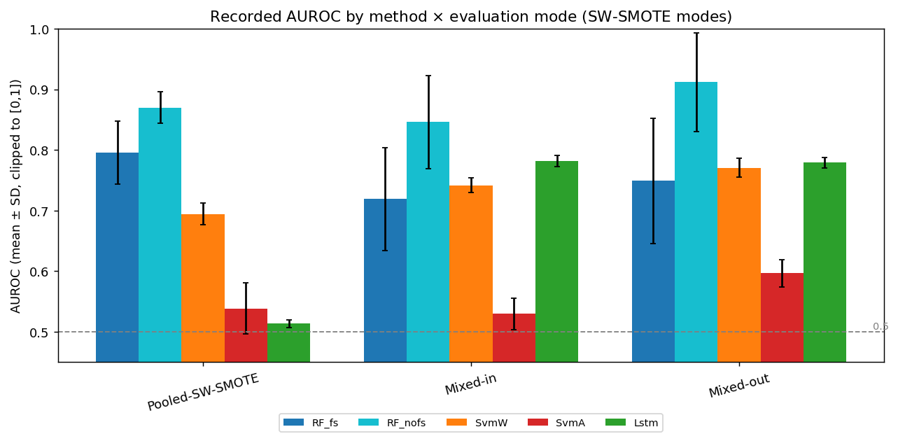
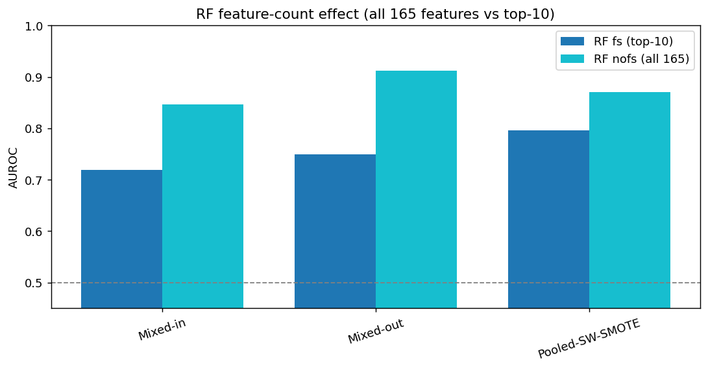
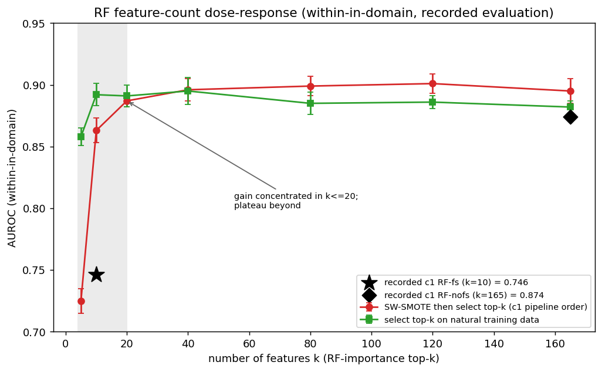
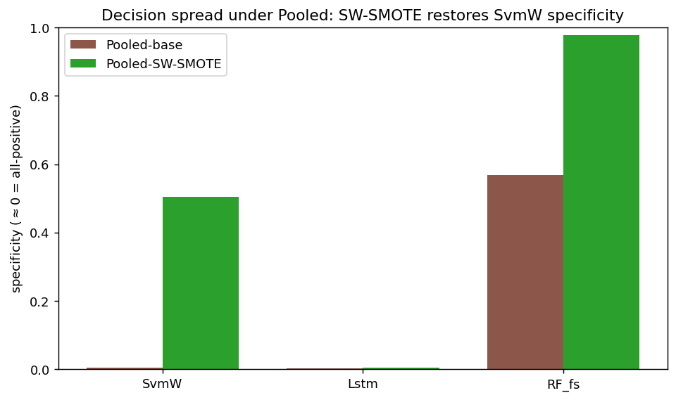
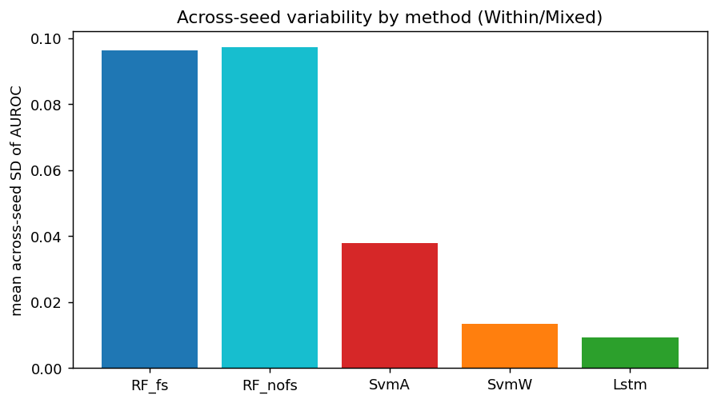
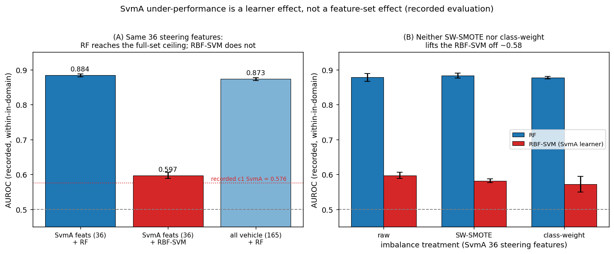
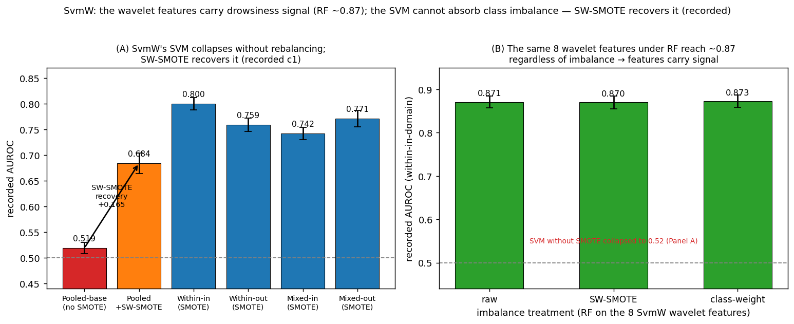
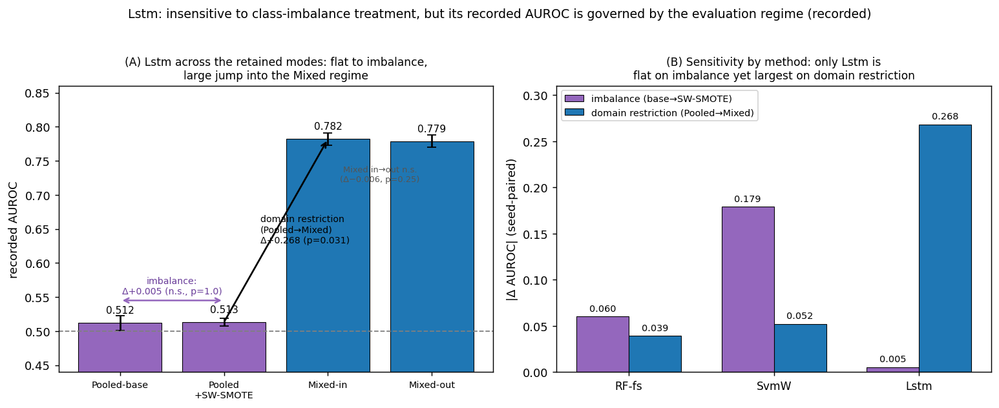
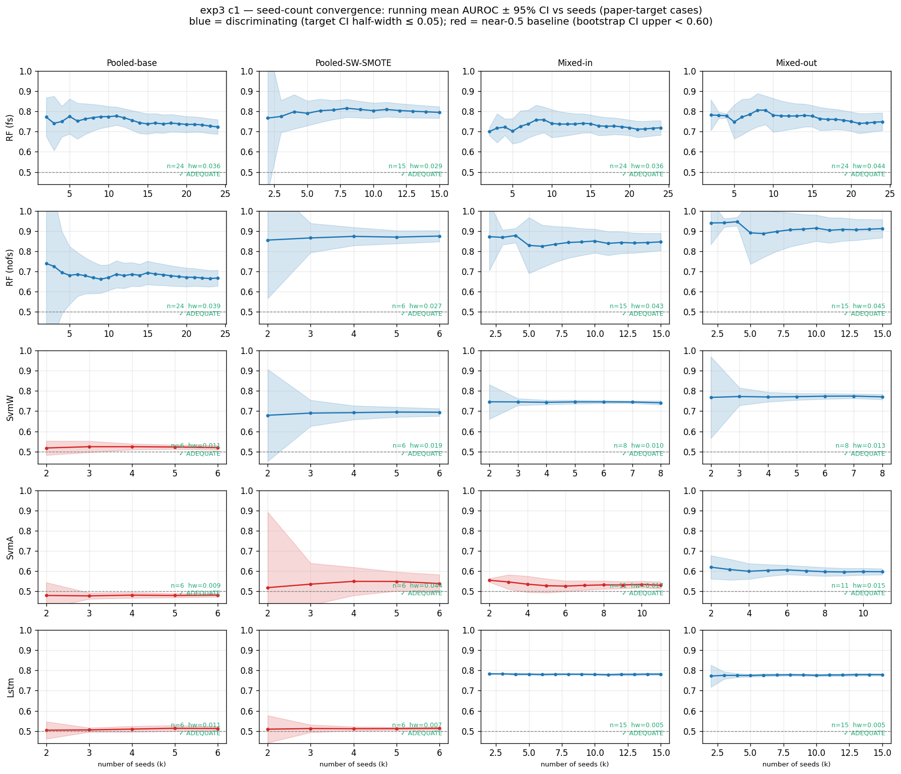

# exp3 c1 — Statistical Characterisation of the Recorded Evaluation Metrics

**Scope.** A model-characteristic analysis of the exp3 "c1" recorded AUROC metrics: 5 methods
× 4 evaluation modes — the deployable **Pooled** and **Mixed** regimes (Within and Cross retired,
see [within_retirement_plan.md](within_retirement_plan.md)). The goal is to characterise the
*model-dependent structure* of the recorded metrics — how the methods differ, and how each method
responds to imbalance handling and to domain restriction — using standard inferential statistics.
This is a descriptive/methodological summary of the recorded metrics under the pooled / mixed
evaluation protocol; it is a cross-method comparison, not a claim about absolute out-of-sample
performance.

- **Methods:** RF (feature-selection on, top-10), RF-nofs (feature-selection off, all 165
  vehicle-dynamics features), SvmW (Zhao steering-wavelet SVM), SvmA (Arefnezhad ANFIS/PSO SVM),
  Lstm (Wang Bi-LSTM; target = DRT `event_label`, a different construct from the KSS label
  used by the other four).
- **Modes:** Pooled-base (no imbalance handling), Pooled-SW-SMOTE, Mixed-in, Mixed-out. (The
  Within modes are retired; `mixed` trains on all 87 recordings and evaluates on a domain subgroup,
  a deployable operating point, whereas `within` trains on the target group alone.)
- **Metric:** AUROC per seed (with AUPRC, confusion-matrix quantities, and predicted-probability
  spread collected for the degeneracy analysis).
- **Reproducibility:** `scripts/python/analysis/exp3_c1_recorded_value_analysis.py`. Tools:
  scipy / numpy / pandas / matplotlib (Dunn, Cliff's δ, Scheirer–Ray–Hare implemented in-script).

> **Status (2026-08-03).** The recorded-value campaign is **complete** — all methods × the retained
> Pooled/Mixed modes are final (RF-nofs reached its full 15-seed extension on 2026-08-02). The Part B
> mechanism probes (Figures 5–7) report **pooled** (the deployment regime), with **mixed-in retained
> as a diagnostic**. Sections A–E below are the finalized numbers.

> **Migration in progress — see [within_retirement_plan.md](within_retirement_plan.md).** The two
> Within modes are being retired because `within` trains only on the target group, discarding the
> other group's data. The deployable regimes retained for reporting are Pooled (primary) and Mixed
> (diagnostic). The Part B mechanism probes (§D1b, §D4, §D5) now report `pooled`; Part A will
> rebuild Sections A–E without the Within columns once the RF-nofs seed extension is complete.

---

## A. Descriptive statistics and interval estimates (AUROC)

Mean ± SD (n); 95% t-CI and percentile bootstrap CI are computed in the script.

| Method | Pooled-base | Pooled-SW-SMOTE | Mixed-in | Mixed-out |
|---|---|---|---|---|
| **RF (fs)** | 0.738 ± 0.090 (15) | 0.795 ± 0.052 (15) | 0.719 ± 0.085 (24) | 0.749 ± 0.104 (24) |
| **RF (nofs)** | 0.670 ± 0.089 (10)† | 0.870 ± 0.026 (5) | 0.846 ± 0.077 (15) | 0.912 ± 0.081 (15) |
| **SvmW** | 0.519 ± 0.011 (6) | 0.694 ± 0.018 (6) | 0.742 ± 0.012 (8) | 0.771 ± 0.016 (8) |
| **SvmA** | 0.481 ± 0.008 (6) | 0.538 ± 0.042 (6) | 0.530 ± 0.026 (11) | 0.597 ± 0.022 (11) |
| **Lstm** | 0.512 ± 0.011 (6) | 0.513 ± 0.006 (6) | 0.782 ± 0.009 (15) | 0.779 ± 0.009 (15) |

† **Interim (2026-08-13, run in progress — 10 of 15 seeds).** This cell had **never been run**: the
earlier "RF-nofs has no Pooled-base arm by design" wording described the hole rather than a recorded
design decision, and no operations entry ever scoped the full-feature ablation to the SW-SMOTE arm. It
was launched 2026-08-12 and is filling to n=15. **It is not yet seed-adequate:** the 10th seed (s42)
came in at 0.875 against a 0.599–0.742 body, lifting SD from 0.055 to **0.089** and the 95 % CI
half-width to **0.063** (> the 0.05 target; req_n ≈ 13, so the planned n=15 covers it). That dispersion
is *expected*, not anomalous — it matches RF-fs Pooled-base almost exactly (SD 0.090, range
0.582–0.877), i.e. the seed instability §D3 already attributes to RF. §A–§F
and Figures 1–4 will be regenerated once the arm completes; **the numbers below that involve
Pooled-base for RF-nofs are therefore provisional, and §D1's scope changes — see the box after the
table.** The two Within modes are retired (see
[within_retirement_plan.md](within_retirement_plan.md)); Pooled and Mixed are the deployable
regimes. RF-nofs reached its full 15-seed extension (2026-08-02); all Mixed cells are final.

> ### ⚠ The filled cell reverses the RF feature-count effect (interim, 2026-08-13)
>
> In every other retained mode RF-nofs outscores RF-fs. **Under Pooled-base it is the other way round:
> 0.670 vs 0.738.** The full feature set helps only once the class imbalance is handled.
>
> | arm | AUROC | AUPRC | proba SD | pred-pos @0.5 |
> |---|---|---|---|---|
> | RF-fs Pooled-base (n=15) | 0.738 ± 0.090 | 0.239 | 0.013 | 0.444 |
> | **RF-nofs Pooled-base (n=10)†** | **0.670 ± 0.089** | **0.140** | 0.013 | 0.490 |
> | RF-fs Pooled-SW-SMOTE (n=15) | 0.795 ± 0.052 | 0.306 | 0.121 | 0.035 |
> | RF-nofs Pooled-SW-SMOTE (n=5) | 0.870 ± 0.026 | 0.521 | 0.141 | 0.051 |
>
> **Because both arms are this seed-noisy, the mean gap understates the effect — the seed-paired view is
> the informative one:** on the 10 shared seeds the median difference is **−0.176** and **7 of 10 seeds
> favour the top-10 variant** (Wilcoxon signed-rank **p = 0.049**; unpaired Mann–Whitney p = 0.063,
> Cliff's δ = −0.45). Marginal at n=10 — the remaining 5 seeds decide it.
>
> Consequences for the sections below, to be applied at regeneration:
>
> 1. **§D1 is rescoped.** "All 165 features instead of the top-10 raises RF's AUROC by ≈0.07–0.16 across
>    the retained modes" holds **under rebalancing only**; without it the sign flips (paired median −0.176).
> 2. **§C gains its missing contrast.** RF-nofs's seed-paired imbalance effect (base→SW-SMOTE) is
>    **≈+0.23** (median over the shared seeds) — the **largest of any method** (SvmW +0.179,
>    SvmA +0.068, RF-fs +0.060, Lstm +0.005). "RF is imbalance-robust" is a property of the **top-10**
>    variant, not of RF as such.
> 3. **§D2's degeneracy reading is unaffected but sharpened.** The probability spread is identical for
>    the two Pooled-base arms (0.013), so this is a genuine **ranking-quality** difference, not an
>    all-positive collapse of the SvmW kind. AUPRC localises it: 0.140 against a ~4.4 % base rate means
>    the 150 extra low-signal features dilute split quality for the rare class, which SW-SMOTE then
>    repairs (0.521).
>
> On the leak-cashing prerequisites this places **RF-nofs closer to SvmW (recoverable degradation) than
> to RF-fs (robust)**: the capacity to memorise overlapping rows is only cashable once rebalancing has
> restored a usable ranking.

*Figure 1. Recorded AUROC (mean ± SD, clipped to [0,1]) for each method across the SW-SMOTE
evaluation modes retained after the Within retirement (Pooled-SW-SMOTE, Mixed-in, Mixed-out;
Pooled-base omitted), with the 0.5 reference line. The error bars use the same SD as the "±" column
of the table above; they are clipped at 1.0 because a symmetric bar on a bounded metric can
otherwise overshoot for small-n, near-ceiling cells (e.g. RF-nofs Mixed-out, n=15, mean 0.912, SD
0.081). RF-nofs is the highest but with the widest dispersion; in the Mixed modes the top-10 RF-fs
is 4th of 5 (SvmW and Lstm both above it); SvmA is the lowest throughout.*

---

## B. Between-method differences within each mode (Kruskal–Wallis)

Kruskal–Wallis across the methods present in each mode, with η²_H, Dunn/Holm post-hoc and
Cliff's δ (details in the script). **The method effect is highly significant in every mode.**

| Mode | H | p | η²_H | Rank (mean AUROC) |
|---|---|---|---|---|
| Pooled-base | 27.4 | 4.8e-06 | 0.84 | RF-fs (0.738) ≫ SvmW ≈ Lstm ≈ SvmA (0.48–0.52) |
| Pooled-SW-SMOTE | 32.3 | 1.7e-06 | 0.86 | RF-nofs (0.870) > RF-fs (0.795) > SvmW > SvmA > Lstm |
| Mixed-in | 47.1 | 1.5e-09 | 0.63 | RF-nofs > **Lstm > SvmW > RF-fs** > SvmA |
| Mixed-out | 40.7 | 3.0e-08 | 0.54 | RF-nofs > **Lstm > SvmW > RF-fs** > SvmA |

- **Under Pooled-base only RF-fs separates from the 0.5 level** (RF-fs vs each of SvmW / SvmA /
  Lstm: p_holm ≤ 0.03, **Cliff's δ = 1.0**); the other three are statistically indistinguishable.
  † **Pending recomputation (2026-08-13):** RF-nofs, absent when this test was run, also separates from
  0.5 at 0.670, so the Pooled-base ranking becomes **RF-fs (0.738) > RF-nofs (0.670) ≫ the ~0.48–0.52
  chance band** — two RF variants above chance, not one, and the top-10 variant ahead of the full set.
- **RF (top-10) leads pooled only.** In both Mixed modes the top-10 RF-fs is **4th of 5**: setting
  Lstm aside as non-commensurable (DRT target), **SvmW beats RF-fs in both** (0.742 vs 0.719;
  0.771 vs 0.749). Only RF-nofs — this study's own full-feature ablation, and its most dispersed
  variant — leads Mixed. The defensible regime-scoped claim is that RF is the only method that
  works pooled and the only one domain restriction does not move (C), not that it has a higher
  Mixed ceiling.
- **SvmA is the consistent lowest rank** in every mode (p_holm < 0.02, |δ| ≥ 0.75–1.0).
- **RF-nofs is the consistent top rank** across the SW-SMOTE modes (mechanism in D1).

---

## C. Within-method mode contrasts (seed-paired Wilcoxon signed-rank)

Paired across shared seeds; median Δ and two-sided p. Contrasts are anchored on the retained
regimes: domain restriction is Pooled→Mixed and domain shift is Mixed in→out.

| Method | Imbalance (base→SW-SMOTE) | Domain restriction (Pooled→Mixed) | Domain shift (Mixed in→out) |
|---|---|---|---|
| **RF-fs** | Δ=+0.060, **p=0.035** | Δ=−0.039, **p=0.005** | Δ=+0.032 **p=8e-06** |
| **RF-nofs** | Δ≈+0.23†, p pending | Δ=+0.008, p=1.0 (n.s.) | Δ=+0.066 **p=6e-05** |
| **SvmW** | Δ=+0.179, **p=0.031** | Δ=+0.052, **p=0.031** | Δ=+0.030 **p=0.008** |
| **SvmA** | Δ=+0.068, p=0.063 | Δ=−0.017, p=0.69 (n.s.) | Δ=+0.060 **p=0.001** |
| **Lstm** | Δ=+0.005, **p=1.0 (inactive)** | Δ=+0.268, **p=0.031** | Δ=−0.006, p=0.25 (n.s.) |

† Interim, from the shared seeds available on 2026-08-13 (the Pooled-base arm is still filling; see §A).
The p-value is pending because a 5-pair Wilcoxon caps at p=0.0625 — a 6th Pooled-SW-SMOTE seed (s7) is
running so the test can reach p<0.05. **RF-nofs's imbalance response is the largest in the study**, which
means the imbalance-robustness attributed to "RF" belongs to the top-10 variant only.

- **Lstm is imbalance-inactive** (base→SW-SMOTE Δ≈0, p=1.0) but shows the **largest
  domain-restriction change** (Pooled→Mixed Δ=+0.27): its recorded AUROC is governed by the
  evaluation regime, not by rebalancing — consistent with its near-balanced DRT target. Notably its
  Mixed in→out shift is *not* significant (Δ=−0.006, p=0.25), so the swing is regime-driven, not a
  sensitivity to the in/out domain split (D6).
- **RF-fs has a small but significant imbalance change**, a significant Pooled→Mixed drop
  (Δ=−0.039), and significant, consistent in→out sensitivity.

---

## D. Model-characteristic quantities

### D1. RF feature-count effect (fs top-10 vs nofs all-165) — Mann–Whitney + Cliff's δ

| Mode | RF-fs | RF-nofs | Δ | p | Cliff's δ |
|---|---|---|---|---|---|
| **Pooled-base** | **0.738** | **0.670** | **−0.176**† (paired median) | **0.049** (Wilcoxon, n=10) | −0.45 (medium) |
| Pooled-SW-SMOTE | 0.795 | 0.870 | +0.074 | **0.008** | +0.79 (large) |
| Mixed-in | 0.719 | 0.846 | +0.127 | **1e-04** | +0.74 (large) |
| Mixed-out | 0.749 | 0.912 | +0.163 | **4e-05** | +0.79 (large) |

**Using all 165 features instead of the top-10 raises RF's recorded AUROC by ≈0.07–0.16 (large
effect) — but only in the rebalanced modes.** † The Pooled-base row (interim, added 2026-08-13 when the
never-run cell was filled) **reverses the sign: paired median −0.176, 7/10 seeds favouring the top-10
variant.** So the feature-count benefit is *conditional on imbalance handling*, not a property of the
feature set: at the natural 3.9 % minority rate the extra 150 features dilute rather than help
(AUPRC 0.140 vs RF-fs's 0.239). Note this row is seed-paired (Wilcoxon), unlike the unpaired
Mann-Whitney rows below, because both Pooled-base arms are highly seed-noisy (SD ~0.09). A controlled dose-response (D1b) further
shows the dependence **saturates by k≈20**, so it is not an open-ended benefit of ever-more features.
(RF-nofs Mixed cells are final at n=15.)

*Figure 2. RF feature-count effect: all 165 features (RF-nofs) vs the top-10 (RF-fs) per retained
mode (Pooled-SW-SMOTE, Mixed-in, Mixed-out).*

### D1b. Feature-count dose-response — where does the gain saturate?

The controlled probe is complete under **pooled** evaluation — the deployment regime that scores
the model on the whole 87-recording cohort (plain RF, RF-importance top-k, recorded evaluation, 3
seeds). It compares selecting top-k after SW-SMOTE (the c1 pipeline order) with selecting on the
natural training data.

**The dependence is not monotone to 165 — it saturates by k≈20 in both selection orders.** The
c1-order curve rises sharply before k=20 (0.69 at k=5 → 0.90 at k=20) and stays around 0.91
thereafter; natural-data selection is already near that plateau by k=5–10. The recorded pooled
anchors are RF-fs (Pooled-SW-SMOTE) = 0.795 and RF-nofs = 0.866, which are not directly comparable
to the simplified probe's absolute levels. The transferable result is the saturation shape, not the
raw level. The same k≈20 knee **reproduces under mixed-in** (the diagnostic regime; anchors 0.719 /
0.829).

Practical reading: **the probe supports a compact feature set (approximately 20 vehicle-dynamics
features); the top-10 arm's low recorded value is primarily consistent with the
SMOTE-before-selection order rather than with ten features being intrinsically insufficient.**

*Figure 5. Recorded pooled AUROC vs feature count k. Both selection orders plateau by k≈20; the
recorded c1 anchors (RF-fs k=10 = 0.795 ★, RF-nofs k=165 = 0.866 ◆) sit below the curve. Probe =
plain RF with fixed hyperparameters and a simplified evaluation split, so absolute levels are not
directly comparable to the tuned c1 pipeline; the saturation shape is what transfers (and it
reproduces under mixed-in, the diagnostic regime).*

### D2. Decision spread / degeneracy (specificity, predicted-positive rate)

| Method · mode | proba SD | specificity | pred-positive rate |
|---|---|---|---|
| SvmW · Pooled-base | 0.001 | 0.004 | 0.997 |
| SvmW · Pooled-SW-SMOTE | 0.199 | 0.540 | 0.472 |
| Lstm · Pooled-base | — | 0.003 | 0.999 |
| Lstm · Pooled-SW-SMOTE | — | 0.005 | 0.997 |
| RF-fs · Pooled-base | 0.013 | 0.569 | 0.444 |

Under Pooled-base **SvmW is an all-positive constant classifier** (probability spread ≈ 0,
specificity ≈ 0). **SW-SMOTE restores a usable probability ranking for SvmW** (spread 0.20,
specificity 0.50) — a de-degeneration. Lstm's Pooled collapse is a majority-class artefact of a
near-balanced target and is unaffected by SMOTE; RF is never degenerate.

*Figure 3. Specificity under Pooled (≈0 = all-positive). SW-SMOTE lifts SvmW's specificity from
≈0.004 to ≈0.50; Lstm stays collapsed; RF is non-degenerate.*

### D3. Across-seed stability (Brown–Forsythe equal-variance test per mode)

| Mode | RF-fs | RF-nofs | SvmW | SvmA | Lstm | Brown–Forsythe |
|---|---|---|---|---|---|---|
| Pooled-base | 0.090 | — | 0.011 | 0.008 | 0.011 | W=5.77, **p=0.003** |
| Pooled-SW-SMOTE | 0.052 | 0.026 | 0.018 | 0.042 | 0.006 | W=1.94, p=0.13 (n.s.) |
| Mixed-in | 0.085 | 0.077 | 0.012 | 0.026 | 0.009 | W=5.19, **p=0.001** |
| Mixed-out | 0.104 | 0.081 | 0.016 | 0.022 | 0.009 | W=4.41, **p=0.003** |

**RF (both variants) is markedly the least seed-stable method** — its across-seed SD (0.05–0.10)
is up to an order of magnitude larger than SvmW's / Lstm's (≈0.01), with significant variance
heterogeneity in every domain-restricted mode (the Pooled-SW-SMOTE heterogeneity is not
significant). This reflects the seed sensitivity of the RF ensemble + Optuna pipeline relative to
the near-deterministic SVM and LSTM pipelines.

*Figure 4. Mean across-seed SD of AUROC over the Mixed modes. RF ≫ SvmW / SvmA / Lstm.*

### D4. SvmA under-performance: a learner effect, not a feature-set effect

SvmA records the lowest AUROC of all methods (A: 0.53–0.60 within/mixed; 0.481 Pooled-base). On a
recorded-value basis the cause is the *learner*, not the steering feature set and not class
imbalance.

**Same features, different learner (recorded pooled).** SvmA's own 36 steering features fed to RF
reach 0.893, close to the full 165-feature vehicle set (0.904), whereas an RBF-SVM (SvmA's learner)
on the same 36 features gives only 0.544, matching the recorded SvmA Pooled-SW-SMOTE band (0.569,
A). The steering feature set is therefore not the bottleneck under the recorded protocol: it yields
as much recorded separability as the full set when a tree ensemble reads it; the RBF-SVM cannot.

| Feature set → learner | Recorded AUROC (pooled) |
|---|---|
| SvmA 36 steering → RF | 0.893 |
| SvmA 36 steering → RBF-SVM | 0.544 |
| all 165 vehicle → RF | 0.904 |

**Imbalance treatment does not lift the SVM.** Under the pooled recorded split, neither SW-SMOTE
nor class weighting moves the RBF-SVM off approximately 0.55 (0.558 / 0.557 / 0.544), while RF stays
around 0.88–0.90 across the same treatments. Class imbalance is therefore not the cause of SvmA's
low score. (The learner gap reproduces as a diagnostic under mixed-in: RF 0.877 vs RBF-SVM 0.544.)

**SvmA's bottom rank is thus a learner limitation** (RBF-SVM on steering features), not a deficient
feature set and not an imbalance artefact — unlike SvmW, whose Pooled degeneracy *is* a
decision-function artefact that SW-SMOTE repairs (D2).

*Figure 6. Recorded pooled AUROC. (A) The same 36 steering features reach the full-set ceiling
under RF (0.893 vs 0.904) but only 0.544 under the RBF-SVM that SvmA uses (≈ its recorded c1
Pooled-SW-SMOTE value 0.569). (B) Neither SW-SMOTE nor class weighting lifts the RBF-SVM off ~0.55,
while RF stays ~0.88–0.90. Probe = plain learners on a recorded-style split; the learner contrast is
the point (and it reproduces under mixed-in, the diagnostic regime).*

### D5. SvmW under imbalance: a recoverable learner degeneracy, not a feature deficit

SvmW behaves oppositely to SvmA. Its wavelet features carry recorded drowsiness signal, but its
SVM cannot absorb severe class imbalance unaided.

**Collapse under imbalance, recovery under SW-SMOTE.** Under Pooled-base (no resampling, natural
3.9% minority) SvmW degenerates to an all-positive constant classifier — AUROC 0.519, specificity
0.004, predicted-positive rate 0.997, probability SD 0.001 (D2). SW-SMOTE de-degenerates it: the
Pooled AUROC rises to 0.684 (+0.165), specificity to 0.540 and probability SD to 0.199 — a usable
ranking is restored. With SW-SMOTE in place, SvmW then delivers 0.74–0.77 across the Mixed modes
(A).

| SvmW (Pooled) | AUROC | specificity | pred-pos rate | proba SD |
|---|---|---|---|---|
| base (no SMOTE) | 0.519 | 0.004 | 0.997 | 0.001 |
| +SW-SMOTE | 0.684 | 0.540 | 0.472 | 0.199 |

**The features carry the signal.** The failure is the SVM's, not the feature set's: feeding SvmW's
8 steering-wheel wavelet features to RF (recorded-style, pooled) gives ~0.87 under *every*
imbalance treatment — raw 0.874, SW-SMOTE 0.878, class-weight 0.871 (Fig 7B) — so a robust learner
reads the recorded signal from them without any rebalancing, and once imbalance is handled the SVM
itself reaches 0.74–0.80. SvmW's low Pooled score is therefore a *recoverable* decision-function
degeneracy under imbalance — the mirror image of SvmA, whose low score is a learner ceiling that
rebalancing does not lift (D4). (The ~0.87 RF read reproduces as a diagnostic under mixed-in:
0.877 / 0.858 / 0.871.)

*Figure 7. (A) Recorded SvmW AUROC by regime: Pooled-base collapses to ~0.52 (all-positive),
SW-SMOTE recovers it to 0.684 (mixed shown as diagnostic). (B) The same 8 steering-wheel wavelet
features fed to RF reach ~0.87 under every pooled imbalance treatment (raw 0.874, SW-SMOTE 0.878,
class-weight 0.871) — a robust learner reads the recorded signal without rebalancing, so SvmW's
collapse is a learner–imbalance interaction, not a feature deficit. (The de-degeneration metrics —
specificity 0.004→0.540, predicted-positive rate 0.997→0.472, probability SD 0.001→0.199 — are
tabulated above.)*

### D6. Lstm: insensitive to imbalance, governed by the evaluation regime

Lstm's recorded AUROC is decoupled from class-imbalance treatment but strongly tied to the
evaluation regime. Seed-paired (C): the imbalance contrast (Pooled-base→Pooled-SW-SMOTE) is
Δ=+0.005 (p=1.0, inactive), whereas the domain-restriction contrast (Pooled→Mixed) is Δ=+0.268
(p=0.031) — the largest of any method. Its recorded AUROC swings from ~0.51 under Pooled to ~0.78
across the Mixed modes, while SW-SMOTE moves it by essentially zero.

| Lstm axis (seed-paired) | Δ AUROC | p |
|---|---|---|
| imbalance (base→SW-SMOTE) | +0.005 | 1.0 (inactive) |
| domain restriction (Pooled→Mixed) | +0.268 | 0.031 |
| domain shift (Mixed in→out) | −0.006 | 0.25 (n.s.) |

**Caution for domain-shift robustness.** Because Lstm's strong Mixed numbers are so
regime-dependent — collapsing to ~0.51 under Pooled — they are protocol-specific and should not be
read as evidence of robust generalisation. Two points sharpen this: (i) Lstm predicts the DRT
`event_label` (a near-balanced construct, different from the KSS label the other methods use), so
its Pooled behaviour and absolute levels are not directly comparable, and the large Pooled→Mixed
swing partly reflects that target rather than domain per se; (ii) the *pure* in→out domain-shift
effect is **not significant under Mixed** (Δ=−0.006, p=0.25), so the swing is a regime effect rather
than a sensitivity to the in/out domain split. The defensible reading is therefore: **Lstm's
recorded performance is governed by the evaluation protocol, not by class imbalance — so its high
domain-aware numbers warrant caution as an indicator of domain-shift robustness.**

*Figure 8. (A) Recorded Lstm AUROC across modes: the imbalance pair (Pooled-base vs Pooled-SW-SMOTE)
is flat (Δ+0.005), while the jump into the Mixed regime is large (Δ+0.268); the Mixed in→out shift
is not significant. (B) Seed-paired |ΔAUROC| by method: only Lstm is flat on the imbalance axis yet
largest on the domain-restriction (Pooled→Mixed) axis (RF-fs and SvmW both respond to imbalance).*

---

## E. Two-way structure (method × mode), Scheirer–Ray–Hare

With the Within modes retired, the balanced two-way design reduces to 5 methods × **2 Mixed modes
(in/out)** × 8 common seeds = 80 observations. The "mode" factor is therefore just the in/out domain
contrast (df=1) — a much weaker design than the previous four-sub-mode one.

| Effect | H | df | p |
|---|---|---|---|
| **Method** | 51.1 | 4 | **2.1e-10** |
| Mode (Mixed in/out) | — | 1 | 0.13 (n.s.) |
| Method × Mode | — | 4 | 0.83 (n.s.) |

**The classifier is the overwhelmingly dominant factor; the Mixed in/out contrast does not differ
significantly and there is no significant method × mode interaction.** With only two modes the
mode-effect test is low-powered, so this null should be read as "no *detectable* in/out difference
in the Mixed regime" rather than a strong claim of equivalence. The method ranking
(RF-nofs > Lstm > SvmW > RF-fs > SvmA) is stable across Mixed in/out.

---

## F. Seed-count convergence (per paper-target case)

Following the TIV2026 / exp2 seed-validity framework (exp2 fig8): for **every reported case** the
seeds are added one at a time (fixed augmentation order) and the running mean AUROC and its 95 %
t-CI half-width are tracked. A case is **adequate** when

- *discriminating* (running mean > 0.55): the 95 % CI half-width ≤ 0.05 **and** the running mean has
  flattened (last-3 span ≤ 0.01); or
- *near-0.5* (running mean ≤ 0.55): the percentile-bootstrap 95 % CI upper bound < 0.60 (excludes any
  weak signal).

**All 19 previously reported cells are adequate**; the 20th (RF-nofs × Pooled-base — never run, not
excluded by design; see §A) is **not yet adequate at the interim n=10** (SD 0.089, hw 0.063, req_n ≈ 13)
and is filling to n=15, which covers it. Final
95 % CI half-width per cell (✓ = adequate; "near-0.5" = judged by the bootstrap-upper < 0.60 rule):

| Method | Pooled-base | Pooled-SW-SMOTE | Mixed-in | Mixed-out |
|---|---|---|---|---|
| **RF (fs)** | n=15, hw 0.050 — **borderline** | n=15, hw 0.029 ✓ | n=24, hw 0.036 ✓ | n=24, hw 0.044 ✓ |
| **RF (nofs)** | n=10, hw 0.063 ✗† (→15) | **n=5, hw 0.032 ✓** | n=15, hw 0.043 ✓ | n=15, hw 0.045 ✓ |
| **SvmW** | n=6, hw 0.011 ✓(near-0.5) | n=6, hw 0.019 ✓ | n=8, hw 0.010 ✓ | n=8, hw 0.013 ✓ |
| **SvmA** | n=6, hw 0.009 ✓(near-0.5) | n=6, hw 0.044 ✓(near-0.5) | n=11, hw 0.017 ✓(near-0.5) | n=11, hw 0.015 ✓ |
| **Lstm** | n=6, hw 0.011 ✓(near-0.5) | n=6, hw 0.007 ✓(near-0.5) | n=15, hw 0.005 ✓ | n=15, hw 0.005 ✓ |

- **RF-nofs Pooled-SW-SMOTE is adequate at n=5** (CI half-width 0.032): the small seed count is
  offset by a low across-seed SD (0.026), so the running mean is already converged — **no extra
  seeds are required** for this cell despite its low n.
- **RF-fs Pooled-base is the one borderline cell** (n=15, CI half-width ≈0.050, exactly at the
  target): its running mean is flat at ~0.74 but the band stays wide because RF is the least
  seed-stable method (SD 0.090, §D3). It is effectively at the target — a handful more seeds would
  push it clearly under 0.05 if a strict margin is wanted, but the point estimate is stable.
- Every other reported cell converges with margin (CI bands narrow and means flatten with k).

*Figure. Running mean AUROC ± 95 % CI vs number of seeds for every method × mode reported. Blue =
discriminating (target CI half-width ≤ 0.05); red = near-0.5 baseline (bootstrap CI upper < 0.60). Each panel
annotates the final n, CI half-width and verdict. Reproducibility:
`scripts/python/analysis/exp3_c1_seed_convergence.py` (output also in
`results/analysis/exp3_verification/c1_seed_convergence.json`).*

---

## Synthesis — model-dependent structure of the recorded metrics

- **RF (fs):** separates from 0.5 under Pooled-base (B) — and on the interim evidence it is the
  **best** method there, ahead of the full-feature variant — with a small
  significant imbalance change (C); but the **least seed-stable** method (D3), and, with all
  features (RF-nofs), a **feature-count dependence** that saturates by k≈20 (D1, D1b).
- **RF-nofs:** the highest recorded AUROC **in the rebalanced modes**; the feature-count gain saturates
  by k≈20 (D1b) and, on the interim Pooled-base evidence, **reverses without rebalancing** (0.670 vs
  RF-fs's 0.738; paired median −0.176, p=0.049) — so its lead is conditional on imbalance handling, and its own imbalance response
  (≈+0.23) is the largest in the study (§A box, §C, §D1).
- **SvmW:** all-positive **degenerate** without rebalancing; SW-SMOTE **de-degenerates** it (D2,
  D5) and its wavelet features then deliver 0.74–0.77 in Mixed — a *recoverable* learner degeneracy
  under imbalance, not a feature deficit (mirror image of SvmA). But in the deployable regimes it
  still **beats the top-10 RF in Mixed** (B), so it is not dominated once Within is set aside.
- **SvmA:** bottom rank is a **learner limitation** (RBF-SVM), not a feature-set or imbalance
  effect — the same steering features under RF reach the full-set ceiling (D4).
- **Lstm:** **imbalance-inactive** (C, D2) but strongly **regime-driven** (largest Pooled→Mixed
  change, D6); its Mixed AUROC reflects the near-balanced DRT target, a different construct
  from the KSS label used by the other methods, so its absolute level is not directly comparable.
  Its performance is governed by the evaluation protocol rather than rebalancing — **so its high
  domain-aware numbers warrant caution as an indicator of domain-shift robustness** (D6).
- **Across methods (E):** the classifier dominates; mode and interaction are non-significant.
