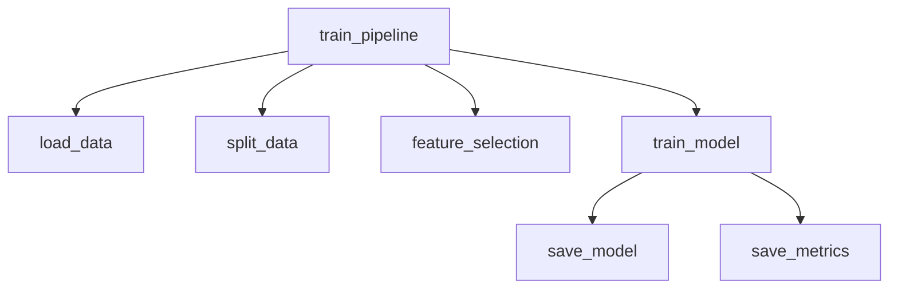
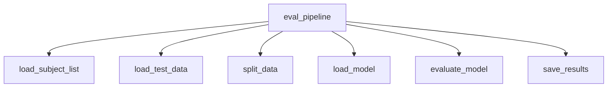
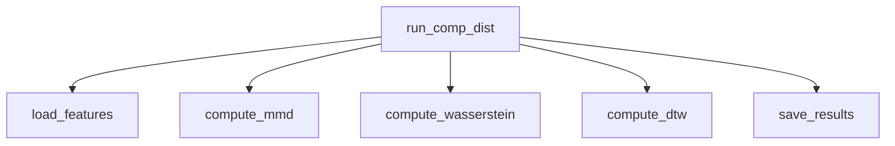

# Repository Architecture

## Overview

This document describes the architecture of the
*vehicle_based_DDD_comparison* repository.

The repository follows a structure inspired by
Cookiecutter Data Science:

```

.
├── config/             # Subject/group definitions, requirements
│   ├── general_subjects.txt
│   ├── subject_list.txt
│   ├── target_groups.txt
│   └── requirements.txt
│
├── data/               # Dataset storage (not tracked except README)
│   ├── interim/        # Intermediate cleaned data
│   ├── processed/      # Final processed datasets
│   └── README.md
│
├── docs/               # Documentation (Sphinx build + generated files)
│   ├── source/         # Developer and API guides
│   ├── bin/            # Auto-generated API docs for scripts
│   ├── _build/         # Sphinx build artifacts
│   ├── _modules/       # Sphinx autodoc modules
│   ├── _sources/       # Sphinx source cache
│   ├── _static/        # Static assets
│   ├── conf.py
│   └── index.rst
│
├── models/             # Saved model artifacts
│   ├── common/
│   ├── common_k10/
│   ├── common_k20/
│   ├── common_k40/
│   ├── Lstm/
│   ├── SvmA/
│   └── SvmW/
│
├── results/            # Experiment outputs
│   ├── evaluation/     # Evaluation metrics and thresholds
│   ├── domain_generalization/  # Domain distance results (MMD, Wasserstein, DTW)
│   ├── ranks10/        # Subject/group ranking results
│   ├── archive/        # Old runs or backups
│   └── README.md
│
├── scripts/            # Job scripts and utilities
│   ├── hpc/            # HPC job submission scripts (PBS etc.)
│   ├── python/         # Entry-point scripts (train, evaluate, preprocess, analyze, plot)
│   └── README.md
│
├── src/                # Core logic
│   ├── analysis/       # Distance metrics (MMD, Wasserstein, DTW)
│   ├── data/           # Data loaders, transformations
│   ├── data_pipeline/  # Dataset preparation workflows
│   ├── evaluation/     # Evaluation routines
│   ├── models/         # Pipelines and architectures
│   ├── utils/          # Shared helpers
│   └── config.py       # Central configuration

````

```mermaid
graph LR
  scripts_python[scripts/python: entry scripts] --> src[src: core logic]
  src --> models[models: saved models]
  src --> results[results: experiment outputs]
  results --> reports[reports: figures/tables]
  scripts_hpc[scripts/hpc: HPC jobs] -.-> scripts_python
````

---

## Entry-point Scripts (`scripts/python/`)

* **`preprocess.py`**
  Reads raw data (MAT files) and produces processed CSV files
  under `data/processed/`.

* **`train.py`**
  Parses command-line arguments (model, augmentation, split strategy, etc.)
  and forwards them to `src.models.model_pipeline.train_pipeline`.
  Supports optional domain generalization techniques such as Domain Mixup,
  CORAL, and VAE-based augmentation.
  Outputs trained models (`models/{model_type}/*.pkl`) and
  training-time metrics (`results/train/{model}/*`).

* **`evaluate.py`**
  Calls `src.evaluation.eval_pipeline.eval_pipeline`.
  Loads trained models and scalers, evaluates them on held-out data,
  and saves metrics (`results/evaluation/{model}/*`).

* **`analyze.py`**
  Provides a unified CLI interface for analysis tasks.
  Calls:

  * `src.analysis.distances.run_comp_dist` → Compute domain distance matrices
  * `src.analysis.rank_export.run_rank_export` → Export ranked subject lists
  * `src.analysis.correlation.run_distance_vs_delta` → Correlate distances with Δmetrics
  * `src.analysis.summary_groups.run_summarize_only10_vs_finetune` → Summarize per-group results

---

## Core Modules (`src/`)

* **`src/models/model_pipeline.py`**
  Orchestrates training (`train_pipeline`).
  Handles subject splits, feature selection, model training,
  and saving artifacts. Evaluation is separated to `src/evaluation/eval_pipeline.py`.

* **`src/models/architectures/*`**
  Defines individual models (RF, SVM-A, SVM-W, LSTM).

* **`src/analysis/distances.py`**
  Implements domain distance computation (`run_comp_dist`).

---

## Pipelines and Function Dependencies

### Preprocessing Pipeline (`src/data_pipeline/processing_pipeline.py`)

This module orchestrates all preprocessing steps before training or evaluation.
It defines `main_pipeline`, which dynamically applies feature extraction
based on the model type.

```mermaid
graph TD
  main_pipeline --> read_subject_list
  main_pipeline --> time_freq_domain_process
  main_pipeline --> wavelet_process
  main_pipeline --> smooth_std_pe_process
  main_pipeline --> eeg_process
  main_pipeline --> pupil_process
  main_pipeline --> perclos_process
  main_pipeline --> merge_process
  main_pipeline --> kss_process
```

| Step / Function            | Input                     | Output                         | Notes                                       |
| -------------------------- | ------------------------- | ------------------------------ | ------------------------------------------- |
| `read_subject_list`        | `config/subject_list.txt` | list of subject IDs            | Provides subjects for iteration             |
| `time_freq_domain_process` | subject, model            | CSV (`time_freq_domain_*.csv`) | For SvmA and common models                  |
| `wavelet_process`          | subject, model            | CSV (`wavelet_*.csv`)          | For SvmW and common models                  |
| `smooth_std_pe_process`    | subject, model            | CSV (`smooth_std_pe_*.csv`)    | For Lstm and common models                  |
| `eeg_process`              | subject, model            | CSV (`eeg_*.csv`)              | Always executed                             |
| `pupil_process`            | subject, model            | CSV (`pupil_*.csv`)            | Currently disabled (commented out)          |
| `perclos_process`          | subject, model            | CSV (`perclos_*.csv`)          | Currently disabled (commented out)          |
| `merge_process`            | subject, model            | CSV (`merged_*.csv`)           | Joins features on `Timestamp`               |
| `kss_process`              | subject, model            | CSV (`processed_*.csv`)        | Aligns Karolinska Sleepiness Scale (labels) |

**Outputs:**

* Interim CSV files saved under `data/interim/{feature}/{model}/`.
* Final processed per-subject datasets: `data/processed/{model}/processed_{subject}.csv`.

---

### `train_pipeline`



| Function            | Input                                             | Output                                                                                      | Notes                                                              |
| ------------------- | ------------------------------------------------- | ------------------------------------------------------------------------------------------- | ------------------------------------------------------------------ |
| `train_pipeline`    | dataset path(s), config params                    | trained model(s), metrics files                                                             | Orchestrates training workflow                                     |
| `load_data`         | `data/processed/*.csv`                            | `pandas.DataFrame`                                                                          | Reads preprocessed subject data                                    |
| `split_data`        | DataFrame, split strategy                         | Train/val/test DataFrames                                                                   | Supports random, subject-wise, time-stratified, or finetune splits |
| `feature_selection` | Training DataFrame, feature config                | Reduced feature DataFrame                                                                   | e.g. ANOVA, MI, RF importance                                      |
| `train_model`       | Reduced training set, model params                | fitted model object                                                                         | RF / SVM-A / SVM-W / LSTM                                          |
| `save_model`        | fitted model, scaler, features, metadata          | `models/{model_type}/*.pkl`, `feature_meta.json`                                            | Stored with joblib                                                 |
| `save_metrics`      | training logs, metrics (loss, F1, AUC, threshold) | `results/train/{model}/trainmetrics_*.{csv,json}`, `results/train/{model}/threshold_*.json` | Saved per model & suffix                                           |

---

### `eval_pipeline`



| Function            | Input                               | Output                                              | Notes                                             |
| ------------------- | ----------------------------------- | --------------------------------------------------- | ------------------------------------------------- |
| `eval_pipeline`     | trained model path, dataset path(s) | evaluation metrics                                  | Orchestrates evaluation workflow                  |
| `load_subject_list` | `config/subject_list.txt`           | subject IDs                                         | Reads subject list or fold-specific               |
| `load_test_data`    | `data/processed/*.csv`              | DataFrame                                           | Same preprocessing as training                    |
| `split_data`        | DataFrame, split strategy           | Train/val/test DataFrames                           | Supports `data_split` and `data_split_by_subject` |
| `load_model`        | model files + scaler + features     | fitted model, scaler, selected features             | joblib or keras                                   |
| `evaluate_model`    | model, test DataFrame               | metrics dict (accuracy, F1, AUC, precision, recall) | Uses model-specific evaluators                    |
| `save_results`      | metrics dict                        | results/evaluation/{model}/metrics_*.{csv,json}     | Saves JSON (timestamped) + CSV                    |

---

### Domain Distance Pipeline (`src/analysis/distances.py`)

Implements `run_comp_dist()`, which orchestrates subject- and group-level
domain distance computation (MMD, Wasserstein, DTW).



| Function                | Input                                    | Output                               | Notes                                 |
| ----------------------- | ---------------------------------------- | ------------------------------------ | ------------------------------------- |
| `run_comp_dist()`       | subject list, data root                  | distance matrices                    | Orchestrates domain distance analysis |
| `compute_mmd()`         | Feature arrays (source vs target groups) | MMD distance matrix (`.npy`)         | Kernel-based                          |
| `compute_wasserstein()` | Feature arrays                           | Wasserstein distance matrix (`.npy`) | Uses POT/OT library                   |
| `compute_dtw()`         | Time-series signals                      | DTW distance matrix (`.npy`)         | Uses fastdtw/scipy                    |

**Outputs:**

* `results/domain_generalization/mmd_matrix.npy`
* `results/domain_generalization/wasserstein_matrix.npy`
* `results/domain_generalization/dtw_matrix.npy`

---

## HPC Integration (`scripts/hpc/`)

The repository integrates with JAIST's Kagayaki HPC cluster using PBS job scripts.

* **General design**

  * Scripts under `scripts/hpc/{train,evaluate,domain_gen}`.
  * Environment setup: conda activation (`python310`), `PYTHONPATH` export, BLAS thread limiting.
  * Logs: `scripts/hpc/log/`.

* **Examples**

  * `scripts/hpc/domain_gen/pbs_compute_distances.sh`
    Submits a single job to compute domain distance matrices (MMD, Wasserstein, DTW).
    Runs `scripts/python/analyze.py comp-dist`.
    Output: `results/domain_generalization/*.npy`.

  * `scripts/hpc/domain_gen/pbs_rank.sh`
    Uses PBS job arrays (`-J 1-9`) to evaluate multiple groups in parallel.
    Supports run modes: `only_general`, `finetune`, `only_target`.
    Reuses or generates `pretrain_setting_*.pkl`.
    Calls `scripts/python/train.py` with `--mode`, `--tag`, and time-stratified options.
    Output: trained models (`models/{model_type}/`) and metrics (`results/train/{model}/`).

---

## Extensibility & Risks

* **Extensibility**

  * Add new models → `src/models/architectures/`
  * Add new distance metrics → `src/analysis/distances.py`
  * Add new domain-generalization methods → `src/utils/domain_generalization/`

* **Risks**

  * Some paths are partially hardcoded in job scripts
  * `results/` and `models/` can grow large → periodic cleanup recommended
  * Cache invalidation requires manual bump of cache version in `distances.py`

```

