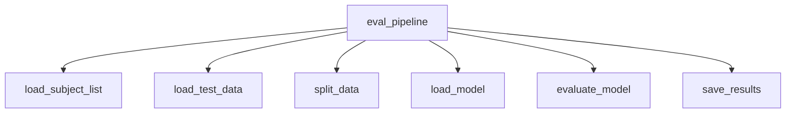
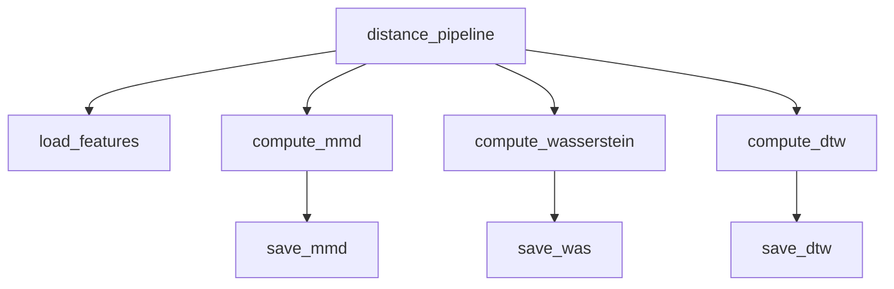

# Repository Architecture

## Overview

This document describes the architecture of the
*vehicle_based_DDD_comparison* repository.

The repository follows a structure inspired by
Cookiecutter Data Science:

```

.
├── config/             # Subject/group definitions, requirements
│   ├── general_subjects.txt
│   ├── subject_list.txt
│   ├── target_groups.txt
│   └── requirements.txt
│
├── data/               # Dataset storage (not tracked except README)
│   ├── interim/        # Intermediate cleaned data
│   ├── processed/      # Final processed datasets
│   └── README.md
│
├── docs/               # Documentation (Sphinx build + generated files)
│   ├── source/         # Developer and API guides
│   ├── bin/            # Auto-generated API docs for scripts
│   ├── _build/         # Sphinx build artifacts
│   ├── _modules/       # Sphinx autodoc modules
│   ├── _sources/       # Sphinx source cache
│   ├── _static/        # Static assets
│   ├── conf.py
│   └── index.rst
│
├── models/             # Saved model artifacts
│   ├── common/
│   ├── common_k10/
│   ├── common_k20/
│   ├── common_k40/
│   ├── Lstm/
│   ├── SvmA/
│   └── SvmW/
│
├── results/            # Experiment outputs
│   ├── evaluation/     # Evaluation metrics, thresholds
│   ├── archive/        # Old runs or backups
│   └── README.md
│
├── scripts/            # Job scripts and utilities
│   ├── hpc/            # HPC job submission scripts (PBS etc.)
│   ├── python/         # Entry-point scripts (train, evaluate, preprocess, analyze, plot)
│   └── README.md
│
├── src/                # Core logic
│   ├── analysis/       # Distance metrics (MMD, Wasserstein, DTW)
│   ├── data/           # Data loaders, transformations
│   ├── data_pipeline/  # Dataset preparation workflows
│   ├── evaluation/     # Evaluation routines
│   ├── models/         # Pipelines and architectures
│   ├── utils/          # Shared helpers
│   └── config.py       # Central configuration

```

```mermaid
graph LR
  scripts_python[scripts/python: entry scripts] --> src[src: core logic]
  src --> models[models: saved models]
  src --> results[results: experiment outputs]
  results --> reports[reports: figures/tables]
  scripts_hpc[scripts/hpc: HPC jobs] -.-> scripts_python
````

---

## Entry-point Scripts (`scripts/python/`)

* **`preprocess.py`**
  Reads raw data (MAT files) and produces processed CSV files
  under `data/processed/`.

* **`train.py`**
  Parses command-line arguments (model, augmentation, split strategy, etc.)
  and forwards them to `src.models.model_pipeline.train_pipeline`.
  Supports optional domain generalization techniques such as Domain Mixup,
  CORAL, and VAE-based augmentation.  
  Outputs trained models (`models/{model_type}/*.pkl`) and
  training-time metrics (`results/train/{model}/*`).

* **`evaluate.py`**
  Calls `src.evaluation.eval_pipeline.eval_pipeline`.  
  Loads trained models and scalers, evaluates them on held-out data,
  and saves metrics (`results/evaluation/{model}/*`).

* **`analyze.py`**
  Calls `src.analysis.distances.distance_pipeline`.

---

## Core Modules (`src/`)

* **`src/models/model_pipeline.py`**
  Orchestrates training (`train_pipeline`).
  Handles subject splits, feature selection, model training,
  and saving artifacts. Evaluation is separated to `src/evaluation/eval_pipeline.py`.

* **`src/models/architectures/*`**
  Defines individual models (RF, SVM-A, SVM-W, LSTM).

* **`src/analysis/distances.py`**
  Implements domain distance computation (`distance_pipeline`).

---

## Pipelines and Function Dependencies

### `train_pipeline`

```mermaid
graph TD
  train_pipeline --> load_data
  train_pipeline --> split_data
  train_pipeline --> feature_selection
  train_pipeline --> train_model
  train_model --> save_model
  train_model --> save_metrics
```

| Function            | Input                                             | Output                                        | Notes                           |
| ------------------- | ------------------------------------------------- | --------------------------------------------- | ------------------------------- |
| `train_pipeline`    | dataset path(s), config params                    | trained model(s), metrics files               | Orchestrates training workflow  |
| `load_data`         | `data/processed/*.csv`                            | `pandas.DataFrame`                            | Reads preprocessed subject data |
| `split_data`        | DataFrame, split strategy                         | Train/val/test DataFrames                     | Supports multiple strategies: random, subject-wise (GroupKFold), subject_time_split, finetune_target_subjects, etc. |
| `feature_selection` | Training DataFrame, feature config                | Reduced feature DataFrame                     | e.g. ANOVA, MI, RF importance   |
| `train_model`       | Reduced training set, model params                | fitted model object                           | RF / SVM-A / SVM-W / LSTM       |
| `save_model`        | fitted model, scaler, features, metadata          | `models/{model_type}/*.pkl`, `feature_meta.json` | Stored with pickle/joblib       |
| `save_metrics`      | training logs, metrics (loss, F1, AUC, threshold) | `results/train/{model}/trainmetrics_*.{csv,json}`, `results/train/{model}/threshold_*.json` | Saved per model & suffix        |

---

### `eval_pipeline`



| Function             | Input                               | Output                                                  | Notes                                 |
| -------------------- | ----------------------------------- | ------------------------------------------------------- | ------------------------------------- |
| eval_pipeline | trained model path, dataset path(s) | evaluation metrics | Orchestrates evaluation workflow |
| load_subject_list | config/subject_list.txt | subject IDs | Reads subject list or fold-specific |
| load_test_data | data/processed/*.csv | DataFrame | Same preprocessing as training |
| split_data | DataFrame, split strategy | Train/val/test DataFrames | data_split or data_split_by_subject|
| load_model | models/{model_type}/*.{pkl,keras}, scaler, features | fitted model, scaler, selected features | joblib or keras |
| evaluate_model | model, test DataFrame | metrics dict (accuracy, F1, AUC, precision, recall, report) | Uses model-specific eval (`lstm_eval`, `SvmA_eval`, `common_eval`) |
| save_results | metrics dict | results/evaluation/{model}/metrics_*.{csv,json} | Saves JSON (timestamped) + flattened CSV |

Notes:  
- Evaluation requires the exact `selected_features` and `scaler` saved during training.  
- LSTM uses `.keras` + scaler, classical ML uses `.pkl` + joblib.

---

### `distance_pipeline`



| Function              | Input                                    | Output                                       | Notes                                 |
| --------------------- | ---------------------------------------- | -------------------------------------------- | ------------------------------------- |
| `distance_pipeline`   | subject list, data root                  | distance matrices                            | Orchestrates domain distance analysis |
| `load_features`       | Cached features (`.pkl`, `.npy`)         | Feature arrays                               | Reuses cache if available             |
| `compute_mmd`         | Feature arrays (source vs target groups) | MMD distance matrix (`.npy`)                 | Kernel-based                          |
| `compute_wasserstein` | Feature arrays                           | Wasserstein distance matrix (`.npy`)         | Uses POT/OT library                   |
| `compute_dtw`         | Time-series signals                      | DTW distance matrix (`.npy`)                 | Uses fastdtw/scipy                    |
| `save_mmd`            | MMD results                              | `results/mmd/mmd_matrix.npy`                 | Numpy array                           |
| `save_was`            | Wasserstein results                      | `results/wasserstein/wasserstein_matrix.npy` | Numpy array                           |
| `save_dtw`            | DTW results                              | `results/dtw/dtw_matrix.npy`                 | Numpy array                           |

---

## Data Flow and Artifacts

| Stage      | Input                    | Output                                                  |
| ---------- | ------------------------ | ------------------------------------------------------- |
| Preprocess | `data/raw/*.mat`         | `data/processed/*.csv`                                  |
| Training   | processed data           | `models/*.pkl`, `results/trainmetrics_*.csv`            |
| Evaluation | models, processed data   | `results/evalmetrics_*.csv`, `results/threshold_*.json` |
| Analysis   | cached features, results | `results/mmd/*.npy`, `reports/figures/*.png`            |

---

## HPC Integration (`jobs/`)

* PBS job scripts invoke entry scripts (`bin/*`)
* Job arrays used for cross-validation and group evaluation
* Resource requests: `ncpus`, `mem`, `walltime` specified per pipeline

---

## Extensibility & Risks

* **Extensibility**:

  * New models → add under `src/models/architectures/`
  * New distance metrics → extend `src/analysis/distances.py`

* **Risks**:

  * Hardcoded paths in some scripts
  * Results and models directories can grow large → need cleanup strategy

