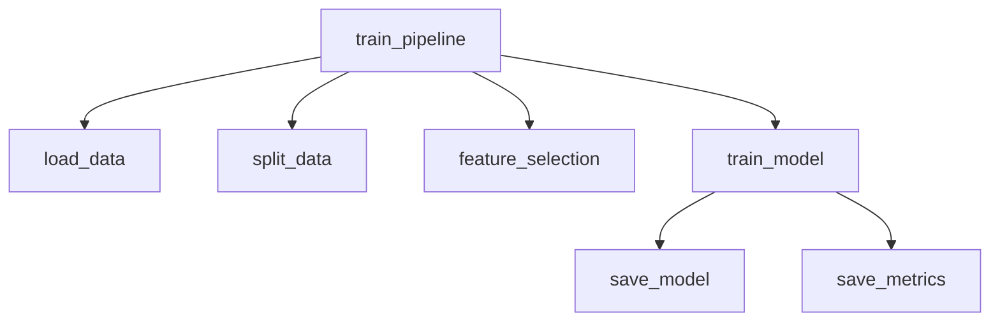
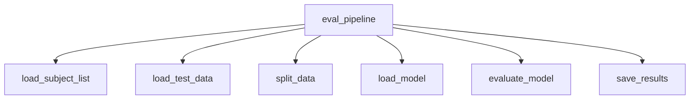
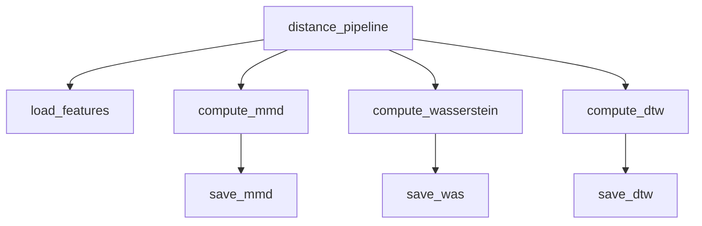

# Repository Architecture

## Overview

This document describes the architecture of the
*vehicle_based_DDD_comparison* repository.

The repository follows a structure inspired by
Cookiecutter Data Science:

```

.
├── config/             # Subject/group definitions, requirements
│   ├── general_subjects.txt
│   ├── subject_list.txt
│   ├── target_groups.txt
│   └── requirements.txt
│
├── data/               # Dataset storage (not tracked except README)
│   ├── interim/        # Intermediate cleaned data
│   ├── processed/      # Final processed datasets
│   └── README.md
│
├── docs/               # Documentation (Sphinx build + generated files)
│   ├── source/         # Developer and API guides
│   ├── bin/            # Auto-generated API docs for scripts
│   ├── _build/         # Sphinx build artifacts
│   ├── _modules/       # Sphinx autodoc modules
│   ├── _sources/       # Sphinx source cache
│   ├── _static/        # Static assets
│   ├── conf.py
│   └── index.rst
│
├── models/             # Saved model artifacts
│   ├── common/
│   ├── common_k10/
│   ├── common_k20/
│   ├── common_k40/
│   ├── Lstm/
│   ├── SvmA/
│   └── SvmW/
│
├── results/            # Experiment outputs
│   ├── evaluation/     # Evaluation metrics, thresholds
│   ├── archive/        # Old runs or backups
│   └── README.md
│
├── scripts/            # Job scripts and utilities
│   ├── hpc/            # HPC job submission scripts (PBS etc.)
│   ├── python/         # Entry-point scripts (train, evaluate, preprocess, analyze, plot)
│   └── README.md
│
├── src/                # Core logic
│   ├── analysis/       # Distance metrics (MMD, Wasserstein, DTW)
│   ├── data/           # Data loaders, transformations
│   ├── data_pipeline/  # Dataset preparation workflows
│   ├── evaluation/     # Evaluation routines
│   ├── models/         # Pipelines and architectures
│   ├── utils/          # Shared helpers
│   └── config.py       # Central configuration

```

```mermaid
graph LR
  scripts_python[scripts/python: entry scripts] --> src[src: core logic]
  src --> models[models: saved models]
  src --> results[results: experiment outputs]
  results --> reports[reports: figures/tables]
  scripts_hpc[scripts/hpc: HPC jobs] -.-> scripts_python
````

---

## Entry-point Scripts (`scripts/python/`)

* **`preprocess.py`**
  Reads raw data (MAT files) and produces processed CSV files
  under `data/processed/`.

* **`train.py`**
  Parses command-line arguments (model, augmentation, split strategy, etc.)
  and forwards them to `src.models.model_pipeline.train_pipeline`.
  Supports optional domain generalization techniques such as Domain Mixup,
  CORAL, and VAE-based augmentation.  
  Outputs trained models (`models/{model_type}/*.pkl`) and
  training-time metrics (`results/train/{model}/*`).

* **`evaluate.py`**
  Calls `src.evaluation.eval_pipeline.eval_pipeline`.  
  Loads trained models and scalers, evaluates them on held-out data,
  and saves metrics (`results/evaluation/{model}/*`).

* **`analyze.py`**
  Calls `src.analysis.distances.distance_pipeline`.

---

## Core Modules (`src/`)

* **`src/models/model_pipeline.py`**
  Orchestrates training (`train_pipeline`).
  Handles subject splits, feature selection, model training,
  and saving artifacts. Evaluation is separated to `src/evaluation/eval_pipeline.py`.

* **`src/models/architectures/*`**
  Defines individual models (RF, SVM-A, SVM-W, LSTM).

* **`src/analysis/distances.py`**
  Implements domain distance computation (`distance_pipeline`).

---

## Pipelines and Function Dependencies

## Preprocessing Pipeline (`src/data_pipeline/processing_pipeline.py`)

This module orchestrates all preprocessing steps before training or evaluation.
It defines `main_pipeline`, which dynamically applies feature extraction
based on the model type.

```mermaid
graph TD
  main_pipeline --> read_subject_list
  main_pipeline --> time_freq_domain_process
  main_pipeline --> wavelet_process
  main_pipeline --> smooth_std_pe_process
  main_pipeline --> eeg_process
  main_pipeline --> pupil_process
  main_pipeline --> perclos_process
  main_pipeline --> merge_process
  main_pipeline --> kss_process
```

| Step / Function             | Input                    | Output                         | Notes                                       |
| ----------------------------| ------------------------ | ------------------------------ | ------------------------------------------- |
| `read_subject_list`         | `config/subject_list.txt` | list of subject IDs            | Provides subjects for iteration             |
| `time_freq_domain_process`  | subject, model           | CSV (`time_freq_domain_*.csv`) | For SvmA and common models                  |
| `wavelet_process`           | subject, model           | CSV (`wavelet_*.csv`)          | For SvmW and common models                  |
| `smooth_std_pe_process`     | subject, model           | CSV (`smooth_std_pe_*.csv`)    | For Lstm and common models                  |
| `eeg_process`               | subject, model           | CSV (`eeg_*.csv`)              | Always executed                             |
| `pupil_process`             | subject, model           | CSV (`pupil_*.csv`)            | Currently disabled (commented out)          |
| `perclos_process`           | subject, model           | CSV (`perclos_*.csv`)          | Currently disabled (commented out)          |
| `merge_process`             | subject, model           | CSV (`merged_*.csv`)           | Joins features on `Timestamp`               |
| `kss_process`               | subject, model           | CSV (`processed_*.csv`)        | Aligns Karolinska Sleepiness Scale (labels) |

**Outputs:**
- Interim CSV files saved under `data/interim/{feature}/{model}/`.
- Final processed per-subject datasets: `data/processed/{model}/processed_{subject}.csv`.

**Notes:**
- Supports optional jittering augmentation.
- Serves as the data preparation stage before `train_pipeline`.

---


### `train_pipeline`



| Function            | Input                                             | Output                                        | Notes                           |
| ------------------- | ------------------------------------------------- | --------------------------------------------- | ------------------------------- |
| `train_pipeline`    | dataset path(s), config params                    | trained model(s), metrics files               | Orchestrates training workflow  |
| `load_data`         | `data/processed/*.csv`                            | `pandas.DataFrame`                            | Reads preprocessed subject data |
| `split_data`        | DataFrame, split strategy                         | Train/val/test DataFrames                     | Supports multiple strategies: random, subject-wise (GroupKFold), subject_time_split, finetune_target_subjects, etc. |
| `feature_selection` | Training DataFrame, feature config                | Reduced feature DataFrame                     | e.g. ANOVA, MI, RF importance   |
| `train_model`       | Reduced training set, model params                | fitted model object                           | RF / SVM-A / SVM-W / LSTM       |
| `save_model`        | fitted model, scaler, features, metadata          | `models/{model_type}/*.pkl`, `feature_meta.json` | Stored with pickle/joblib       |
| `save_metrics`      | training logs, metrics (loss, F1, AUC, threshold) | `results/train/{model}/trainmetrics_*.{csv,json}`, `results/train/{model}/threshold_*.json` | Saved per model & suffix        |

---

### `eval_pipeline`



| Function             | Input                               | Output                                                  | Notes                                 |
| -------------------- | ----------------------------------- | ------------------------------------------------------- | ------------------------------------- |
| eval_pipeline | trained model path, dataset path(s) | evaluation metrics | Orchestrates evaluation workflow |
| load_subject_list | config/subject_list.txt | subject IDs | Reads subject list or fold-specific |
| load_test_data | data/processed/*.csv | DataFrame | Same preprocessing as training |
| split_data | DataFrame, split strategy | Train/val/test DataFrames | data_split or data_split_by_subject|
| load_model | models/{model_type}/*.{pkl,keras}, scaler, features | fitted model, scaler, selected features | joblib or keras |
| evaluate_model | model, test DataFrame | metrics dict (accuracy, F1, AUC, precision, recall, report) | Uses model-specific eval (`lstm_eval`, `SvmA_eval`, `common_eval`) |
| save_results | metrics dict | results/evaluation/{model}/metrics_*.{csv,json} | Saves JSON (timestamped) + flattened CSV |

Notes:  
- Evaluation requires the exact `selected_features` and `scaler` saved during training.  
- LSTM uses `.keras` + scaler, classical ML uses `.pkl` + joblib.

---

### `distance_pipeline`



| Function              | Input                                    | Output                                       | Notes                                 |
| --------------------- | ---------------------------------------- | -------------------------------------------- | ------------------------------------- |
| `distance_pipeline`   | subject list, data root                  | distance matrices                            | Orchestrates domain distance analysis |
| `load_features`       | Cached features (`.pkl`, `.npy`)         | Feature arrays                               | Reuses cache if available             |
| `compute_mmd`         | Feature arrays (source vs target groups) | MMD distance matrix (`.npy`)                 | Kernel-based                          |
| `compute_wasserstein` | Feature arrays                           | Wasserstein distance matrix (`.npy`)         | Uses POT/OT library                   |
| `compute_dtw`         | Time-series signals                      | DTW distance matrix (`.npy`)                 | Uses fastdtw/scipy                    |
| `save_mmd`            | MMD results                              | `results/mmd/mmd_matrix.npy`                 | Numpy array                           |
| `save_was`            | Wasserstein results                      | `results/wasserstein/wasserstein_matrix.npy` | Numpy array                           |
| `save_dtw`            | DTW results                              | `results/dtw/dtw_matrix.npy`                 | Numpy array                           |

---

## Utility Modules (`src/utils/`)

The `utils` package provides shared helpers for I/O, domain generalization, and visualization.  
Here we document the I/O layer, which is critical for dataset preparation and experiment reproducibility.

### I/O Utilities (`src/utils/io/`)

#### `loaders.py`

| Function | Input | Output | Notes |
|----------|-------|--------|-------|
| `safe_load_mat(file_path)` | `.mat` file path | dict (matlab content) or `None` | Wraps `scipy.io.loadmat` with error handling |
| `read_subject_list()` | `config/subject_list.txt` | list of subject IDs | Reads all subjects |
| `read_subject_list_fold(fold)` | `config/subject_list_fold/subject_list_{fold}.txt` | list of IDs | Fold-specific split |
| `read_train_subject_list()` | `config/subject_list_train.txt` | list of IDs | Training-only subjects |
| `read_train_subject_list_fold(fold)` | `config/subject_list_fold/subject_list_train_{fold}.txt` | list of IDs | Fold-specific training split |
| `save_csv(df, subject_id, version, feat, model)` | DataFrame + metadata | writes CSV | Saves either interim (`data/interim/...`) or processed (`data/processed/...`) |
| `get_model_type(model_name)` | e.g. `RF`, `SvmA` | string | Maps to `"common"`, `"SvmA"`, `"SvmW"`, `"Lstm"` |
| `load_subject_csvs(subject_list, model_type, add_subject_id)` | subject IDs, model | `(DataFrame, feature_columns)` | Batch load processed subject CSVs |

---

#### `merge.py`

| Function | Input | Output | Notes |
|----------|-------|--------|-------|
| `load_feature_csv(feature, timestamp_col, model, subject_id, version)` | feature name + ids | DataFrame (with `Timestamp`) | Standardizes timestamp column |
| `merge_features(features, model, subject_id, version)` | dict of {feature → timestamp_col} | merged DataFrame | Aligns features by nearest timestamp |
| `merge_process(subject, model)` | `"S0210_1"`, `"common"` | writes `merged_*.csv` | Saves merged features via `save_csv` |
| `combine_file(subject)` | `"S0210_1"` | list[DataFrame] | Legacy loader for processed CSV |

---

#### `split.py`

| Function | Input | Output | Notes |
|----------|-------|--------|-------|
| `data_split(df, train/val/test ratios)` | DataFrame | (X_train, X_val, X_test, y_train, y_val, y_test) | Random split with stratification |
| `data_split_by_subject(df, train_subjects, …)` | DataFrame + subject lists | tuple of DataFrames | Ensures subject-level separation |
| `data_time_split_by_subject(df, subject_col, time_col, ratios)` | DataFrame | tuple of DataFrames | Preserves temporal order per subject |
| `time_stratified_three_way_split(df, label_col, …)` | DataFrame | (idx_train, idx_val, idx_test) | Finds optimal time cutpoints to balance label distribution |

**Notes:**
- All split functions filter KSS labels and convert them to binary classification.
- `split.py` automatically handles non-finite values (`NaN`, `inf`) with cleanup and logging.
- Supports both **random/global splits** and **subject-wise splits** (to prevent leakage).
- Provides **time-stratified splitting** for more realistic evaluation.

---

### Role of Utilities

- **`loaders.py`** → interface between raw/processed data and the pipeline.
- **`merge.py`** → aligns heterogeneous features into a unified dataset per subject.
- **`split.py`** → defines robust evaluation strategies (random vs subject vs time-aware).

Together, these modules abstract away repetitive tasks (file I/O, alignment, splitting) and provide a **reusable foundation** for preprocessing, training, and evaluation pipelines.


## Data Flow and Artifacts

| Stage      | Input                    | Output                                                  |
| ---------- | ------------------------ | ------------------------------------------------------- |
| Preprocess | `data/raw/*.mat`         | `data/processed/*.csv`                                  |
| Training   | processed data           | `models/*.pkl`, `results/trainmetrics_*.csv`            |
| Evaluation | models, processed data   | `results/evalmetrics_*.csv`, `results/threshold_*.json` |
| Analysis   | cached features, results | `results/mmd/*.npy`, `reports/figures/*.png`            |

---

## HPC Integration (`jobs/`)

The repository integrates with the JAIST Kagayaki HPC cluster using PBS job scripts:

* **General design**
  * Scripts live under `scripts/hpc/` (subfolders: `train/`, `evaluate/`, `domain_gen/`, etc.).
  * Environment setup: conda activation (`python310`), `PYTHONPATH` export, BLAS thread limiting.
  * Each job requests resources explicitly (`ncpus`, `mem`, `walltime`) depending on task scale.
  * Logs are written to `scripts/hpc/log/`.

* **Examples**
  * `scripts/hpc/domain_gen/pbs_compute_distance.sh`
    - Submits a single job to compute domain distance matrices (MMD, Wasserstein, DTW).
    - Runs `scripts/python/analyze.py comp-dist` with subject list and group config.
    - Installs dependencies (`requirements.txt` or fallback `pip install numpy pandas ...`).
    - Output: `results/{mmd, wasserstein, dtw}/*.npy`.

  * `scripts/hpc/domain_gen/pbs_rank.sh`
    - Uses PBS job arrays (`-J 1-9`) to evaluate multiple groups in parallel.
    - Reads group definitions (e.g. `results/ranks/*.txt`) and assigns them by `PBS_ARRAY_INDEX`.
    - Supports three run modes: `only_general`, `finetune`, `only_target`.
    - Pretrain artifacts (`pretrain_setting_*.pkl`) are reused if available, otherwise generated.
    - Calls `bin/train.py` with `--mode`, `--tag`, and time-stratified split options.
    - Output: trained models under `models/{model_type}/`, metrics under `results/train/{model}/`.


---

## Extensibility & Risks

* **Extensibility**:

  * New models → add under `src/models/architectures/`
  * New distance metrics → extend `src/analysis/distances.py`

* **Risks**:

  * Hardcoded paths in some scripts
  * Results and models directories can grow large → need cleanup strategy

