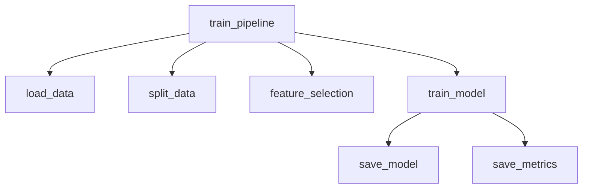
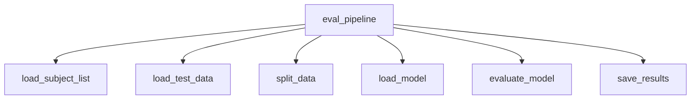
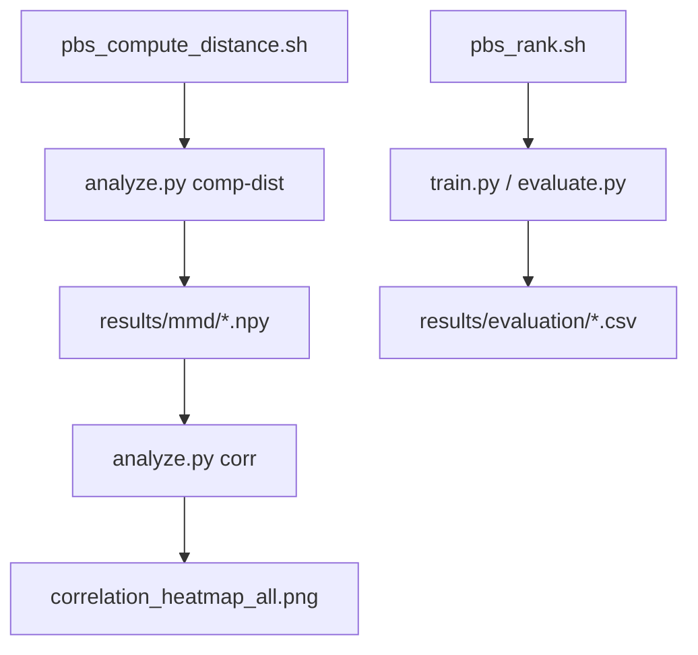

# Developer Guide: Repository Architecture and Data Flow

## Table of Contents

## Table of Contents

* [Overview](#overview)
* [Repository Structure](#repository-structure)
* [1. Preprocessing Pipeline (`src/data_pipeline/processing_pipeline.py`)](#preprocessing-pipeline)
* [2. Training Pipeline (`src/models/model_pipeline.py`)](#training-pipeline)
* [3. Evaluation Pipeline (`src/evaluation/eval_pipeline.py`)](#evaluation-pipeline)
* [4. Domain Generalisation & Distance Analysis](#domain-analysis)
  * [Stage 1: Compute Distances](#stage-1)
  * [Stage 2: Fine-tuning and Ranking Experiments](#stage-2)
  * [Stage 3: Correlation and Reporting](#stage-3)
* [5. Utility Modules (`src/utils/`)](#utils)
* [6. Data Flow Summary](#data-flow)
* [7. HPC Integration](#hpc)
* [8. Extensibility & Maintenance](#extensibility)
* [References](#references)

---

## Overview

This document describes the overall architecture, module dependencies, and end-to-end data flow
of the `vehicle_based_DDD_comparison` repository.

The repository implements a **multi-stage Driver Drowsiness Detection (DDD)** workflow,
spanning preprocessing, model training, evaluation, and domain generalisation analysis.

---

## Repository Structure

```

.
├── config/             # Subject/group definitions, requirements
│   ├── general_subjects.txt
│   ├── subject_list.txt
│   ├── target_groups.txt
│   └── requirements.txt
│
├── data/               # Dataset storage (not tracked except README)
│   ├── interim/        # Intermediate cleaned data
│   ├── processed/      # Final processed datasets (per subject)
│   └── README.md
│
├── docs/               # Documentation (Sphinx build + generated files)
│   ├── source/         # Developer and API guides
│   └── _build/         # HTML outputs
│
├── models/             # Trained model artifacts
│   ├── common/         # Classical ML (shared preprocessing)
│   ├── Lstm/           # Deep models (temporal)
│   ├── SvmA/           # Amplitude-based SVM
│   └── SvmW/           # Wavelet-based SVM
│
├── results/            # Experiment results
│   ├── evaluation/     # Test metrics, thresholds
│   ├── mmd/            # Domain distance matrices (MMD)
│   ├── distances/      # Wasserstein / DTW results
│   ├── ranks/          # Subject-level rankings
│   └── archive/
│
├── scripts/
│   ├── python/         # Entry-point CLI scripts (train, evaluate, analyze)
│   ├── hpc/            # PBS job scripts for batch execution
│   └── README.md
│
├── src/                # Core logic
│   ├── analysis/       # Distance computation and correlation
│   ├── data_pipeline/  # Preprocessing (feature extraction, merging, labeling)
│   ├── evaluation/     # Evaluation routines
│   ├── models/         # Training pipelines and model architectures
│   ├── utils/          # Common utilities (I/O, split, caching)
│   └── config.py

````

```mermaid
graph TB
  scripts_hpc["scripts/hpc (job scripts)"] -.-> scripts_python["scripts/python (CLI)"]
  scripts_python --> src_core["src/ (core logic)"]
  src_core --> data_pipeline["src/data_pipeline"]
  data_pipeline --> data["data/ (interim/processed)"]
  src_core --> models["src/models (training)"]
  models --> results["results/"]
  src_core --> evaluation["src/evaluation"]
  evaluation --> results
  src_core --> analysis["src/analysis (domain analysis)"]
  analysis --> results

````

---

## 1. Preprocessing Pipeline (`src/data_pipeline/processing_pipeline.py`) {#preprocessing-pipeline}

The preprocessing pipeline prepares per-subject datasets from raw physiological and EEG signals.

```mermaid
graph LR
  main_pipeline --> read_subject_list["(1) read_subject_list"]
  main_pipeline --> time_freq_domain_process["(2) time_freq_domain_process"]
  main_pipeline --> wavelet_process["(3) wavelet_process"]
  main_pipeline --> smooth_std_pe_process["(4) smooth_std_pe_process"]
  main_pipeline --> eeg_process["(5) eeg_process"]
  main_pipeline --> merge_process["(6) merge_process"]
  main_pipeline --> kss_process["(7) kss_process"]
```

| Step / Function                | Input                                      | Output                         | Notes                             |
| --------------------------     | -------------------------                  | ------------------------------ | --------------------------------- |
| `(1) read_subject_list`        | `../dataset/mdapbe/subject_list.txt`       | list of subject IDs            | Target subjects for preprocessing |
| `(2) time_freq_domain_process` | `../dataset/mdapbe/physio/{subject}/*.mat` | CSV (`data/intermim/time_freq_domain/{model}/time_freq_domain_*.csv`) | For SvmA and common models        |
| `(3) wavelet_process`          | `../dataset/mdapbe/physio/{subject}/*.mat` | CSV (`data/intermim/wavelet/{model}/wavelet_*.csv`)          | For SvmW and common models        |
| `(4) smooth_std_pe_process`    | `../dataset/mdapbe/physio/{subject}/*.mat` | CSV (`data/intermim/smooth_std_pe/{model}/smooth_std_pe_*.csv`)    | For Lstm and common models        |
| `(5) eeg_process`              | `../dataset/mdapbe/physio/{subject}/*.mat` | CSV (`data/intermim/eeg/{model}/eeg_*.csv`)              | EEG band power, ratios            |
| `(6) merge_process`            | `../dataset/mdapbe/physio/{subject}/*.mat` | CSV (`data/intermim/merged/{model}/merged_*.csv`)           | Merges features by timestamp      |
| `(7) kss_process`              | `data/intermim/merged/{model}/*.csv`       | CSV (`data/processed/{model}processed_*.csv`)        | Aligns KSS labels                 |

**Notes:**  
- Supported models: `"common"`, `"SvmA"`, `"SvmW"`, and `"Lstm"`.  
- Each step supports optional augmentation via `use_jittering=True`.  
- All steps are logged via Python’s `logging` module for progress tracking.

**Outputs:**

* Interim features: `data/interim/{feature}/{model}/`
* Final datasets: `data/processed/{model}/processed_{subject}.csv`

---

## 2. Training Pipeline (`src/models/model_pipeline.py`) {#training-pipeline}

Handles data loading, splitting, feature selection, model fitting, and artifact saving.

### Function: `train_pipeline(model_name, split_strategy, options)`



| Function            | Input                | Output                                          | Notes                                    |
| ------------------- | -------------------- | ----------------------------------------------- | ---------------------------------------- |
| `load_data`         | processed CSVs       | DataFrame                                       | Loads per-subject data                   |
| `split_data`        | DataFrame + strategy | Train/Val/Test splits                           | Supports random, subject-wise, time-wise, and fine-tune strategies (`single_subject_data_split`, `isolate_target_subjects`, `finetune_target_subjects`) |
| `feature_selection` | Train data           | Reduced features                                | RF importance, ANOVA, MI                 |
| `train_model`       | Selected data        | trained estimator                               | RF, SvmA, or LSTM (`common_train`, `SvmA_train`, `lstm_train`) |
| `save_model`        | model, scaler        | `models/{model}/`                               | Unified naming scheme (`{model}.pkl`, `scaler_{model}.pkl`) |
| `save_metrics`      | logs, metrics        | `results/train/{model}/trainmetrics_*.csv/json` | Includes thresholds for F1 optimisation  |

**Additional:**  
- Supports optional `sample_size` limitation and label balancing (`balance_labels`, `balance_method`).  
- Time-based stratified splitting options available (`time_stratify_*`).

---

## 3. Evaluation Pipeline (`src/evaluation/eval_pipeline.py`) {#evaluation-pipeline}



| Step                | Input            | Output                                            | Notes                        |
| ------------------- | ---------------- | ------------------------------------------------- | ---------------------------- |
| `load_subject_list` | subject list     | IDs                                               | Supports `fold`-based CV splits (`read_subject_list_fold`) |
| `load_test_data`    | processed CSVs   | DataFrame                                         | Data for evaluation; supports subject-wise or random split |
| `load_model`        | `models/{model}` | model, scaler, selected_features                  | Uses unified filenames (`{model}.pkl`, `scaler_{model}.pkl`, etc.) |
| `evaluate_model`    | model, test data | metrics dict                                      | Accuracy, F1, AUC (via `common_eval`, `lstm_eval`, `SvmA_eval`) |
| `save_results`      | metrics dict     | `results/evaluation/{model}/metrics_*.json`       | Includes metadata (subject list, sample size, selected features); filenames timestamped |

---

## 4. Domain Generalisation & Distance Analysis {#domain-analysis}

The **domain generalisation analysis** quantifies the difference between subjects or groups (domains) using multiple distance metrics.

It follows a two-stage HPC workflow:

### Stage 1: Compute Distances {#stage-1}

**Job script:** `scripts/hpc/domain_analysis/pbs_compute_distance.sh`

```bash
python scripts/python/analyze.py comp-dist \
  --subject_list config/subject_list.txt \
  --data_root data/processed/common \
  --groups_file config/target_groups.txt
```

| Metric      | Module                      | Output                                     |
| ----------- | --------------------------- | ------------------------------------------ |
| MMD         | `src/analysis/distances.py` | `results/domain_analysis/distance/mmd/mmd_matrix.npy`               |
| Wasserstein | `src/analysis/distances.py` | `results/domain_analysis/distance/wasserstein/wasserstein_matrix.npy` |
| DTW         | `src/analysis/distances.py` | `results/domain_analysis/distance/dtw/dtw_matrix.npy`               |


All three metrics are computed via a unified, cached pipeline that handles feature extraction and group-wise comparisons.  
Intermediate data are cached under `results/.cache/` for performance optimization.

**Generated JSONs:**

* `mmd_subjects.json`, `subjects.json`
* Store the subject ordering for reproducibility

---

### Stage 2: Fine-tuning and Ranking Experiments {#stage-2}

**Job script:**  

* `scripts/hpc/domain_analysis/pbs_rank.sh`

This unified job script replaces the older `pbs_rank_10_was*.sh` variants.
It uses **PBS job arrays** to process each rank-based group in parallel:

| Mode           | Description                                  |
| -------------- | -------------------------------------------- |
| `only_general` | Train on general group only                  |
| `finetune`     | Fine-tune model pre-trained on general group |
| `only_target`  | Train from scratch on target group           |

Each task internally executes:

```bash
python scripts/python/train.py --mode only_general --tag rank_was_high
python scripts/python/evaluate.py --model RF --split test
```

Resulting artifacts:

* Trained models: `models/{model}/rank_*`
* Metrics: `results/train/{model}/metrics_*.csv/json`

---

### Stage 3: Correlation and Reporting {#stage-3}

**Job script:** `scripts/python/analyze.py`

Provides multiple subcommands:

All analysis stages are now implemented as CLI **subcommands** in `scripts/python/analyze.py`, managed via `argparse`:

| Subcommand         | Description                                   | Core Function                                      |
| ------------------ | --------------------------------------------- | -------------------------------------------------- |
| `comp-dist`        | Compute distance matrices (MMD, Wasserstein, DTW) | `src.analysis.distances.run_comp_dist()`           |
| `corr`             | Correlate distance metrics with performance deltas | `src.analysis.correlation`                         |
| `summarize-metrics`| Summarize only10 vs finetune results          | `src.analysis.metrics_tables.summarize_metrics()`  |
| `rank-export`      | Export top/bottom-k subjects                  | `src.analysis.rank_export`                         |
| `make-table`       | Generate wide-format comparison tables        | `src.analysis.metrics_tables.make_comparison_table()` |

Each command logs `[RUN] <subcommand>` and stores results under `results/`.  
This replaces the earlier standalone `run_*` helper calls.

**Outputs:**

* `results/mmd/*.npy`, `results/distances/*.npy`
* `model/common/dist_corr_*/correlations_dUG_vs_deltas.csv`
* `results/ranks10/wasserstein_mean_high.txt` (subject lists)

---

## 5. Utility Modules (`src/utils/`) {#utils}

### `io/loaders.py`

* File I/O wrappers for MATLAB and CSV
* Subject list readers (`read_subject_list`, `read_train_subject_list`)
* Model type mapper (`get_model_type`)

### `io/merge.py`

* `merge_process(subject, model)` aligns features by timestamp and saves merged CSVs.

### `io/split.py`

Implements reproducible data splits:

* Random or stratified
* Subject-wise
* Time-stratified (`time_stratified_three_way_split`)

---

## 6. Data Flow Summary {#data-flow}

| Stage           | Input              | Output                      | Responsible Module                     |
| --------------- | ------------------ | --------------------------- | -------------------------------------- |
| Preprocessing   | `.mat` raw files   | `data/processed/*.csv`      | `src/data_pipeline`                    |
| Training        | processed CSVs     | models + metrics            | `src/models/model_pipeline`            |
| Evaluation      | models + CSVs      | evaluation metrics          | `src/evaluation/eval_pipeline`         |
| Domain Analysis | features + metrics | distance matrices, rankings | `src/analysis/distances`, `analyze.py` |

---

## 7. HPC Integration {#hpc}



### Notes

* All scripts set BLAS thread limits (`OMP_NUM_THREADS=1`, etc.) for HPC safety.
* Logs are stored in `scripts/hpc/log/*.OU`.
* PBS job arrays enable multi-group parallelism for domain generalisation.

---

## 8. Extensibility & Maintenance {#extensibility}

| Area                    | How to Extend                                                          |
| ----------------------- | ---------------------------------------------------------------------- |
| **New model types**     | Add under `src/models/architectures/` and register in `model_pipeline` |
| **New features**        | Add extraction in `src/data_pipeline/features/`                        |
| **New distance metric** | Extend `src/analysis/distances.py`                                     |
| **Custom splits**       | Add to `src/utils/io/split.py`                                         |

**Risks:**

* Hardcoded paths in HPC scripts (`$PROJECT_ROOT`, etc.)
* Large intermediate data may exceed HPC quotas; clean `results/` periodically

---

## References

* **Dataset:** *Estimating Systemic Cognitive States from a Mixture of Physiological and Brain Signals* (Scheutz et al.)
* **Architecture Standard:** Cookiecutter Data Science
* **Domain Metrics:** MMD, Wasserstein, DTW — implemented via SciPy, POT, and FastDTW

---

*Last updated: October 2025*

```

