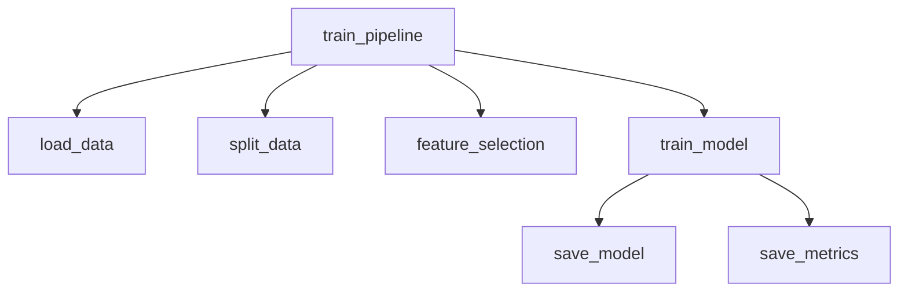
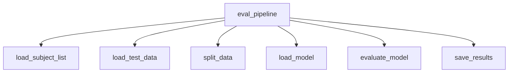
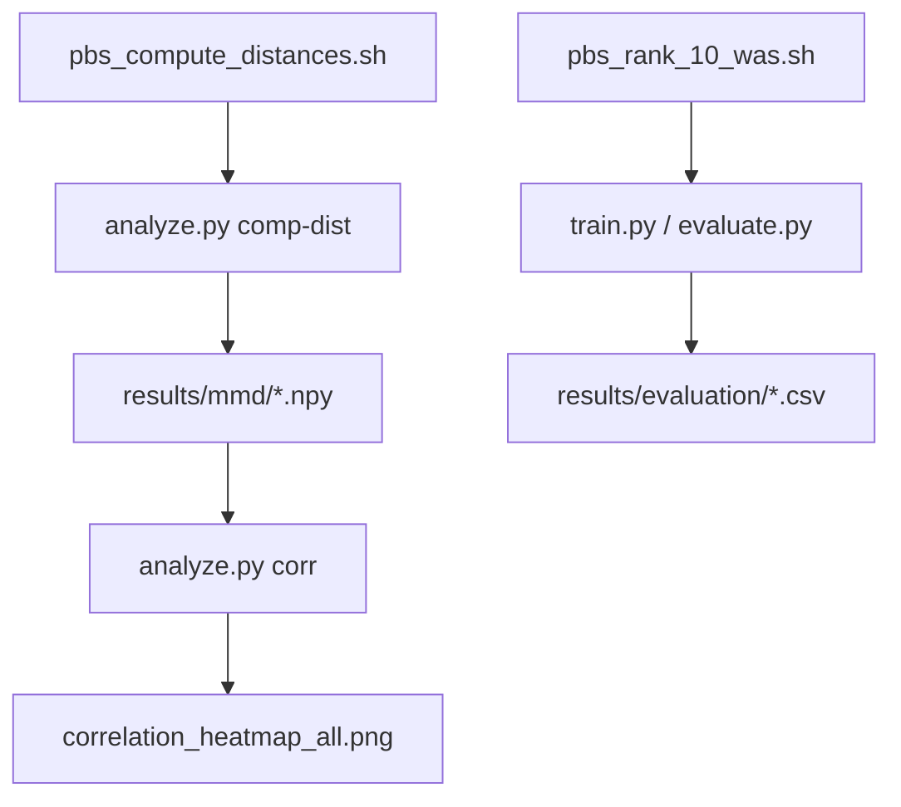

# Developer Guide: Repository Architecture and Data Flow

## Overview

This document describes the overall architecture, module dependencies, and end-to-end data flow
of the `vehicle_based_DDD_comparison` repository.

The repository implements a **multi-stage Driver Drowsiness Detection (DDD)** workflow,
spanning preprocessing, model training, evaluation, and domain generalisation analysis.
It is structured according to the [Cookiecutter Data Science](https://drivendata.github.io/cookiecutter-data-science/) convention, with HPC (PBS) support for large-scale experiments.

---

## Repository Structure

```

.
├── config/             # Subject/group definitions, requirements
│   ├── general_subjects.txt
│   ├── subject_list.txt
│   ├── target_groups.txt
│   └── requirements.txt
│
├── data/               # Dataset storage (not tracked except README)
│   ├── interim/        # Intermediate cleaned data
│   ├── processed/      # Final processed datasets (per subject)
│   └── README.md
│
├── docs/               # Documentation (Sphinx build + generated files)
│   ├── source/         # Developer and API guides
│   └── _build/         # HTML outputs
│
├── models/             # Trained model artifacts
│   ├── common/         # Classical ML (shared preprocessing)
│   ├── Lstm/           # Deep models (temporal)
│   ├── SvmA/           # Amplitude-based SVM
│   └── SvmW/           # Wavelet-based SVM
│
├── results/            # Experiment results
│   ├── evaluation/     # Test metrics, thresholds
│   ├── mmd/            # Domain distance matrices (MMD)
│   ├── distances/      # Wasserstein / DTW results
│   ├── ranks/          # Subject-level rankings
│   └── archive/
│
├── scripts/
│   ├── python/         # Entry-point CLI scripts (train, evaluate, analyze)
│   ├── hpc/            # PBS job scripts for batch execution
│   └── README.md
│
├── src/                # Core logic
│   ├── analysis/       # Distance computation and correlation
│   ├── data_pipeline/  # Preprocessing (feature extraction, merging, labeling)
│   ├── evaluation/     # Evaluation routines
│   ├── models/         # Training pipelines and model architectures
│   ├── utils/          # Common utilities (I/O, split, caching)
│   └── config.py

````

```mermaid
graph LR
  scripts_python[scripts/python CLI] --> src[src (core logic)]
  src --> data[data_pipeline]
  src --> models[models]
  src --> analysis[analysis]
  src --> evaluation[evaluation]
  analysis --> results[results/]
  models --> results
  results --> reports[reports/figures]
  scripts_hpc[scripts/hpc jobs] -.-> scripts_python
````

---

## 1. Preprocessing Pipeline (`src/data_pipeline/processing_pipeline.py`)

The preprocessing pipeline prepares per-subject datasets from raw physiological and EEG signals.

### Function: `main_pipeline(model: str, use_jittering: bool = False)`

```mermaid
graph TD
  main_pipeline --> read_subject_list
  main_pipeline --> time_freq_domain_process
  main_pipeline --> wavelet_process
  main_pipeline --> smooth_std_pe_process
  main_pipeline --> eeg_process
  main_pipeline --> merge_process
  main_pipeline --> kss_process
```

| Step / Function            | Input                     | Output                         | Notes                             |
| -------------------------- | ------------------------- | ------------------------------ | --------------------------------- |
| `read_subject_list`        | `config/subject_list.txt` | list of subject IDs            | Target subjects for preprocessing |
| `time_freq_domain_process` | subject, model            | CSV (`time_freq_domain_*.csv`) | For SvmA and common models        |
| `wavelet_process`          | subject, model            | CSV (`wavelet_*.csv`)          | For SvmW and common models        |
| `smooth_std_pe_process`    | subject, model            | CSV (`smooth_std_pe_*.csv`)    | For Lstm and common models        |
| `eeg_process`              | subject, model            | CSV (`eeg_*.csv`)              | EEG band power, ratios            |
| `merge_process`            | subject, model            | CSV (`merged_*.csv`)           | Merges features by timestamp      |
| `kss_process`              | subject, model            | CSV (`processed_*.csv`)        | Aligns KSS labels                 |

**Outputs:**

* Interim features: `data/interim/{feature}/{model}/`
* Final datasets: `data/processed/{model}/processed_{subject}.csv`

---

## 2. Training Pipeline (`src/models/model_pipeline.py`)

Handles data loading, splitting, feature selection, model fitting, and artifact saving.

### Function: `train_pipeline(model_name, split_strategy, options)`



| Function            | Input                | Output                                          | Notes                                    |
| ------------------- | -------------------- | ----------------------------------------------- | ---------------------------------------- |
| `load_data`         | processed CSVs       | DataFrame                                       | Loads per-subject data                   |
| `split_data`        | DataFrame + strategy | Train/Val/Test splits                           | Supports random, subject-wise, time-wise |
| `feature_selection` | Train data           | Reduced features                                | RF importance, ANOVA, MI                 |
| `train_model`       | Selected data        | trained estimator                               | RF, SvmA, SvmW, or LSTM                  |
| `save_model`        | model, scaler        | `models/{model}/`                               | Saved via joblib or keras                |
| `save_metrics`      | logs, metrics        | `results/train/{model}/trainmetrics_*.csv/json` | Includes thresholds for F1 optimisation  |

---

## 3. Evaluation Pipeline (`src/evaluation/eval_pipeline.py`)



| Step                | Input            | Output                                            | Notes                        |
| ------------------- | ---------------- | ------------------------------------------------- | ---------------------------- |
| `load_subject_list` | subject list     | IDs                                               | Same as training             |
| `load_test_data`    | processed CSVs   | DataFrame                                         | Data for evaluation          |
| `load_model`        | `models/{model}` | model, scaler, features                           | joblib or keras              |
| `evaluate_model`    | model, test data | metrics dict                                      | Accuracy, F1, AUC            |
| `save_results`      | metrics dict     | `results/evaluation/{model}/metrics_*.{csv,json}` | Includes per-subject details |

---

## 4. Domain Generalisation & Distance Analysis

The **domain generalisation analysis** quantifies the difference between subjects or groups (domains) using multiple distance metrics.

It follows a two-stage HPC workflow:

### Stage 1: Compute Distances

**Job script:** `scripts/hpc/domain_gen/pbs_compute_distances.sh`

```bash
python scripts/python/analyze.py comp-dist \
  --subject_list config/subject_list.txt \
  --data_root data/processed/common \
  --groups_file config/target_groups.txt
```

| Metric      | Module                      | Output                                     |
| ----------- | --------------------------- | ------------------------------------------ |
| MMD         | `src/analysis/distances.py` | `results/mmd/mmd_matrix.npy`               |
| Wasserstein | `src/analysis/distances.py` | `results/distances/wasserstein_matrix.npy` |
| DTW         | `src/analysis/distances.py` | `results/distances/dtw_matrix.npy`         |

**Generated JSONs:**

* `mmd_subjects.json`, `subjects.json`
* Store the subject ordering for reproducibility

---

### Stage 2: Fine-tuning and Ranking Experiments

**Job scripts:**

* `scripts/hpc/domain_gen/pbs_rank_10_was.sh`
* `scripts/hpc/domain_gen/pbs_rank_10_was_general_vs_target.sh`

These use **PBS job arrays** to process each rank-based group in parallel:

| Mode           | Description                                  |
| -------------- | -------------------------------------------- |
| `only_general` | Train on general group only                  |
| `finetune`     | Fine-tune model pre-trained on general group |
| `only_target`  | Train from scratch on target group           |

Each task internally executes:

```bash
python scripts/python/train.py --mode only_general --tag rank_was_high
python scripts/python/evaluate.py --model RF --split test
```

Resulting artifacts:

* Trained models: `models/{model}/rank_*`
* Metrics: `results/train/{model}/metrics_*.csv/json`

---

### Stage 3: Correlation and Reporting

**Job script:** `scripts/python/analyze.py`

Provides multiple subcommands:

| Subcommand     | Purpose                              | Core Function                        |
| -------------- | ------------------------------------ | ------------------------------------ |
| `comp-dist`    | Compute domain distances             | `run_comp_dist()`                    |
| `corr`         | Correlate distances with Δ metrics   | `run_distance_vs_delta()`            |
| `summarize`    | Summarise results across groups      | `run_summarize_only10_vs_finetune()` |
| `rank-export`  | Export top/bottom-k subjects         | `run_rank_export()`                  |
| `corr-collect` | Aggregate correlations into heatmaps | internal plotting                    |

**Outputs:**

* `results/mmd/*.npy`, `results/distances/*.npy`
* `model/common/dist_corr_*/correlations_dUG_vs_deltas.csv`
* `results/ranks10/wasserstein_mean_high.txt` (subject lists)

---

## 5. Utility Modules (`src/utils/`)

### `io/loaders.py`

* File I/O wrappers for MATLAB and CSV
* Subject list readers (`read_subject_list`, `read_train_subject_list`)
* Model type mapper (`get_model_type`)

### `io/merge.py`

* `merge_process(subject, model)` aligns features by timestamp and saves merged CSVs.

### `io/split.py`

Implements reproducible data splits:

* Random or stratified
* Subject-wise
* Time-stratified (`time_stratified_three_way_split`)

---

## 6. Data Flow Summary

| Stage           | Input              | Output                      | Responsible Module                     |
| --------------- | ------------------ | --------------------------- | -------------------------------------- |
| Preprocessing   | `.mat` raw files   | `data/processed/*.csv`      | `src/data_pipeline`                    |
| Training        | processed CSVs     | models + metrics            | `src/models/model_pipeline`            |
| Evaluation      | models + CSVs      | evaluation metrics          | `src/evaluation/eval_pipeline`         |
| Domain Analysis | features + metrics | distance matrices, rankings | `src/analysis/distances`, `analyze.py` |

---

## 7. HPC Integration



### Notes

* All scripts set BLAS thread limits (`OMP_NUM_THREADS=1`, etc.) for HPC safety.
* Logs are stored in `scripts/hpc/log/*.OU`.
* PBS job arrays enable multi-group parallelism for domain generalisation.

---

## 8. Extensibility & Maintenance

| Area                    | How to Extend                                                          |
| ----------------------- | ---------------------------------------------------------------------- |
| **New model types**     | Add under `src/models/architectures/` and register in `model_pipeline` |
| **New features**        | Add extraction in `src/data_pipeline/features/`                        |
| **New distance metric** | Extend `src/analysis/distances.py`                                     |
| **Custom splits**       | Add to `src/utils/io/split.py`                                         |

**Risks:**

* Hardcoded paths in HPC scripts (`$PROJECT_ROOT`, etc.)
* Large intermediate data may exceed HPC quotas; clean `results/` periodically

---

## References

* **Dataset:** *Estimating Systemic Cognitive States from a Mixture of Physiological and Brain Signals* (Scheutz et al.)
* **Architecture Standard:** Cookiecutter Data Science
* **Domain Metrics:** MMD, Wasserstein, DTW — implemented via SciPy, POT, and FastDTW

---

*Last updated: October 2025*

```

