```mermaid
flowchart TB

subgraph PBS["PBS Array Job (1–9)"]
  A1["#1–9: ranked 10-subject groups<br/>(MMD / WAS / DTW × High / Mid / Low)"]
end

subgraph CLI["scripts/python/train.py"]
  B1["cmd_train()"]
  B2["→ model_pipeline.train_pipeline()"]
end

subgraph Input["Input Files"]
  C1["data/processed/common/<br/>(feature CSVs)"]
  C2["ranks10/{metric}_mean_{level}.txt<br/>(10 target subjects)"]
  C3["subject_list.txt<br/>(all subjects)"]
end

subgraph Stage2["Training Pipeline"]
  direction TB
  E1{"Mode?"}
  E2a["only_general:<br/>Use all non-target subjects<br/>(subject_list − target_group)"]
  E2b["only_target:<br/>Use only target 10 subjects<br/>(within-domain split)"]
  E3["Feature selection (RF / MI / ANOVA)"]
  E4["Train model & save artifacts"]
end

subgraph Output["Results"]
  F1["models/{model}/rank_*/"]
  F2["results/train/{model}/"]
end

A1 --> B1 --> B2 --> E1
E1 -->|only_general| E2a
E1 -->|only_target| E2b
E2a & E2b --> E3 --> E4 --> F1 & F2

%% Subject relationships (explicit)
C1 & C2 & C3 -. "All subjects" .-> E2a
C1 & C2 -. "Target group (10 subjects)" .-> E2b

```

# Developer Guide: Repository Architecture and Data Flow

## Table of Contents

* [Overview](#overview)
* [Repository Structure](#repository-structure)
* [Core Pipelines](#core-pipeline)
  * [1. Preprocessing Pipeline](#1-preprocessing-pipeline-srcdatapipelineprocessing_pipelinepy)
  * [2. Training Pipeline](#2-training-pipeline-srcmodelsmodel_pipelinepy)
  * [3. Evaluation Pipeline](#3-evaluation-pipeline-srcevaluationeval_pipelinepy)
* [Domain Analysis](#domain-analysis)
  * [1. Compute Distances](#1-compute-distances)
  * [2. Fine-tuning and Ranking Experiments](#2-fine-tuning-and-ranking-experiments)
  * [3. Correlation and Reporting](#3-correlation-and-reporting)
* [Utility Modules](#utility-modules-srcutils)
<!--
* [Data Flow Summary](#data-flow-summary)
* [HPC Integration](#hpc-integration)
* [Extensibility & Maintenance](#extensibility--maintenance)
* [References](#references)
-->
---

## Overview

This document describes the overall architecture, module dependencies, and end-to-end data flow
of the `vehicle_based_DDD_comparison` repository.

The repository implements a **multi-stage Driver Drowsiness Detection (DDD)** workflow,
spanning preprocessing, model training, evaluation, and domain generalisation analysis.

---

## Repository Structure

```

.
├── config/             # Subject/group definitions, requirements
│   ├── general_subjects.txt
│   ├── subject_list.txt
│   ├── target_groups.txt
│   └── requirements.txt
│
├── data/               # Dataset storage (not tracked except README)
│   ├── interim/        # Intermediate cleaned data
│   ├── processed/      # Final processed datasets (per subject)
│   └── README.md
│
├── docs/               # Documentation (Sphinx build + generated files)
│   ├── source/         # Developer and API guides
│   └── _build/         # HTML outputs
│
├── models/             # Trained model artifacts
│   ├── common/         # Classical ML (shared preprocessing)
│   ├── Lstm/           # Deep models (temporal)
│   ├── SvmA/           # Amplitude-based SVM
│   └── SvmW/           # Wavelet-based SVM
│
├── results/            # Experiment results
│   ├── evaluation/     # Test metrics, thresholds
│   ├── mmd/            # Domain distance matrices (MMD)
│   ├── distances/      # Wasserstein / DTW results
│   ├── ranks/          # Subject-level rankings
│   └── archive/
│
├── scripts/
│   ├── python/         # Entry-point CLI scripts (train, evaluate, analyze)
│   ├── hpc/            # PBS job scripts for batch execution
│   └── README.md
│
├── src/                # Core logic
│   ├── analysis/       # Distance computation and correlation
│   ├── data_pipeline/  # Preprocessing (feature extraction, merging, labeling)
│   ├── evaluation/     # Evaluation routines
│   ├── models/         # Training pipelines and model architectures
│   ├── utils/          # Common utilities (I/O, split, caching)
│   └── config.py

````

```mermaid
graph TB
  scripts_hpc["scripts/hpc (job scripts)"] -.-> scripts_python["scripts/python (CLI)"]
  scripts_python --> src_core["src/ (core logic)"]
  src_core --> data_pipeline["src/data_pipeline"]
  data_pipeline --> data["data/ (interim/processed)"]
  src_core --> models["src/models (training)"]
  models --> results["results/"]
  src_core --> evaluation["src/evaluation"]
  evaluation --> results
  src_core --> analysis["src/analysis (domain analysis)"]
  analysis --> results

````

---

## Core Pipelines

### 1. Preprocessing Pipeline (src/data_pipeline/processing_pipeline.py)

The preprocessing pipeline prepares per-subject datasets from raw physiological and EEG signals.

```mermaid
graph LR
  main_pipeline --> read_subject_list["(1) read_subject_list"]
  main_pipeline --> time_freq_domain_process["(2) time_freq_domain_process"]
  main_pipeline --> wavelet_process["(3) wavelet_process"]
  main_pipeline --> smooth_std_pe_process["(4) smooth_std_pe_process"]
  main_pipeline --> eeg_process["(5) eeg_process"]
  main_pipeline --> merge_process["(6) merge_process"]
  main_pipeline --> kss_process["(7) kss_process"]
```

| Step / Function                | Input                                      | Output                         | Notes                             |
| --------------------------     | -------------------------                  | ------------------------------ | --------------------------------- |
| `(1) read_subject_list`        | `../dataset/mdapbe/subject_list.txt`       | list of subject IDs            | Target subjects for preprocessing |
| `(2) time_freq_domain_process` | `../dataset/mdapbe/physio/{subject}/*.mat` | CSV (`data/intermim/time_freq_domain/{model}/time_freq_domain_*.csv`) | For SvmA and common models        |
| `(3) wavelet_process`          | `../dataset/mdapbe/physio/{subject}/*.mat` | CSV (`data/intermim/wavelet/{model}/wavelet_*.csv`)          | For SvmW and common models        |
| `(4) smooth_std_pe_process`    | `../dataset/mdapbe/physio/{subject}/*.mat` | CSV (`data/intermim/smooth_std_pe/{model}/smooth_std_pe_*.csv`)    | For Lstm and common models        |
| `(5) eeg_process`              | `../dataset/mdapbe/physio/{subject}/*.mat` | CSV (`data/intermim/eeg/{model}/eeg_*.csv`)              | EEG band power, ratios            |
| `(6) merge_process`            | `../dataset/mdapbe/physio/{subject}/*.mat` | CSV (`data/intermim/merged/{model}/merged_*.csv`)           | Merges features by timestamp      |
| `(7) kss_process`              | `data/intermim/merged/{model}/*.csv`       | CSV (`data/processed/{model}processed_*.csv`)        | Aligns KSS labels                 |

---

### 2. Training Pipeline (`src/models/model_pipeline.py`) 

Handles data loading, splitting, feature selection, model fitting, and artifact saving.


| Function            | Input                | Output                                          | Notes                                    |
| ------------------- | -------------------- | ----------------------------------------------- | ---------------------------------------- |
| `(1) load_data`         | processed CSVs       | DataFrame                                       | Loads per-subject data                   |
| `(2) split_data`        | DataFrame + strategy | Train/Val/Test splits                           | Supports random, subject-wise, time-wise, and fine-tune strategies (`single_subject_data_split`, `isolate_target_subjects`, `finetune_target_subjects`) |
| `(3) feature_selection` | Train data           | Reduced features                                | RF importance, ANOVA, MI                 |
| `(4) train_model`       | Selected data        | trained estimator                               | RF, SvmA, or LSTM (`common_train`, `SvmA_train`, `lstm_train`) |
| `(4-1) save_model`        | model, scaler        | `models/{model}/`                               | Unified naming scheme (`{model}.pkl`, `scaler_{model}.pkl`) |
| `(4-2) save_metrics`      | logs, metrics        | `results/train/{model}/trainmetrics_*.csv/json` | Includes thresholds for F1 optimisation  |

---

### 3. Evaluation Pipeline (`src/evaluation/eval_pipeline.py`) 


| Step                | Input            | Output                                            | Notes                        |
| ------------------- | ---------------- | ------------------------------------------------- | ---------------------------- |
| `(1) load_subject_list` | subject list     | IDs                                               | Supports `fold`-based CV splits (`read_subject_list_fold`) |
| `(2) load_test_data`    | processed CSVs   | DataFrame                                         | Data for evaluation; supports subject-wise or random split |
| `(3) split_data`        | DataFrame + strategy | Train/Val/Test splits                           | Supports random, subject-wise, time-wise, and fine-tune strategies |
| `(4) load_model`        | `models/{model}` | model, scaler, selected_features                  | Uses unified filenames (`{model}.pkl`, `scaler_{model}.pkl`, etc.) |
| `(5) evaluate_model`    | model, test data | metrics dict                                      | Accuracy, F1, AUC (via `common_eval`, `lstm_eval`, `SvmA_eval`) |
| `(6) save_results`      | metrics dict     | `results/evaluation/{model}/metrics_*.json`       | Includes metadata (subject list, sample size, selected features); filenames timestamped |

---

## Domain Analysis 

The **domain generalisation analysis** quantifies the difference between subjects or groups (domains) using multiple distance metrics.

---

### 1. Compute Distances

**Job script:** `scripts/hpc/domain_analysis/pbs_compute_distance.sh`

```bash
#PBS -N compute_distance
#PBS -J 1-3
#PBS -l select=1:ncpus=16
#PBS -l walltime=24:00:00
#PBS -j oe
#PBS -q SINGLE

python scripts/python/analyze.py comp-dist --metric "$METRIC" \
  --subject_list ../dataset/mdapbe/subject_list.txt \
  --data_root data/processed/common \
  --groups_file config/target_groups.txt
```

| Metric      | Module                      | Output Path                                                           |
| ----------- | --------------------------- | --------------------------------------------------------------------- |
| MMD         | `src/analysis/distances.py` | `results/domain_analysis/distance/mmd/mmd_matrix.npy`                 |
| Wasserstein | `src/analysis/distances.py` | `results/domain_analysis/distance/wasserstein/wasserstein_matrix.npy` |
| DTW         | `src/analysis/distances.py` | `results/domain_analysis/distance/dtw/dtw_matrix.npy`                 |

Each metric is computed via an **array job (`PBS -J 1–3`)**,
where the array index determines which metric (`mmd`, `wasserstein`, or `dtw`) is processed.
All computations share a unified backend implemented in
`src/analysis/distances.py`, invoked through the command:

```bash
python scripts/python/analyze.py comp-dist
```

Intermediate features are **cached under `results/.cache/`**
to accelerate repeated runs and avoid redundant data loading.

After all three metrics are computed,
the script automatically calls
`src/data_preparation/make_ranked_groups.py`
to generate ranked subject groups for downstream fine-tuning experiments.

---

#### **Generated Outputs**

* **Distance Matrices**

  * `results/domain_analysis/distance/mmd/mmd_matrix.npy`
  * `results/domain_analysis/distance/wasserstein/wasserstein_matrix.npy`
  * `results/domain_analysis/distance/dtw/dtw_matrix.npy`
* **Subject Ordering JSONs** (for reproducibility)

  * `results/domain_analysis/distance/mmd/mmd_subjects.json`
  * `results/domain_analysis/distance/subjects.json`

---

### **Data Flow Diagram**


### 2. Rank-Based Domain Generalization Experiments

**Job script:**  
`scripts/hpc/domain_analysis/pbs_rank.sh`

This job script evaluates **domain generalization performance** across subject groups
ranked by domain distances (MMD, Wasserstein, DTW).

Each PBS array index (1–9) corresponds to one ranked group file under:

```

results/domain_analysis/distance/ranks10/{metric}*mean*{level}.txt

````

Each file contains 10 subjects forming a domain group (High / Middle / Low) for a specific metric.
The script runs three experiment modes sequentially:

| Mode | Description |
|------|--------------|
| **only_general** | Train on general subjects only (source domain) |
| **finetune** | Adapt pre-trained general model to the target domain |
| **only_target** | Train from scratch on target domain subjects |

---

#### Execution Example

```bash
python scripts/python/train.py \
  --model RF \
  --mode only_general \
  --target_subjects $(cat results/domain_analysis/distance/ranks10/wasserstein_mean_high.txt) \
  --tag rank_was_high
````

---

#### Data Flow



---

#### Outputs

| Category       | Path                                            | Example                                |
| -------------- | ----------------------------------------------- | -------------------------------------- |
| Trained models | `models/{model}/rank_*`                         | `models/RF/rank_was_high_finetune.pkl` |
| Metrics        | `results/train/{model}/trainmetrics_*.csv/json` |                                        |
| Thresholds     | `results/train/{model}/threshold_*.json`        |                                        |

---

### 3. Performance Aggregation and Visualization

**Job scripts:**
- `scripts/python/make_summary_tables.py`
- `scripts/python/plot_summary_results.py`

This stage performs **final aggregation and visualization of model performance**
across all domain ranking groups (High / Middle / Low × MMD / Wasserstein / DTW).  
It summarizes per-mode results (`only_general`, `only_target`, `finetune`)  
and visualizes their cross-domain differences.

---

#### Overview

| Step | Script | Description | Output |
|------|---------|-------------|---------|
| 1 | `make_summary_tables.py` | Collects all per-run metrics from `results/evaluation/common/` and merges them by domain type and rank level. | `results/analysis/summary_40cases_*.csv` |
| 2 | `plot_summary_results.py` | Visualizes aggregated scores as multi-panel bar plots and heatmaps for metric deltas between modes. | `results/analysis/summary_metrics_40_mean_tri_bar.png`, `diff_heatmap_all5_40.png` |

---

#### Step 1 — Aggregation: `make_summary_tables.py`

This script parses all metric CSVs from `results/evaluation/common/`,  
infers experimental mode and rank grouping from filenames,  
and produces both long-form and comparison-form summary tables.

**Core operations:**
- Detects file mode from filename:  
  `metrics_<model>_<mode>_<rank_key>.csv`
- Extracts `distance` (dtw/mmd/wasserstein), `stat` (mean/std), and `level` (high/middle/low)
- Aggregates per-metric averages across runs
- Computes deltas between modes:
  - Δ(fin.) = `finetune - only_general`
  - Δ(target) = `finetune - only_target`

**Outputs:**

| File | Description |
|------|--------------|
| `summary_40cases_all_splits.csv` | All metrics (train/val/test combined) |
| `summary_40cases_test.csv` | Only test-split metrics |
| `summary_40cases_test_mode_compare.csv` | Pivoted comparison table with Δ values |

---

#### 📊 Step 2 — Visualization: `plot_summary_results.py`

This script reads the comparison table (`summary_40cases_test_mode_compare.csv`)  
and generates publication-ready visualizations summarizing  
domain-level and metric-level performance trends.

**Visualizations:**
1. **Tri-Bar Plot:**  
   Multi-panel figure showing mean scores per distance (DTW/MMD/Wasserstein)  
   × level (High/Mid/Low) for each metric (AUC, Precision, Recall, Accuracy, F1).  
   → `summary_metrics_40_mean_tri_bar.png`

2. **Heatmap of Deltas:**  
   Shows pairwise differences between modes (`General–Target`, `Finetune–Target`, `General–Finetune`)  
   across all distances and ranks.  
   → `diff_heatmap_all5_40.png`

---

#### Data Flow

```mermaid
flowchart TB

subgraph Step1["make_summary_tables.py"]
  B1["Parse filenames → infer distance/rank/mode"]
  B2["Merge all test metrics into one table"]
  B3["Pivot per metric (AUC, Precision, Recall, Accuracy, F1)"]
  B4["Compute Δ(fin. vs general / fin. vs target)"]
end

subgraph Step2["plot_summary_results.py"]
  C1["Load summary_40cases_test_mode_compare.csv"]
  C2["Generate tri-bar plots (per distance × level)"]
  C3["Generate Δ heatmaps (General–Target / Finetune–Target / General–Finetune)"]
end

subgraph Output["Results/"]
  A1["results/evaluation/common/metrics_*.csv<br/>(per-group test metrics)"]
  D1["results/analysis/summary_40cases_*.csv"]
  D2["results/analysis/summary_metrics_40_mean_tri_bar.png"]
  D3["results/analysis/diff_heatmap_all5_40.png"]
end

A1 --> B1 --> B2 --> B3 --> B4
D1 --> C1
C1 --> C2 & C3
B4 --> D1
C2 --> D2
C3 --> D3
````

---

#### Interpretation

* Each *distance metric* (MMD, Wasserstein, DTW) is compared under three domain levels (High/Mid/Low).
* Each *model mode* (only_general, only_target, finetune) is evaluated independently,
  allowing visual inspection of domain adaptation behavior.
* Δ values directly indicate **improvement or degradation** of performance across modes.

---

#### Example Outputs

| File                                    | Type   | Description                                  |
| --------------------------------------- | ------ | -------------------------------------------- |
| `summary_40cases_test_mode_compare.csv` | CSV    | Aggregated table with all metrics and deltas |
| `summary_metrics_40_mean_tri_bar.png`   | Figure | Mean metric bar plot by distance × level     |
| `diff_heatmap_all5_40.png`              | Figure | Δ(Performance differences) heatmap           |

---


## Utility Modules (`src/utils/`) 

### `io/loaders.py`

* File I/O wrappers for MATLAB and CSV
* Subject list readers (`read_subject_list`, `read_train_subject_list`)
* Model type mapper (`get_model_type`)

### `io/merge.py`

* `merge_process(subject, model)` aligns features by timestamp and saves merged CSVs.

### `io/split.py`

Implements reproducible data splits:

* Random or stratified
* Subject-wise
* Time-stratified (`time_stratified_three_way_split`)


<!--
## 6. Data Flow Summary 

| Stage           | Input              | Output                      | Responsible Module                     |
| --------------- | ------------------ | --------------------------- | -------------------------------------- |
| Preprocessing   | `.mat` raw files   | `data/processed/*.csv`      | `src/data_pipeline`                    |
| Training        | processed CSVs     | models + metrics            | `src/models/model_pipeline`            |
| Evaluation      | models + CSVs      | evaluation metrics          | `src/evaluation/eval_pipeline`         |
| Domain Analysis | features + metrics | distance matrices, rankings | `src/analysis/distances`, `analyze.py` |

---
-->
<!--
## 8. Extensibility & Maintenance 

| Area                    | How to Extend                                                          |
| ----------------------- | ---------------------------------------------------------------------- |
| **New model types**     | Add under `src/models/architectures/` and register in `model_pipeline` |
| **New features**        | Add extraction in `src/data_pipeline/features/`                        |
| **New distance metric** | Extend `src/analysis/distances.py`                                     |
| **Custom splits**       | Add to `src/utils/io/split.py`                                         |

**Risks:**

* Hardcoded paths in HPC scripts (`$PROJECT_ROOT`, etc.)
* Large intermediate data may exceed HPC quotas; clean `results/` periodically

---

## References

* **Dataset:** *Estimating Systemic Cognitive States from a Mixture of Physiological and Brain Signals* (Scheutz et al.)
* **Architecture Standard:** Cookiecutter Data Science
* **Domain Metrics:** MMD, Wasserstein, DTW — implemented via SciPy, POT, and FastDTW

---

*Last updated: October 2025*

-->

